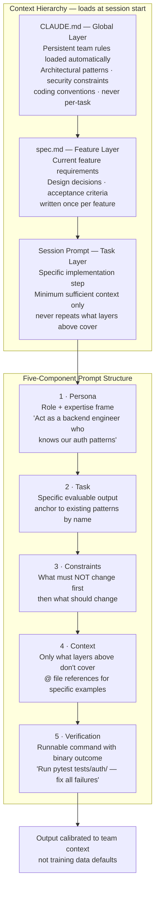

## Prompt Architecture: Structuring Requests for Reliable Output

**Related to:** [Prompting Overview](00-overview.md) — Pattern 1 · [Issues: Prompt Fragmentation](../Issues/07-prompt-fragmentation.md)[^a] · [Workflows: Context Engineering](../Workflows/03-context-engineering.md)[^b] · [Prompting: Prompt Library Management](06-prompt-library.md)[^c] · [Tooling: CLAUDE.md Configuration](../Tooling & Configuration/01-claude-md-configuration.md)[^d]

---

## Overview

A prompt is not a question. It is a specification. Engineers who treat prompts as questions — "can you implement X?" — get probabilistic answers calibrated to what the AI thinks X usually looks like. Engineers who treat prompts as specifications — "implement X, constrained by Y, using pattern Z, validated by test W" — get outputs calibrated to the team's actual context. The difference in output quality between these two approaches is not marginal; it is the primary variable distinguishing teams that adopt structured prompting from those that do not.[^1]

This memo covers the five components of a well-architected prompt, how to apply them to different task types, the relationship between prompt structure and session context (CLAUDE.md and spec.md), and the specific structural patterns that Anthropic's own documentation and leading practitioners have identified as highest-leverage. The goal is to develop an architectural intuition for prompts — an understanding of which components matter most for which task types — rather than a rigid template to follow mechanically.

---

## Section 1: The Five Prompt Components

**Description:** A complete prompt for a non-trivial task has five identifiable components: **persona** (what role Claude is acting in), **task** (what specific output is required), **constraints** (what must not change or must be preserved), **context** (what background information Claude cannot read from files), and **verification** (how Claude should validate that the output is correct). Every component serves a distinct function; omitting any one of them shifts responsibility for that function onto Claude's defaults — which are calibrated to training data patterns rather than the team's specific requirements.[^2]

The persona component is most commonly omitted because it feels artificial. But persona does real work: "Act as a backend engineer who has been working on this codebase for a year and understands our authentication patterns" produces fundamentally different outputs than a prompt with no persona specification. The persona sets the expertise frame — what level of architectural awareness, what conventions, what tradeoffs to favor — that Claude will apply to the task.[^3]

**Recommended Practice:**
- Write prompts with all five components before submitting them for non-trivial tasks. For quick tasks (single-line changes, obvious fixes), constraints and persona can be omitted; for any change involving multiple files or architectural decisions, all five should be present.[^2]
- Anchor the task component with a specific, evaluable output description: not "implement authentication" but "implement JWT authentication using our existing `AuthService` pattern, adding a new `validateRefreshToken` method consistent with the existing `validateAccessToken` method." Specificity in the task component is the single highest-leverage structural change for most engineers.[^4]
- Lead the constraints component with what should not change before specifying what should change. "Refactor the data processing pipeline — do not change the function signatures or the return types; modernize only the internal error handling" prevents the most common refactoring failure mode: AI changing things it was not asked to change.[^2]
- Write the verification component as a runnable command, not a description: "Run `npm test src/auth/` and fix any failures" rather than "make sure the tests pass." A verification component that can be executed automatically — and whose result Claude can observe — closes the feedback loop within the session rather than deferring it to the engineer.[^5]

---

## Section 2: Context Hierarchy and Prompt Layers

**Description:** Every Claude Code session operates within a layered context hierarchy. The global layer is CLAUDE.md — the team's persistent architectural instructions that apply to all sessions. The feature layer is spec.md — the specific requirements and context for the current feature or task. The session layer is the prompt itself — the task-specific context for this particular implementation step. Well-structured prompts work with this hierarchy rather than against it: they build on CLAUDE.md without repeating it, add to spec.md without contradicting it, and provide task-specific context without burying it in information already available at higher layers.[^6]

The most common structural error is context duplication: prompts that re-explain context already present in CLAUDE.md or spec.md. This adds length to the prompt, reduces the signal-to-noise ratio, and creates potential for contradictions if the duplicated content has drifted from the authoritative source. The discipline is minimum sufficient context — provide only what is not already present in higher layers.[^3]

**Recommended Practice:**
- Reference CLAUDE.md and spec.md explicitly in prompts rather than restating their content: "Per our CLAUDE.md conventions, implement this endpoint using our standard handler pattern. The feature requirements are in spec.md." This keeps prompts concise and maintains the authoritative role of the persistent context layers.[^6]
- Use `@` references for specific file content that the task requires but that does not rise to the level of team-wide CLAUDE.md instructions: "@src/api/users.ts — follow this handler structure for the new endpoint." This injects the relevant context precisely without adding it to the global layer where it would apply to all sessions.[^2]
- Distinguish between context that changes (belongs in the prompt) and context that is stable (belongs in CLAUDE.md or spec.md). The test: would this context be relevant in every session involving this part of the codebase? If yes, it belongs in a higher layer. If it is specific to this task, it belongs in the prompt.[^7]
- When writing the feature-level spec.md before a session, treat it as pre-work for the prompt: the spec.md should answer the context and constraints questions so the prompts within the spec.md's scope can be shorter and more focused. The goal is session prompts that are mostly task and verification, with context delegated to spec.md.[^8]

---

## Section 3: Prompt Patterns for Planning vs. Implementation

**Description:** Planning prompts and implementation prompts have structurally different requirements. A planning prompt should produce a plan that the engineer can evaluate, edit, and approve before any code is written. The most important quality of a planning prompt is that it surfaces architectural decisions explicitly rather than embedding them in code. An implementation prompt, by contrast, should produce runnable code that passes verification — the architectural decisions are already resolved and the task is execution.[^2]

Mixing planning and implementation into a single prompt is one of the most common structural failures in AI-assisted development. Asking Claude to "implement an authentication system" conflates a planning question (what authentication pattern should we use?) with an implementation task (write the specific code). The result is implementation that encodes planning decisions Claude made silently, without the engineer having reviewed or approved them.[^2]

**Recommended Practice:**
- Structure multi-step tasks as explicit two-phase interactions: a planning prompt that produces an implementation plan for review, followed by an implementation prompt that executes against the approved plan. Never combine these into a single "implement everything" prompt for non-trivial work.[^2]
- Planning prompts should end with: "Do not write any code. Produce a numbered implementation plan that I will review before you begin." This prevents Claude from starting implementation in the same response as the plan — a common pattern when the planning prompt does not explicitly prevent it.[^2]
- Implementation prompts should begin with the approved plan: "Implement the plan we agreed on. Start with step 1." This anchors the implementation to the reviewed plan rather than to Claude's current (potentially modified) interpretation of the original requirement.[^5]
- When a session deviates from the approved plan mid-implementation, stop and audit rather than continuing: "You've diverged from the plan at step 3. Explain the deviation before continuing." Unreviewed plan deviations are the source of most mid-session architectural drift.[^2]

---

## Section 4: Verification Component Design

**Description:** The verification component of a prompt is the mechanism by which Claude knows whether it has succeeded. Without it, Claude reports completion when code is written — not when code is correct. With it, Claude can observe whether its output meets the specified standard and iterate within the same session until it does. This is the "feedback loop" that Anthropic identifies as the single highest-leverage element of session design: "Give Claude a way to verify its work. If Claude has that feedback loop, it will 2–3x the quality of the final result."[^5]

Verification components vary in strength. The weakest is a description ("make sure it works"), which Claude interprets subjectively. A medium verification component is a test command with observable output ("run `npm test` and show me the results"). The strongest is a blocking verification: a hook that prevents the session from completing until the tests pass, combined with a prompt instruction to not report completion until the hook confirms success.[^10]

**Recommended Practice:**
- Always write the verification component as a runnable command with a binary outcome: pass or fail. "Run `pytest tests/auth/ -v` and fix all failures before reporting completion" is a strong verification component. "Make sure authentication works" is not.[^5]
- For UI changes, specify screenshot-based verification: "After implementation, take a screenshot of the component in the browser and compare it to the design mockup at `docs/designs/auth-modal.png`. Report any visual differences." This creates a verifiable visual standard within the session.[^2]
- Pair the verification component with a hook (see Tooling & Configuration — Hooks and Automation) that runs the test command automatically at session completion. The combination of a prompt-level verification instruction and a hook-level automated check creates redundant verification that catches failures before they reach engineer review.[^10]
- After any session that required multiple correction cycles on verification failures, diagnose the verification component design: was the failing test actually testing what was implemented? Was the verification scope too broad (catching pre-existing failures) or too narrow (missing the defect that was introduced)? Improve the verification design before the next similar session.[^4]

---

## Section 5: Prompt Length and Specificity Calibration

**Description:** There is an inverse-U relationship between prompt length and output quality. Prompts that are too short under-specify the task and produce outputs based on defaults. Prompts that are too long dilute the signal with noise, producing outputs where important constraints are lost in the verbosity. The optimal prompt length is the minimum required to fully specify the task — neither shorter (missing components) nor longer (adding noise that dilutes signal).[^11]

Calibrating for length requires distinguishing between structural components (all five should be present) and explanatory prose (usually counterproductive). "Do not use direct DOM manipulation — we use React's virtual DOM" is useful constraint. "We have been using React since 2019 and have standardized on it because of its component model and the team's existing expertise with hooks-based state management, and we find that direct DOM manipulation conflicts with React's reconciliation model and causes subtle rendering bugs..." is the same constraint wrapped in explanation Claude does not need and which adds noise without adding precision.[^3]

**Recommended Practice:**
- Aim for prompts that can be read in 30 seconds. If a prompt takes longer, identify the explanatory content that can be converted to constraints (shorter and more precise) or moved to CLAUDE.md (more appropriate for global context).[^11]
- After a session produces poor output, diagnose whether the root cause was prompt length (too long, signal lost in noise) or prompt completeness (too short, missing component). These require different fixes: the former needs trimming, the latter needs additions.[^4]
- Use structured formatting (numbered steps, bullet lists) for complex task descriptions rather than prose paragraphs. Claude attends to structured formats more reliably than dense prose for multi-part instructions.[^2]
- Test prompt length calibration by asking Claude to summarize the constraints in a prompt before implementing it. If Claude's summary omits important constraints, the prompt is either too long (constraints buried) or insufficiently emphasized (constraints not structurally prominent enough).[^7]

---

## Summary of Recommended Practices

| Practice | Immediate Action | Owner |
|---|---|---|
| Five Components | Audit existing team prompts for missing components; update command library | Architect |
| Context Hierarchy | Add explicit CLAUDE.md and spec.md references to prompt templates | Engineering team |
| Planning vs. Implementation | Add "do not write code" instruction to planning command template | Architect |
| Verification Design | Convert all verification descriptions to runnable commands in command library | Engineering team |
| Length Calibration | Apply 30-second reading test to all command library entries; trim explanatory prose | Architect |

---

[^1]: Addy Osmani — "My LLM Coding Workflow Going Into 2026," April 2026. https://addyosmani.com/blog/ai-coding-workflow/
    Prompt-as-specification framing: the structural argument for treating AI prompts as formal specifications rather than conversational requests; the compound quality difference from structured prompting.

[^2]: Anthropic — "Best Practices for Claude Code," Claude Code Documentation, 2026. https://code.claude.com/docs/en/best-practices
    Five-component prompt structure: persona, task, constraints, context, verification; constraint-leading patterns for refactoring; minimum sufficient context discipline.

[^3]: Boris Cherny — "How Boris Uses Claude Code," January 2026. https://howborisusesclaudecode.com
    Persona component effectiveness: how explicit role framing changes the architectural assumptions Claude applies to a task; the minimum sufficient context principle applied to prompt length.

[^4]: Phillip Carter — "How I Code With LLMs These Days," Honeycomb, March 2025. https://www.honeycomb.io/blog/how-i-code-with-llms-these-days
    Task specificity: why vague task descriptions produce worse outputs than specific ones even with identical constraints; anchoring implementation prompts to specific existing patterns.

[^5]: Boris Cherny at Y Combinator — "Inside Claude Code With Its Creator Boris Cherny," February 17, 2026. https://www.ycombinator.com/library/NJ-inside-claude-code-with-its-creator-boris-cherny
    Verification as the highest-leverage session design element: the 2–3× quality improvement from adding a working feedback loop; binary verification components vs. descriptive ones.

[^6]: Artur Less — "Spec-Driven Development with Claude Code," Level Up Coding / Medium, March 2026. https://levelup.gitconnected.com/spec-driven-development-with-claude-code-1b08184965e3
    Context hierarchy: how CLAUDE.md, spec.md, and session prompts form a layered specification architecture; the relationship between persistent context and session-level prompts.

[^7]: Anthropic — "Common Workflows," Claude Code Documentation, 2026. https://code.claude.com/docs/en/common-workflows
    `@` file reference syntax for context injection; stable vs. changing context and the appropriate layer for each; prompt summarization as a structural validation technique.

[^8]: Dave Patten — "The State of AI Coding Agents (2026): From Pair Programming to Autonomous AI Teams," Medium, March 2026. https://medium.com/@dave-patten/the-state-of-ai-coding-agents-2026-from-pair-programming-to-autonomous-ai-teams-b11f2b39232a
    Spec.md as pre-work for session prompts: how upfront specification reduces session-level prompt length and improves implementation precision.

[^10]: Anthropic — "Hooks Reference," Claude Code Documentation, 2026. https://code.claude.com/docs/en/hooks-reference
    Blocking verification via hooks: how PostToolUse and Stop hooks create automated verification gates that complement prompt-level verification instructions.

[^11]: DEV Community — "AI Is Creating a New Kind of Tech Debt — And Nobody Is Talking About It," March 2026. https://dev.to/harsh2644/ai-is-creating-a-new-kind-of-tech-debt-and-nobody-is-talking-about-it-3pm6
    Prompt length and quality: how over-specified prompts dilute signal as effectively as under-specified prompts; the inverse-U relationship between verbosity and output precision.

[^12]: Sabrina Ramonov — "CLAUDE CODE FULL COURSE," YouTube, February 17, 2025. https://www.youtube.com/watch?v=fYX6hHC9FhQ
    - Step 1 (Prompt Structure): live demonstration of the five-component prompt structure applied to a real feature implementation task
    - Planning vs. implementation separation: how to use the "do not write code" instruction to enforce a planning review gate before implementation begins
    - Verification design: converting descriptive verification statements into runnable commands that Claude can execute and evaluate

[^13]: Dex Horthy (YC Root Access) — "Advanced Context Engineering for Agents," YouTube, August 2025. https://www.youtube.com/watch?v=IS_y40zY-hc
    - Context hierarchy in practice: how CLAUDE.md, spec.md, and session prompts interact and how to keep each layer responsible for the right content
    - Minimum sufficient context: empirical demonstration of how prompt length affects Claude's attention to specific constraints in the presence of surrounding noise
    - Prompt calibration: the 30-second reading test applied to real prompts; trimming explanatory prose to constraint-focused language

[^a]: [Issues: Prompt Fragmentation](../Issues/07-prompt-fragmentation.md) — prompt architecture is the discipline that prevents fragmentation; structured, reusable prompt patterns are the countermeasure to the ad-hoc variation described there.
[^b]: [Workflows: Context Engineering](../Workflows/03-context-engineering.md) — prompt architecture operates within the context engineering framework; the two disciplines are nested — context engineering sets the session foundation, prompt architecture governs individual requests.
[^c]: [Prompting: Prompt Library Management](06-prompt-library.md) — the prompt library stores the output of good prompt architecture work; the architecture principles determine what goes into the library.
[^d]: [Tooling: CLAUDE.md Configuration](../Tooling & Configuration/01-claude-md-configuration.md) — CLAUDE.md provides the baseline context that all prompts execute within; prompt architecture must account for what CLAUDE.md already defines.