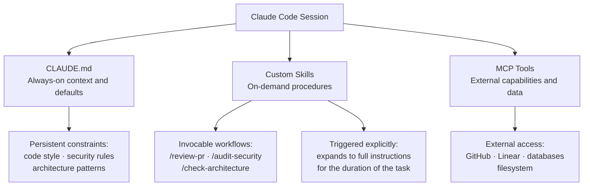

## Custom Skills: Encoding Team Workflows as Invocable Commands

**Related to:** [Tooling Overview](00-overview.md) — Tool 4 · [Prompting: Prompt Library Management](../Prompting/06-prompt-library.md)[^a] · [Workflows: Agentic Delegation](../Workflows/07-agentic-delegation.md)[^b] · [Issues: Prompt Fragmentation](../Issues/07-prompt-fragmentation.md)[^c]

---

## Overview

Claude Code's custom skills system — also called slash commands — allows teams to encode repeatable workflows as named, invocable commands. When a skill is invoked with `/skill-name`, Claude Code expands the skill's definition into full instructions at the moment of invocation and executes the workflow exactly as specified, without requiring the engineer to re-describe the process each time. This is meaningfully different from putting instructions into CLAUDE.md: CLAUDE.md configures Claude's persistent context and defaults, while skills are discrete, invocable procedures that fire on demand.[^1] For a small team with consistent workflows — code review, security analysis, architectural assessment — skills eliminate the prompt-rewriting overhead that accumulates across dozens of sessions per week.[^2]

The skills system occupies a specific position in the tooling hierarchy. CLAUDE.md handles what Claude always knows and how it always behaves; MCP tools extend what Claude can access and do externally; skills encode what Claude should do step-by-step when asked to perform a specific named task. A well-designed skill library captures the team's most-repeated workflows at a level of precision that would be tedious to type each time but is entirely appropriate to encode once, review as a team, and invoke reliably.[^3] This memo covers what skills are, how to design them well, how to build a shared team library, how to apply them to code review workflows, and how to prevent the library from growing stale.

---

## Section 1: What Custom Skills Are

**Description:** Custom skills are Markdown files stored in `.claude/commands/` at the repository root (for project-level skills) or in `~/.claude/commands/` (for personal skills available across all projects). Each file's name becomes the slash command: a file named `review.md` becomes `/review`. When an engineer types `/review`, Claude Code reads the file's contents and expands them into the active session as full instructions — the skill's Markdown becomes Claude's operating procedure for the duration of that invocation.[^1] Skills differ from MCP tools in that they do not provide external capabilities; they provide procedural instructions. An MCP tool might give Claude access to a database; a skill tells Claude how to conduct a thorough database-schema review using whatever context is available in the session.

The distinction between skills and CLAUDE.md is one of scope and trigger. CLAUDE.md instructions apply to every interaction in a session — they define defaults, constraints, and persistent context. Skills are invoked explicitly and apply to a specific task within a session. Encoding something as a skill rather than a CLAUDE.md instruction signals: "This is not something Claude should always do; it is something Claude should do when asked." A code review checklist belongs in a skill; the requirement to never use `var` in TypeScript belongs in CLAUDE.md.[^4] Getting this distinction right keeps both the skills library and CLAUDE.md lean and purposeful.[^2]

**Recommended Practice:**
- Store project-level skills in `.claude/commands/` at the repository root, checked into version control so every team member shares the same skill set. Personal skills that are not team-relevant belong in `~/.claude/commands/` and stay outside version control.[^1]
- Name skill files with a verb-noun pattern (`review-pr.md`, `audit-security.md`, `check-architecture.md`) so the resulting slash commands are self-documenting and predictable for new team members.[^4]
- Include a one-paragraph description at the top of every skill file explaining what the skill does, when to invoke it, and what output it produces. This serves as both documentation and as orientation for Claude when the skill expands.[^2]
- Distinguish clearly between skills (invocable procedures) and CLAUDE.md (persistent defaults) before encoding any new workflow. If you find yourself wanting Claude to always do something, put it in CLAUDE.md. If you want it available on demand, make it a skill.[^3]

---

## Section 2: Designing Effective Skills

**Description:** The most common failure mode in skill design is over-specification: encoding so many conditions, edge cases, and sub-steps into a single skill that it becomes brittle and produces inconsistent results. Effective skills follow the single-responsibility principle — one skill, one clearly scoped task. A skill that is simultaneously a code review, a security audit, and an architectural assessment will produce worse results than three separate focused skills, because each invocation will trade depth for breadth and Claude will allocate attention across too many dimensions simultaneously. The single-responsibility principle also makes skills easier to maintain: a narrowly scoped skill has a clear test for correctness, while a broad skill is difficult to evaluate or improve.

Trigger clarity is the second design dimension. A skill's trigger — the moment when an engineer would reach for it — should be unambiguous. If two skills might plausibly be invoked for the same situation, one of them is redundant or the two are insufficiently differentiated. A skill for reviewing PR diffs (`/review-pr`) and a skill for reviewing a full module before a major release (`/release-review`) serve different triggers and different depths of analysis; both are justified.[^6] When designing a new skill, the test is: can an engineer on the team, reading the slash command name alone, correctly predict when to use it? If not, the name or scope needs refinement before the skill is added to the shared library.

**Recommended Practice:**
- Apply the single-responsibility principle strictly: each skill should do one thing and produce one type of output. If you find yourself writing "and also" in a skill description, split it into two skills.
- Define the trigger condition explicitly in the skill file's opening paragraph. State what state the repository or session must be in for this skill to be appropriate, and what it is not for.[^4]
- Avoid encoding knowledge that belongs in CLAUDE.md into a skill. If a constraint should apply universally (no direct database mutations, always write tests before implementation), it belongs in CLAUDE.md, not in a skill that might be skipped.[^1]
- After writing a first draft of a skill, test it in three real sessions before adding it to the shared library. Skills that work well in theory often need adjustment once they encounter actual codebases; building in a trial period catches design flaws before the skill is team-standard.[^6]

---

## Section 3: Building a Team Skill Library

**Description:** A team skill library is a shared, versioned collection of `.claude/commands/` files that encodes the team's most-repeated AI-assisted workflows. The value of a shared library over individual engineers maintaining their own skills is consistency: when everyone uses the same `/review-pr` skill, PR reviews have a predictable structure, findings are comparable across reviewers, and the quality of AI-assisted review improves as the skill is refined based on collective feedback. The library is most useful when it is small enough to be well-maintained: a library of five highly reliable skills is more valuable than a library of twenty skills of varying quality and unknown reliability.

Naming conventions and a review process before adding new skills are the two structural requirements that keep a team library functional over time. Without naming conventions, the library accumulates redundant or ambiguous commands that engineers avoid because they cannot predict what they will do. Without a review process, skills are added impulsively and the library grows to include skills that duplicate CLAUDE.md instructions, overlap with each other, or have never been tested against real sessions. Both requirements are lightweight to implement: a naming convention fits in a single paragraph of documentation, and a review process can be as simple as requiring one other engineer to test the skill in a real session before it is merged.

**Recommended Practice:**
- Adopt a naming convention for the shared library before adding the first skill. Recommended: `{verb}-{scope}.md` where verb is the action (`review`, `audit`, `check`, `generate`) and scope is the target (`pr`, `security`, `architecture`, `migration`). Document the convention in a `README.md` in `.claude/commands/`.
- Require that new skills pass a two-session test — tested by the author and one other team member in real sessions — before being merged into the shared library. Include the test session notes as a comment in the PR that adds the skill.
- Version the shared skill library with the repository. When a skill is modified, record the change in the PR description so the team understands what changed and why. Skills that change frequently are signals that they are either too broad or not well-understood.[^1]
- Keep the shared library small: target five to eight skills that cover the team's most common AI-assisted workflows. Prefer depth and reliability in a small library over breadth in a large one. Additional candidate skills can live in a `candidates/` subdirectory until they have proven value.[^3]

---

## Section 4: Skills for Code Review Workflows

**Description:** Code review is the highest-value application domain for the team skills library. The writer/reviewer pattern — in which the same AI session that wrote code then reviews it from a critic's perspective — is most effective when the reviewer role is invoked as a structured skill rather than an ad hoc request. A `/review-pr` skill that specifies the review dimensions (logic correctness, test coverage, security implications, naming clarity, CLAUDE.md constraint adherence) produces more consistent and actionable findings than asking Claude to "review this" with no structure.[^9] The skill encodes the team's definition of a good review, making that standard replicable across every PR regardless of who invokes it.

Security review and architectural assessment are natural extensions of the review skill domain. A `/audit-security` skill that encodes the team's specific security concerns — the types of vulnerabilities most relevant to the stack, the compliance constraints from CLAUDE.md, the known high-risk areas of the codebase — produces security findings that are calibrated to the team's actual risk profile rather than generic vulnerability lists.[^10] An `/check-architecture` skill that embodies the team's architectural principles (bounded context boundaries, API contract requirements, dependency direction rules) functions as an automated architectural checklist that applies consistently even when the team is moving fast.[^2]

**Recommended Practice:**
- Create a `/review-pr` skill as the first entry in the shared library. Define the review dimensions explicitly: correctness, test coverage, security surface, CLAUDE.md constraint adherence, and naming/readability. The skill should output a structured list of findings by dimension, with severity ratings.[^9]
- Create a `/audit-security` skill that references the specific security constraints in CLAUDE.md and adds stack-specific vulnerability categories (e.g., SQL injection surface, authentication boundary checks, dependency vulnerability patterns relevant to the team's stack).[^10]
- Create a `/check-architecture` skill that encodes the team's architectural principles as a checklist. Each principle should be a named item Claude checks explicitly, with a pass/fail determination and an explanation for any failures.[^6]
- For the writer/reviewer pattern, the review skill should explicitly instruct Claude to adopt a critical perspective distinct from the implementation perspective — to look for what is wrong, not to defend what was written. Include this role-shift instruction explicitly in the skill definition.

---

## Section 5: Skill Maintenance and Deprecation

**Description:** A skill library that is not actively maintained degrades in the same way that documentation degrades: it drifts out of alignment with actual practice, accumulates dead weight, and gradually stops being trusted by the team. Staleness signals are the primary indicator that a skill needs attention: if engineers are frequently editing a skill's output before using it, the skill is not well-calibrated; if a skill is rarely invoked, it is either redundant or solving a problem that is no longer common; if a skill produces findings that do not match the team's current standards, it has not kept pace with the team's evolving practices.

A quarterly audit of the skill library is the minimum maintenance cadence. The audit should answer three questions for each skill: Is it still being invoked? Is its output still useful without significant editing? Has anything changed in CLAUDE.md, the stack, or the team's practices that should update the skill's instructions? Skills that no longer pass this audit should be deprecated explicitly — either removed from the library or moved to a `deprecated/` subdirectory with a note explaining what replaced them. A library that shrinks during an audit is healthier than one that only grows.

**Recommended Practice:**
- Establish staleness signals for the library: if a skill has not been invoked in the past 30 days or if its output requires editing more than 50% of the time, flag it for review at the next quarterly audit.
- During the quarterly audit, check each skill against the current CLAUDE.md and the current MCP tool set. Skills that duplicate CLAUDE.md instructions should be simplified; skills that are better implemented as MCP tool workflows should be migrated and removed.
- When deprecating a skill, do not silently delete it. Add a `deprecated/` subdirectory, move the skill there with a `DEPRECATED.md` note explaining what replaced it and when, and announce the deprecation in the team's engineering channel. This preserves the skill's history and prevents engineers from re-adding it.
- Assign skill library ownership to a named role (the Architect, in this team's structure). The owner is responsible for the quarterly audit, for reviewing new skill additions, and for ensuring the library reflects current team practice. Without a named owner, maintenance defaults to nobody.

---

## Summary of Recommended Practices

| Practice | Immediate Action | Owner |
|---|---|---|
| What Custom Skills Are | Add `.claude/commands/` to the repository; document the skills system in the team onboarding guide | Architect |
| Designing Effective Skills | Audit any existing ad-hoc prompts the team reuses; identify candidates for skill encoding | Architect |
| Building a Team Skill Library | Establish naming conventions; create `README.md` in `.claude/commands/`; set review requirement for new additions | Architect |
| Skills for Code Review Workflows | Implement `/review-pr`, `/audit-security`, and `/check-architecture` as the initial shared skill library | Backend lead |
| Skill Maintenance and Deprecation | Schedule quarterly skill audit; assign library ownership to Architect | Architect |

---

[^1]: Anthropic — "Claude Code Slash Commands," Claude Code Documentation, 2026. https://docs.anthropic.com/en/docs/claude-code/slash-commands
 Skills system architecture: how `.claude/commands/` files become slash commands, the difference between project-level and personal skills, and the expansion mechanism at invocation time.

[^2]: Boris Cherny — "How Boris Uses Claude Code," January 2026. https://howborisusesclaudecode.com
 Skill design philosophy: the distinction between what belongs in CLAUDE.md vs. what belongs in a skill; single-responsibility design as the primary quality criterion for effective commands.

[^3]: Addy Osmani — "My LLM Coding Workflow Going Into 2026," April 2026. https://addyosmani.com/blog/ai-coding-workflow/
 Skills as workflow encodings: how reusable slash commands reduce prompt-rewriting overhead and enable consistent AI-assisted workflows across a team.

[^4]: Anthropic — "CLAUDE.md Configuration Guide," Claude Code Documentation, 2026. https://docs.anthropic.com/en/docs/claude-code/memory
 CLAUDE.md vs. skills distinction: persistent context and universal defaults belong in CLAUDE.md; invocable procedures belong in skills. Trigger clarity as a design criterion.

[^6]: Dex Horthy (YC Root Access) — "Advanced Context Engineering for Agents," YouTube, August 2025. https://www.youtube.com/watch?v=IS_y40zY-hc
 - Trigger clarity in skill design: defining the precise conditions under which a skill should be invoked and explicitly excluding adjacent use cases
 - Skill naming and discoverability: how verb-noun naming conventions make slash commands predictable for new team members
 - Trial period for new skills: why testing a skill in three real sessions before library inclusion prevents design flaws from becoming team-standard

[^9]: Fannar Steinn Aðalsteinsson et al. — "Rethinking Code Review Workflows with LLM Assistance: An Empirical Study," arXiv:2505.16339, May 22, 2025. https://arxiv.org/abs/2505.16339
 Structured review skills: how explicitly encoding review dimensions (correctness, coverage, security, naming) in a skill produces more consistent and actionable findings than unstructured review requests.

[^10]: CodeRabbit — "AI Code Review Best Practices 2026," CodeRabbit Blog, 2026. https://www.qodo.ai/blog/5-ai-code-review-pattern-predictions-in-2026/
 Security review skills: calibrating audit skills to team-specific vulnerability categories rather than generic lists; the role of CLAUDE.md security constraints in security review skill design.

[^a]: [Prompting: Prompt Library Management](../Prompting/06-prompt-library.md) — the prompt library is the source repository from which skills are extracted; high-value, stable prompts become skills, making the prompt library the upstream dependency.

[^b]: [Workflows: Agentic Delegation](../Workflows/07-agentic-delegation.md) — custom skills are the primary mechanism for packaging agentic workflows as invocable commands; delegation patterns become skills once they are stable.

[^c]: [Issues: Prompt Fragmentation](../Issues/07-prompt-fragmentation.md) — custom skills eliminate per-engineer prompt variation for common tasks by standardizing the invocation; team-wide skills are the distribution mechanism for consistent prompting.
