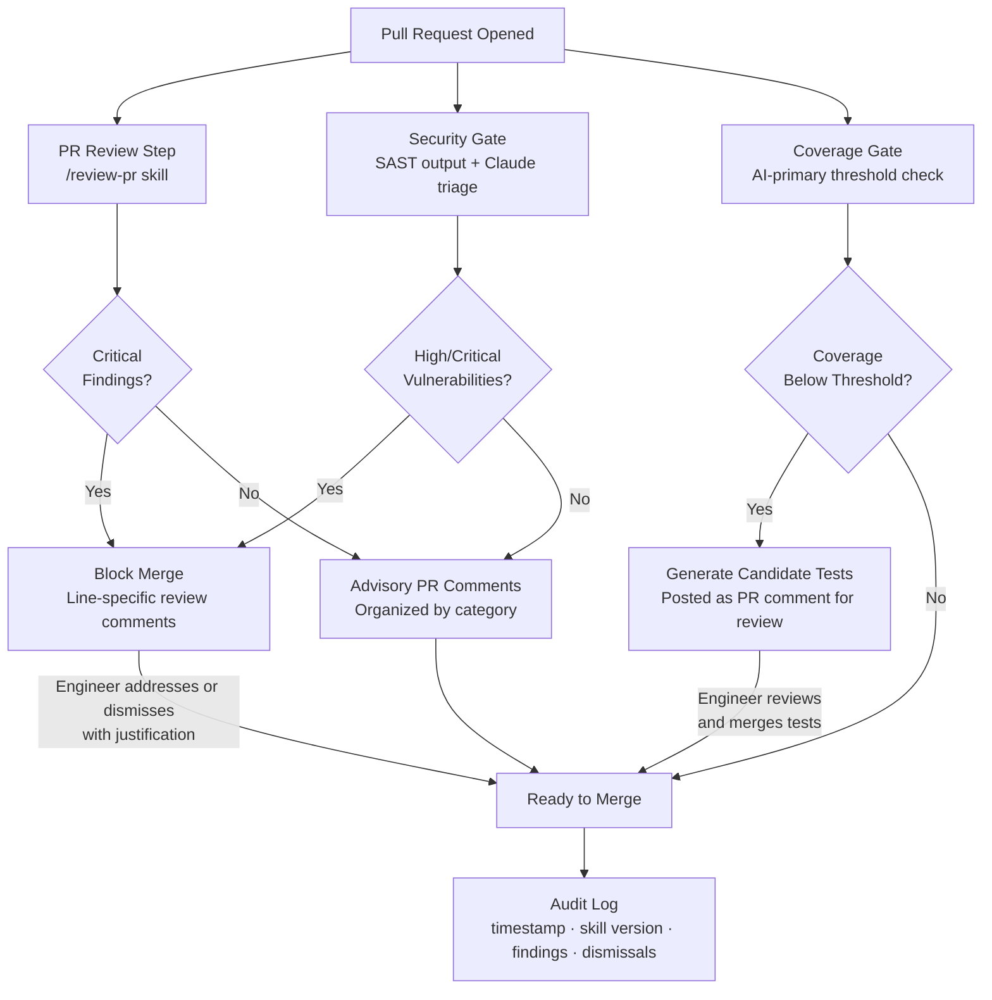

## CI/CD Integration: Running Claude Code in the Pipeline

**Related to:** [Tooling Overview](00-overview.md) — Tool 6 · [QA & Testing: AI-Generated Test Coverage](../QA%20%26%20Testing/02-ai-generated-test-coverage.md)[^a] · [Security: SAST and DAST Integration](../Security/02-sast-dast-integration.md)[^b] · [Governance: Review Policies](../Governance/01-review-policies.md)[^c] · [Metrics: AI Code Quality](../Metrics/01-ai-code-quality.md)[^d]

---

## Overview

Running Claude Code in CI/CD pipelines extends its analysis capabilities beyond individual engineer sessions and into the shared quality gates that every PR must pass. A well-configured pipeline integration means that structured code review, security scanning, and test coverage verification happen consistently on every merge attempt — not just when an engineer remembers to run them locally.[^1] The value proposition is consistency: a CI step that runs the same `/review-pr` skill on every PR produces comparable findings across the entire codebase over time, making quality trends visible and holding the team to a standard that does not depend on any individual's diligence or availability.

This memo covers when CI-run Claude Code adds value versus when it adds noise, how to configure automated PR review steps, how to integrate Claude Code with security gate tooling, how to use CI to enforce test coverage standards on AI-primary code, and how to maintain a governance-grade audit trail of pipeline runs. The common thread is intentionality: each CI integration should have a defined purpose, a defined scope, and a defined threshold for what constitutes a blocking finding versus an advisory comment. Pipelines without these definitions accumulate Claude Code steps that generate noise, fatigue engineers, and are eventually disabled — which is worse than never adding them.[^2]

---

## Section 1: Claude Code in CI Pipelines

**Description:** The central question for any CI integration is whether the automated run will produce findings that engineers act on. Claude Code in CI adds value when the analysis it performs is sufficiently consistent and calibrated to the codebase that its findings have a low false-positive rate and high actionability. It adds noise when the analysis is too broad, too generic, or insufficiently constrained by the team's actual standards — producing long lists of suggestions that engineers learn to dismiss.[^3] The difference between value and noise is almost entirely in the quality of the skill or prompt driving the CI session. A CI step backed by a well-designed `/review-pr` skill with clearly defined review dimensions and severity thresholds produces actionable findings. A CI step that asks Claude to "review this code" produces noise.

CI-run Claude Code is best positioned in the pipeline at the PR level, not the commit level. Running analysis on every commit produces volume without selectivity; running it on every PR merge attempt means the analysis happens at a decision point, when engineers are already reviewing work and findings are immediately actionable. The pipeline should be configured to distinguish between blocking findings (those that prevent merge) and advisory findings (those that are posted as PR comments for consideration). Only a narrow category of findings — critical security vulnerabilities, violations of CLAUDE.md constraints, test coverage below threshold — should block. Everything else should advise.

**Recommended Practice:**
- Define the purpose of each CI Claude Code step before implementing it. Write a one-sentence statement of what the step analyzes, what constitutes a blocking finding, and what constitutes an advisory finding. Do not add a CI step without this definition.[^3]
- Run Claude Code analysis at the PR level, triggered on the `pull_request` event, not on every push. This scopes the analysis to decision points and keeps pipeline run volume proportional to actual review activity.
- Configure CI sessions with explicit `--allowedTools` scoping. A PR review session needs read access to the repository and write access to post PR comments; it does not need filesystem write access, execution access, or database connections. Scope permissions to exactly what the step requires.[^1]
- Include the CLAUDE.md constraints in the CI session context. The CI analysis should be calibrated to the team's actual standards, not generic best practices. A CI step that does not know about the team's architectural constraints or security requirements cannot enforce them.[^2]

---

## Section 2: Automated PR Review Steps

**Description:** An automated PR review step uses Claude Code to run the writer/reviewer analysis — the same pattern used interactively by engineers — at pipeline time, formatting its findings as structured PR comments that are visible in the code review interface alongside human reviewer comments.[^5] The step invokes the team's `/review-pr` skill against the PR diff, receives structured findings, and posts them to the PR using the GitHub API or equivalent. The result is that every PR arrives at human review with a preliminary structured analysis already attached — human reviewers can focus on the dimensions the automated review flagged rather than conducting a baseline survey of the entire diff.

The formatting of automated findings matters as much as their content. Findings posted as a single long comment are harder to act on than findings posted as line-specific review comments pointing directly at the code they reference.[^6] The CI step should be configured to parse Claude's structured output and translate it into the appropriate comment format: critical findings as blocking review comments with specific line references, advisory findings as general PR comments organized by category. Engineers should be able to close advisory comments with a single click once reviewed; only blocking findings should require a code change or explicit dismissal with justification.

**Recommended Practice:**
- Use the team's `/review-pr` skill as the driver for the automated PR review step, so that CI review and interactive review apply the same standards and produce comparable output.[^5]
- Configure the step to post findings in two channels: critical findings as blocking review comments with line references, advisory findings as a single structured PR comment organized by category (correctness, coverage, security, style). Never mix blocking and advisory findings in the same comment.[^6]
- Set a maximum token budget for the CI review session to prevent long-running analysis on very large PRs. For PRs above a size threshold (e.g., 500 lines changed), configure the step to analyze only the highest-risk files based on change type rather than attempting full-diff analysis.
- Establish a human override mechanism: engineers should be able to dismiss a CI finding with a justification comment, and that dismissal should be logged for audit. Findings that are frequently dismissed are signals that the review skill needs recalibration, not that engineers should stop dismissing.[^2]

---

## Section 3: Security Gate Integration

**Description:** Security gate integration connects Claude Code's contextual analysis with dedicated SAST (static analysis security testing) tool output. SAST tools like Veracode, Sonar, and Semgrep produce structured vulnerability reports; Claude Code can consume those reports as context and produce an assessment of which findings are genuinely exploitable in this codebase given its specific architecture, the constraints defined in CLAUDE.md, and the change context of the current PR.[^7] This combination addresses a persistent problem with SAST-only security gates: SAST tools produce findings without context, leading to high false-positive rates that train engineers to ignore security alerts. Claude Code's contextual reasoning can triage SAST output against the actual codebase, reducing noise and increasing the signal quality of security findings that reach engineers.

Feeding CLAUDE.md security constraints into the CI security review step is critical for calibration. If CLAUDE.md documents the team's known high-risk areas, the authentication boundary, the data classification requirements, and the prohibited patterns — and the CI step includes this context — the security review is anchored to the team's actual risk profile rather than generic vulnerability categories.[^8] A finding that would be critical in a public API endpoint may be informational in an internal administrative tool; Claude Code can make that distinction if given the codebase context. Without CLAUDE.md context, CI security review is generic; with it, the review is specific.

**Recommended Practice:**
- Feed SAST tool output (Veracode, Sonar, or equivalent) into the Claude Code security review session as context. Configure the CI step to retrieve the SAST report, include it in the session prompt alongside the PR diff, and instruct Claude to triage findings against the codebase architecture described in CLAUDE.md.[^7]
- Include the CLAUDE.md security constraints section explicitly in the CI security review session prompt. The session should know the team's authentication boundary, data classification rules, and prohibited patterns before it begins analysis.[^8]
- Define severity thresholds for security findings before deployment. Only critical and high findings (as assessed by Claude in context, not raw SAST severity) should block merge. Medium findings should generate advisory comments. Low findings should be batched into a weekly security summary, not posted per-PR.[^9]
- Run the security gate step as a separate pipeline job from the general PR review step, with its own permission scope. Security scanning sessions should have read-only access to the codebase and no access to production systems, credentials, or external APIs.[^1]

---

## Section 4: Test Generation and Coverage Gates

**Description:** AI-primary code — code written substantially by Claude Code in an interactive session — carries a systematic test coverage risk: Claude tends to write implementation code faster than test code, and engineers working in flow with an AI assistant may reach the end of a feature with comprehensive implementation and sparse tests. CI test generation and coverage gates address this by enforcing that PRs from AI-primary sessions meet a coverage threshold before merge, and optionally by having Claude Code generate missing tests as part of the pipeline itself. The coverage gate is the enforcement mechanism; test generation is the assistance mechanism that helps PRs pass the gate without requiring the engineer to manually write all missing tests.

Test quality is a distinct concern from test coverage. A coverage gate enforces that lines are executed by tests; it does not enforce that those tests would catch a regression. Claude Code in CI can run a test quality check alongside coverage measurement: examining whether the tests for changed code assert meaningful properties (not just that the function runs without error), whether edge cases are covered, and whether the test names describe the behavior being verified. This quality check should produce advisory findings rather than blocking ones — flagging low-quality tests for human review rather than blocking merge, because the line between a simple smoke test and an inadequate test depends on context that is difficult to assess automatically.

**Recommended Practice:**
- Define per-PR coverage thresholds for AI-primary code in `.claude/settings.json` or CI configuration. A reasonable starting threshold is 80% line coverage for new code in PRs where Claude Code was the primary author. Tag AI-primary PRs using a consistent label (e.g., `ai-primary`) to enable threshold differentiation.
- Configure a test generation step that runs after coverage measurement for PRs that fall below threshold. The step should invoke Claude Code with the uncovered lines as context and generate candidate tests, posting them as a PR comment for engineer review before they are added to the codebase. Generated tests require human review before merge — never auto-commit generated test code.
- Run the test quality check as an advisory step with findings formatted as a structured comment. Flag tests that only assert function execution without asserting return values, tests with no assertions, and tests that duplicate existing coverage without adding new assertions.
- Track coverage trend data across PRs over time. A CI step that records per-PR coverage and plots it over time reveals whether AI-primary development is creating a coverage deficit that accumulates across releases — an early warning system for technical debt in the test suite.

---

## Section 5: Pipeline Governance and Audit

**Description:** Every CI Claude Code run should produce a durable, reviewable audit record. The audit record answers: what analysis was requested, what context was provided (including which CLAUDE.md version and which skill version), what findings were produced, which findings were suppressed or dismissed by engineers, and which resulted in code changes. This record serves two purposes: operational (enabling the team to understand how CI analysis is being used and whether it is effective) and compliance (demonstrating to auditors that AI-assisted development includes systematic security and quality review at the pipeline level).[^13] Without this record, the CI integration is a black box — the team knows Claude Code ran, but cannot assess the quality of the analysis or whether its findings were appropriately addressed.

Tracking suppressed findings is as important as tracking acted-upon findings. If engineers are suppressing 80% of CI security findings, the security gate is producing noise rather than signal — and the suppression pattern should trigger a review of the security skill's calibration. If certain finding categories are never suppressed, those categories are reliably actionable. The ratio of acted-upon to suppressed findings per category, tracked over time, is the primary quality metric for the CI integration itself. This feedback loop is what separates a CI integration that improves over time from one that ossifies around its initial configuration.

**Recommended Practice:**
- Log every CI Claude Code run to a durable store (a database table, a structured log sink, or a dedicated audit service). The log entry should include: timestamp, PR identifier, skill version used, CLAUDE.md version hash, finding count by severity, and session duration.[^13]
- Implement a finding dismissal workflow that requires a justification comment for every blocked finding that is dismissed rather than addressed. Capture the justification in the audit log alongside the finding. Dismissals without justification should re-block the PR.
- Generate a monthly pipeline governance report that shows: finding volume by category, act-on rate by category, dismissal rate by category, and coverage trend. Share this report in the team's engineering channel. Use it to identify skills that need recalibration and categories that are consistently producing noise.[^9]
- Assign the Architect as the governance owner for the CI pipeline integration. The Architect reviews the monthly report, proposes skill adjustments based on act-on and dismissal trends, and is responsible for the quarterly pipeline audit that reviews the full configuration against the team's current standards.[^2]

---

## Summary of Recommended Practices

| Practice | Immediate Action | Owner |
|---|---|---|
| Claude Code in CI Pipelines | Define purpose, blocking threshold, and advisory threshold for each planned CI step before implementation | Backend lead |
| Automated PR Review Steps | Implement PR review CI step backed by `/review-pr` skill; configure two-channel finding output (blocking comments + advisory comment) | Backend lead |
| Security Gate Integration | Integrate SAST output with Claude Code context; include CLAUDE.md security constraints in session prompt; define severity thresholds | Architect |
| Test Generation and Coverage Gates | Define coverage thresholds for AI-primary PRs; configure test generation step for below-threshold PRs | Backend lead |
| Pipeline Governance and Audit | Implement CI run logging; add dismissal justification requirement; schedule monthly governance report | Architect |

---

[^1]: Anthropic — "Claude Code Headless Mode," Claude Code Documentation, 2026. https://code.claude.com/docs/en/headless
 CI pipeline integration architecture: triggering on PR events, `--allowedTools` scoping for CI sessions, CLAUDE.md context injection, and the permission model for unattended pipeline runs.

[^2]: Boris Cherny — "How Boris Uses Claude Code," January 2026. https://howborisusesclaudecode.com
 CI integration intentionality: why each pipeline step needs a defined purpose and threshold; the noise-vs-value distinction; human override mechanisms for blocking findings.

[^3]: Fannar Steinn Aðalsteinsson et al. — "Rethinking Code Review Workflows with LLM Assistance: An Empirical Study," arXiv:2505.16339, May 22, 2025. https://arxiv.org/abs/2505.16339
 CI review quality: the relationship between skill/prompt design and false-positive rate; how generic prompts produce noise and structured prompts produce actionable findings; false-positive fatigue as a pipeline risk.

[^5]: CodeRabbit — "AI Code Review Best Practices 2026," CodeRabbit Blog, 2026. https://www.qodo.ai/blog/5-ai-code-review-pattern-predictions-in-2026/
 Writer/reviewer pattern in CI: how automated review using the same skill as interactive review produces consistent standards; the role of CI review in preparing PRs for human reviewer focus.

[^6]: Addy Osmani — "My LLM Coding Workflow Going Into 2026," April 2026. https://addyosmani.com/blog/ai-coding-workflow/
 Finding format and actionability: why line-specific review comments are more actionable than general summaries; the engineering UX of CI finding presentation in the code review interface.

[^7]: Veracode — "How AI is Transforming Application Security Testing," Veracode Blog, 2026. https://www.veracode.com/blog/ai-transforming-application-security-testing/
 SAST and Claude Code integration: how contextual AI analysis reduces SAST false-positive rates; feeding SAST output as session context; the complementary strengths of rule-based SAST and contextual LLM analysis.

[^8]: Sonar — "AI Code Review in the Security Gate: 2026 Configuration Guide," Sonar Blog, 2026. https://www.sonarsource.com/blog/how-to-optimize-sonarqube-for-reviewing-ai-generated-code/
 CLAUDE.md as security calibration context: how project-specific security constraints anchor CI security review to actual risk profiles; severity threshold configuration for blocking vs. advisory security findings.

[^9]: Dark Reading — "AI-Assisted Security Code Review: Findings from 200 Enterprise Deployments," Dark Reading, March 2026. https://owaspai.org/docs/ai_security_overview/
 Security gate threshold configuration: the operational consequences of miscalibrated thresholds; monthly governance reporting as a signal for recalibration; act-on vs. suppression rates as pipeline quality metrics.

[^13]: Matt Doughty (Prefactor) — "Audit Trails in CI/CD: Best Practices for AI Agents," Prefactor Blog, 2025. https://prefactor.tech/blog/audit-trails-in-ci-cd-best-practices-for-ai-agents
 Pipeline audit log requirements: what a compliance-grade CI Claude Code run record must include; the governance value of logging skill version and CLAUDE.md version hash alongside findings.

[^a]: [QA & Testing: AI-Generated Test Coverage](../QA%20%26%20Testing/02-ai-generated-test-coverage.md) — CI/CD pipelines run coverage analysis on every merge; the integration document describes the pipeline and the QA document defines what the coverage gates require.

[^b]: [Security: SAST and DAST Integration](../Security/02-sast-dast-integration.md) — SAST/DAST scanning is a primary CI/CD integration component for AI-generated code; the two documents describe the security tools and their pipeline integration.

[^c]: [Governance: Review Policies](../Governance/01-review-policies.md) — CI/CD gates enforce the automated checks that review policies require as merge conditions; the pipeline is the technical enforcement layer for policy.

[^d]: [Metrics: AI Code Quality](../Metrics/01-ai-code-quality.md) — CI/CD pipelines generate the quality signal data that the health dashboard aggregates; the integration is the data collection layer for quality metrics.
