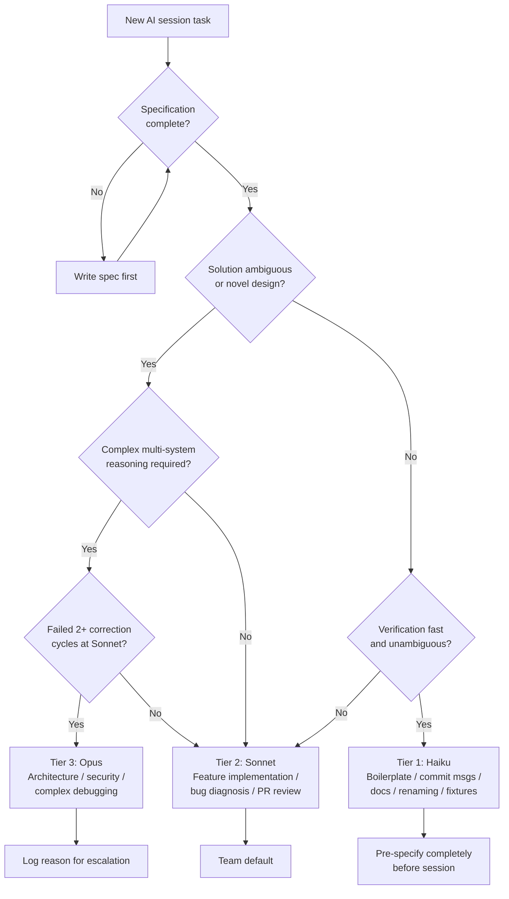

## Model Selection Strategy

**Related to:** [Cost & Token Economics Overview](00-overview.md) — Cost Area 2 · [Workflows: Task Decomposition](../Workflows/02-task-decomposition.md) · [Governance: AI Usage Policy](../Governance/02-ai-usage-policy.md) · [Tooling: CLAUDE.md Configuration](../Tooling & Configuration/01-claude-md-configuration.md)

---

## Overview

Model selection is the most impactful single variable in Claude Code cost management — more impactful than context size, prompt structure, or session length for teams that have not yet established a selection policy. The Claude model family in 2026 spans a capability and cost range where the difference between the cheapest and most expensive model is approximately 20× on a per-token basis. A team that defaults to Opus for every session is paying that 20× premium regardless of whether the task benefits from Opus-tier capability. A team that defaults to Haiku is saving money on simple tasks at the cost of quality degradation on complex ones. The goal of a model selection strategy is to match model capability to task complexity across the actual distribution of work the team runs.[^1]

The economic stakes are concrete. For a team of 11 running an average of three sessions per engineer per day, each session averaging 30,000 input tokens and 3,000 output tokens, the monthly token volume is approximately 300 million input tokens and 30 million output tokens. The cost difference between running all sessions at Opus tier versus all sessions at Sonnet tier is roughly 3–5×; the difference between Opus and a Haiku/Sonnet mix calibrated to task complexity is roughly 8–15×. Model selection policy, more than any other single practice, determines whether the team's AI spend is in the hundreds or thousands of dollars per month for equivalent engineering output.[^2]

---

## Section 1: The Three-Tier Task Taxonomy

**Description:** The foundation of a model selection strategy is a task taxonomy — a shared classification of the work the team does into groups that correspond to appropriate model tiers. Without a taxonomy, each engineer makes individual model selection decisions based on habit or intuition, producing inconsistent outcomes: the same task type handled at different tiers by different engineers on different days. A shared taxonomy converts individual decisions into a consistent team policy that can be reviewed, improved, and enforced through CLAUDE.md defaults.[^1]

The three tiers correspond to the primary Claude model tiers and to the cognitive complexity profile of typical software engineering tasks. The taxonomy is not a rigid rule — it is a default classification that engineers can override with explicit justification when a task does not fit its expected tier. The value is that the override requires a deliberate judgment rather than an unreflective default, which surfaces model selection decisions that the team can learn from.[^3]

**Recommended Practice:**
- Define Tier 1 (Haiku) tasks for the team's specific codebase: boilerplate generation, test fixture creation, documentation formatting, renaming refactors with a clear specification, extracting functions with obvious boundaries, and generating commit messages. These are tasks where the specification is complete, the solution is not ambiguous, and verification is fast.[^1]
- Define Tier 2 (Sonnet) tasks as the team's default category: feature implementation from a spec, bug diagnosis with a reproduction case, code review of a PR with defined scope, moderate refactoring with explicit goals, integration test writing, and API endpoint implementation. These tasks require genuine code comprehension and multi-step reasoning but not extended cross-system analysis.[^3]
- Define Tier 3 (Opus) tasks narrowly, reserving them for work that demonstrably benefits from the additional reasoning depth: architectural decisions affecting multiple systems, complex debugging spanning three or more interacting subsystems, security threat analysis, and tasks that have completed two or more correction cycles at Sonnet tier without resolution. The key test for Opus is whether the task complexity justifies the 3–5× cost premium over Sonnet — not whether Opus would theoretically perform better, but whether the difference is large enough to be worth the cost.[^1]
- Encode the taxonomy in CLAUDE.md so it is available at session start without requiring engineers to reference separate documentation: include the tier definitions and examples in a "Model Selection" section that engineers can consult when the appropriate tier is unclear.

---

## Section 2: Setting and Enforcing Defaults

**Description:** Defaults matter because most sessions are started without deliberate model selection thought. An engineer who opens Claude Code to fix a minor bug and does not think explicitly about model tier will use whatever the default is. If the default is Opus, that bug fix costs 20× more than it would at Haiku. Defaults are not the worst-case scenario — they are the average case, repeated hundreds of times per month across the team. Calibrating the default is therefore the highest-leverage model selection intervention available.[^4]

Sonnet is the recommended default for the team's general engineering work. It provides the reasoning capability required for the majority of software engineering tasks while costing approximately 3–5× less than Opus per token. It is also well-matched to the typical context window usage of engineering sessions: Opus's additional capability shows most clearly in tasks requiring complex multi-step reasoning over large contexts, which are not the majority of the team's daily sessions.[^3]

**Recommended Practice:**
- Set Sonnet as the team's default model in Claude Code's configuration. Document the rationale in CLAUDE.md and in the AI usage policy (see Governance: AI Usage Policy): "Default model is Sonnet. Use Haiku for tasks that match Tier 1 criteria. Use Opus only for tasks that match Tier 3 criteria or have failed two correction cycles at Sonnet."[^3]
- Configure model selection as part of project-specific CLAUDE.md files where the default should differ from the team default. A project that consists primarily of boilerplate generation may benefit from a Haiku default; a project involving architectural analysis may warrant a Sonnet default with a lower Opus escalation threshold.[^4]
- Track model selection distributions in the team's cost monitoring dashboard (see Cost Area 5: Cost Monitoring). If Opus usage is growing as a proportion of total sessions without a corresponding change in task complexity distribution, it is a signal that engineers are escalating to Opus by habit rather than by task classification.[^2]
- Review model selection decisions in the monthly cost stewardship review: are Opus sessions concentrated in the task types defined in the taxonomy? Are there recurring task types at Opus tier that could be addressed with better CLAUDE.md context at Sonnet tier? The review converts aggregate data into taxonomy refinements.

---

## Section 3: When Haiku Is Right

**Description:** Haiku is underused by most teams because it requires a deliberate selection decision — engineers default to Sonnet or Opus rather than explicitly choosing the lowest tier. The result is systematic overspend on tasks where Haiku would produce equivalent output. Identifying the specific task types where Haiku is appropriate for the team's codebase, and creating friction-reducing mechanisms for selecting it (saved presets, CLAUDE.md task-specific notes, script shortcuts), converts a theoretical cost saving into an actual one.[^1]

The quality difference between Haiku and Sonnet on well-specified, bounded tasks is small enough to be negligible for engineering purposes. When a task has complete specifications, a clear verification criterion, and no ambiguity about the approach, Haiku's constraint relative to Sonnet is primarily in handling ambiguity and reasoning through novel situations — neither of which is a significant factor for a task that is fully specified before the session starts.[^3]

**Recommended Practice:**
- Pre-specify Haiku sessions completely before starting: the task, the scope, the files to be modified, and the verification criterion should all be defined before the session opens. Haiku's quality on a fully specified task rivals Sonnet's; Haiku's quality on an underspecified task degrades more rapidly than Sonnet's when disambiguation is required.[^1]
- Use Haiku for the "administrative" layer of AI-assisted development: commit message generation, PR description drafting, changelog entries, inline comment writing, and test naming. These tasks consume engineering time but require minimal reasoning — Haiku handles them at full quality for 1/20 the cost of Opus.[^3]
- Evaluate Haiku for CI/CD pipeline integrations where AI is called at high frequency: automated code review comments on trivial style issues, automated test failure summaries, and automated PR categorization. High-frequency automated calls magnify cost differences — a task called 500 times per day costs 500× more at Opus than at Haiku.[^4]
- When a Haiku session produces inadequate output, escalate to Sonnet with the same task specification rather than immediately jumping to Opus. Haiku failures on specification-complete tasks are usually addressable with the modest additional capability of Sonnet, not the full capability of Opus.

---

## Section 4: Opus Escalation Criteria

**Description:** The value of Opus is not that it is the "best" model — it is that it is better than Sonnet at a specific set of tasks involving extended multi-step reasoning, ambiguous requirements, or synthesis across large and disparate context. For the majority of engineering tasks, Sonnet provides equal or near-equal quality at a fraction of the cost. The escalation criteria for Opus should be narrow, explicit, and applied with judgment rather than by default when a task "feels hard."[^5]

The most reliable escalation criterion is task failure: if a task has failed two or more correction cycles at Sonnet tier, the failure is likely attributable to either insufficient model capability or insufficient context — and trying Opus is a faster test of which factor is operative than extensive prompt iteration. If Opus resolves the failure quickly, capability was the constraint. If Opus also fails, context is the constraint and no model tier will resolve it — the problem is in the task specification or the context available, not the model.[^5]

**Recommended Practice:**
- Use Opus for architectural planning sessions that require reasoning across the full system: evaluating competing architectural approaches with shared context, identifying cross-cutting concerns in a proposed design, and assessing second-order effects of architectural changes. These are the task types where Opus's reasoning depth produces meaningfully different output from Sonnet.[^5]
- Invoke Opus for security threat analysis of complex integrations: threat modeling for new external API integrations, analyzing the security implications of architectural changes, and reviewing authentication and authorization logic in high-sensitivity modules. The cost of a security oversight in production outweighs the cost of an Opus session; this is the category where the quality premium is most justified.[^1]
- Reserve Opus for debugging sessions where the failure mode is non-obvious and spans multiple interacting systems. Bugs that involve race conditions, distributed system timing, unexpected interactions between three or more libraries, or platform-specific behavior are Opus-appropriate; bugs that involve a clear reproduction case and a localized failure are Sonnet-appropriate.[^5]
- Document Opus sessions in the team's session log with the reason for escalation. This creates the dataset to evaluate whether the Opus escalation was productive: did the additional capability resolve the task in fewer turns than Sonnet would have? Over time, this data refines the escalation criteria to be specific to the team's actual experience.

---

## Summary of Recommended Practices

| Practice | Immediate Action | Owner |
|---|---|---|
| Three-Tier Taxonomy | Define Tier 1/2/3 task lists for this codebase; encode in CLAUDE.md | Architect |
| Default Configuration | Set Sonnet as team default in Claude Code settings | Architect |
| Haiku Utilization | Identify team's Tier 1 task list; create Haiku session shortcuts | Backend lead |
| Opus Escalation | Document narrow Opus criteria; add two-correction-cycle rule to CLAUDE.md | Architect |

---

[^1]: Anthropic — "Models Overview," Anthropic API Documentation, 2026. https://docs.anthropic.com/en/docs/about-claude/models/overview
    Model capability and cost comparison across the Claude family; the 20× cost differential between Haiku and Opus; model selection by task type; the case for Sonnet as the general engineering default.

[^2]: WorkOS — "AI Development Costs in 2026: What Engineering Teams Are Actually Spending," WorkOS Blog, January 2026. https://workos.com/blog/ai-development-costs-2026
    Monthly token volume estimates for teams of 10–15; cost difference between Opus-default and tiered-selection teams; model selection as the primary lever for cost management at team scale.

[^3]: Simon Willison — "How I Use LLMs: A Pragmatic 2026 Field Guide," simonwillison.net, February 2026. https://simonwillison.net/2026/Feb/how-i-use-llms/
    Three-tier task classification in practice; Haiku quality on specification-complete tasks; Sonnet as the recommended general default; the marginal value of Opus on well-understood task types.

[^4]: Anthropic — "Best Practices for Claude Code," Claude Code Documentation, 2026. https://code.claude.com/docs/en/best-practices
    Default model configuration in Claude Code settings; project-specific CLAUDE.md model defaults; CI/CD integration model selection for high-frequency automated calls.

[^5]: Anthropic — "2026 Agentic Coding Trends Report," Anthropic, 2026. https://resources.anthropic.com/hubfs/2026%20Agentic%20Coding%20Trends%20Report.pdf
    Opus escalation criteria in agentic workflows; two-correction-cycle rule as a practical escalation trigger; architectural and security analysis as the primary Opus use cases; session logging for escalation criteria refinement.
