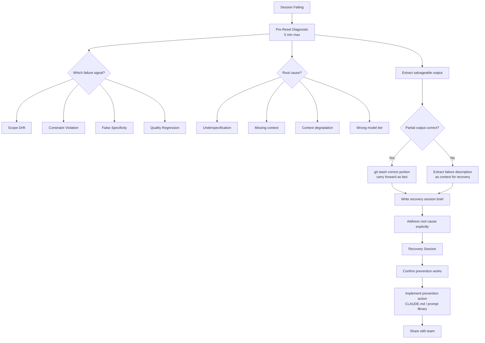

## Recovering from Bad Sessions

**Related to:** [Debugging & Troubleshooting Overview](00-overview.md) — Debugging Area 4 · [Debugging: Recognizing Session Failure Patterns](01-recognizing-session-failure-patterns.md) · [Debugging: Context Degradation](03-context-degradation.md) · [Workflows: Session Hygiene](../Workflows/04-session-hygiene.md) · [Tooling: CLAUDE.md Configuration](../Tooling & Configuration/01-claude-md-configuration.md)

---

## Overview

Recovery from a bad session is a distinct skill from preventing bad sessions. Prevention is the goal; recovery is the reality when prevention fails. Engineers who have not developed a structured recovery approach tend to respond to bad sessions in one of two costly ways: continuing to iterate corrections indefinitely (accumulating cost and time without resolution) or abandoning the session entirely without extracting what was useful (discarding progress that could have been preserved). A structured recovery approach extracts salvageable output, diagnoses the root cause, resets the session state cleanly, and converts the failure into a prevention action.[^1]

The economic case for structured recovery is straightforward. An unstructured recovery — continuing to correct a failing session without diagnosis — generates API cost at the full per-turn rate while producing diminishing returns. A structured recovery — five minutes of diagnosis, git stash of incorrect changes, and a fresh session with a revised specification — typically resolves the task in fewer total turns than the extended unstructured approach, and does so with higher quality output. The five-minute diagnostic investment pays for itself in reduced recovery session turns.[^2]

---

## Section 1: The Pre-Reset Diagnostic

**Description:** Before resetting a failing session, five minutes of structured diagnosis converts an isolated failure into a team learning. The diagnostic answers four questions: what went wrong (which failure signal was present), why it went wrong (specification problem, hallucination, context degradation, or wrong model tier), what from the session is salvageable, and what change to the next session will prevent the same failure. Without this diagnostic, the next session starts with the same conditions that caused the current one to fail.[^3]

The diagnostic is not a lengthy post-mortem — it is a brief structured reflection performed while the failure is fresh and the session context is visible. Engineers who perform the diagnostic consistently report that the majority of session failures fall into a small number of recurring categories specific to their codebase and workflow, and that recognizing these categories becomes faster with practice. The diagnostic accelerates over time.[^1]

**Recommended Practice:**
- Perform the pre-reset diagnostic by answering four questions in the session log before closing the session: (1) Which failure signal appeared (scope drift, constraint violation, false specificity, quality regression)? (2) What caused it (underspecification, missing context, context degradation, wrong model tier)? (3) What parts of the session output are correct and salvageable? (4) What will I change in the next session to prevent this failure?[^3]
- Keep the diagnostic short — five minutes maximum. The value of the diagnostic is in the habit and in the four answers, not in a comprehensive analysis. An engineer who spends 30 minutes on a diagnostic is investing too much; an engineer who skips it entirely is not learning from the failure.[^1]
- Record the diagnostic in the team's shared failure pattern log (see Recognizing Session Failure Patterns: Section 4). Individual diagnostics are useful; accumulated diagnostics that reveal patterns across engineers and sessions are what drive CLAUDE.md improvements and prompt library updates.[^4]
- Do not perform the diagnostic mentally — write it down, even briefly. Mental diagnostics are not recorded, not shared, and not available when the same failure recurs three weeks later. A two-sentence written entry in the failure log is more valuable than a thorough mental analysis that leaves no trace.

---

## Section 2: Extracting Salvageable Output

**Description:** A bad session is rarely entirely wrong. A session that went significantly off course architecturally may still have produced correct diagnostic observations, accurate error analysis, or useful partial implementations. A session that hallucinated a library API may have correctly designed the surrounding code structure. Extracting what is correct before resetting prevents the waste of re-deriving correct output in the recovery session that could have been carried forward.[^5]

The extraction step requires reading the session output with the diagnostic in mind: knowing why the session failed makes it possible to identify which parts of the output were produced before the failure point and are unaffected by its cause. A session that failed due to context degradation in the last five turns may have produced 10 turns of high-quality output before degradation set in — all of which is salvageable.

**Recommended Practice:**
- Before closing a failed session, scan the conversation for content that should be extracted: correct analysis, design decisions that were sound even if the implementation went wrong, confirmed hypotheses from debugging, and partial implementations whose logic is correct even if their integration is not. Copy or document this content before the session is closed.[^5]
- Express salvageable output as explicit starting context for the recovery session, not as a summary of what the failed session produced. Instead of "the previous session determined X," write "the current implementation has [specific problem]: [description]" — phrasing the recovered insight as a direct fact rather than a reference to a prior session.[^2]
- For salvageable partial implementations, use git stash to isolate the correct portion before stashing the incorrect changes. A session that correctly implemented part of a feature but incorrectly implemented another part should be partially committed (the correct part) and partially stashed (the incorrect part) rather than fully rolled back.[^3]
- When the entire session's output is incorrect, extract the failure mode description rather than the output itself. A clear description of what the session attempted, why it failed, and what approach produced the failure is valuable starting context for the recovery session — it prevents the recovery session from re-attempting the same failed approach.

---

## Section 3: Setting Up the Recovery Session

**Description:** A recovery session that starts with the same conditions as the failed session will produce the same failure. The recovery session setup is the step that converts the pre-reset diagnostic into actionable changes to the starting conditions: a more precise specification, corrected context injection, appropriate model tier selection, and explicit prevention of the failure mode identified in the diagnostic.[^1]

The recovery session brief should be more specific than the original brief, explicitly addressing the failure mode: if the original failed due to scope drift, the recovery brief defines scope more narrowly; if the original failed due to hallucination about a library, the recovery brief injects the library's current documentation; if the original failed due to context degradation, the recovery brief is shorter and uses a lower turn-count target before the first planned compact.[^3]

**Recommended Practice:**
- Write the recovery session brief before starting the session, incorporating the four diagnostic answers from the pre-reset diagnostic. The brief should explicitly include: the revised scope boundary (if scope drift was the failure cause), the authoritative information that the session should not confabulate (if hallucination was the cause), and the model tier and compact plan (if context degradation was the cause).[^1]
- Use the recovery session to test the prevention, not just to complete the task. If the original failure was a CLAUDE.md constraint violation, test the constraint explicitly in the recovery session before proceeding with the task — verify that the constraint now prevents the behavior that caused the original failure.[^4]
- Start the recovery session with a statement of the failure context and what has changed: "The previous session on this task attempted [approach] and failed because [specific cause]. In this session, I will [revised approach] with [specific change that addresses the failure cause]." This context helps the model avoid repeating the failed approach and surfaces assumptions that should be made explicit.[^2]
- For failures caused by incorrect model tier, the recovery session should use the appropriate tier from the start rather than attempting the task again at the same tier and escalating only if it fails again. The diagnostic identified the tier as the cause — acting on that diagnosis immediately is more efficient than repeating the failure.

---

## Section 4: Converting Failures into Prevention

**Description:** A session failure that produces only a corrected output has generated value only for this task. A session failure that produces a CLAUDE.md update, a prompt library entry, or a task taxonomy change has generated value for every future task of the same type. The prevention step is the mechanism by which the team's AI governance improves over time rather than repeating the same failures indefinitely.[^4]

The prevention action should be identified in the pre-reset diagnostic (the fourth question: "What will I change in the next session?") and implemented immediately after the recovery session confirms that the change is effective. A prevention action that is planned but never implemented because the recovery session was successful and the engineer moved on has the same effect as no prevention at all — the next session of the same type will fail for the same reason.[^1]

**Recommended Practice:**
- Match the prevention action to the failure cause: specification failures → update the task spec template or prompt library for that task type; hallucination failures → add the correct information to CLAUDE.md or create an injection file for that library; context degradation failures → add a compact checkpoint to the session plan for that task type; model tier failures → update the model selection taxonomy for that task type.[^4]
- Implement the prevention action immediately after the recovery session confirms it is no longer needed for the current task — before moving to the next task. Prevention actions that are deferred to "later" consistently fail to be implemented, because "later" never arrives in a team with active sprint work.[^3]
- Test the prevention action explicitly: run a brief session that would have triggered the original failure, and confirm that the prevention now blocks it. A CLAUDE.md constraint that has not been tested may not be enforced as intended; an untested prevention is partial prevention at best.[^4]
- Share the prevention action with the team in the next stand-up or team channel post: "[Failure pattern] + [Prevention implemented]. Going forward, [task type] sessions should [specific guidance]." This brief communication converts a single engineer's learning into team knowledge without requiring a formal process or documentation overhead.

---

## Summary of Recommended Practices

| Practice | Immediate Action | Owner |
|---|---|---|
| Pre-Reset Diagnostic | Add four-question diagnostic to session log before any session reset | Engineering team |
| Extracting Salvageable Output | Establish pre-reset output scan habit; use git stash for partial saves | Engineering team |
| Recovery Session Setup | Write recovery brief before opening recovery session; test prevention in-session | Engineering team |
| Converting Failures to Prevention | Implement prevention action immediately after recovery; share with team | Engineering team |

---

[^1]: Boris Cherny — "How Boris Uses Claude Code," January 2026. https://howborisusesclaudecode.com
    Structured recovery approach vs. extended correction iteration; five-minute diagnostic habit; prevention as the value-capture step in session failure recovery; the recovery brief format and its role in avoiding repeated failure.

[^2]: Anthropic — "Best Practices for Claude Code," Claude Code Documentation, 2026. https://code.claude.com/docs/en/best-practices
    Recovery session as a fresh-start workflow; salvageable output as direct-fact context rather than prior-session references; model tier selection for recovery sessions; recovery brief specification standards.

[^3]: Anthropic — "Managing Long Sessions," Claude Code Documentation, 2026. https://code.claude.com/docs/en/managing-long-sessions
    Pre-reset session state assessment; git stash pattern for partial rollback; recovery session brief incorporating diagnostic outputs; scope revision for scope-drift failure recovery.

[^4]: Anthropic — "CLAUDE.md Configuration Guide," Claude Code Documentation, 2026. https://docs.anthropic.com/en/docs/claude-code/memory
    Prevention action taxonomy matched to failure cause; CLAUDE.md constraint implementation and testing; prompt library updates as prevention for specification failures; immediate vs. deferred prevention implementation.

[^5]: The Pragmatic Engineer — "AI Tooling for Software Engineers in 2026," March 2026. https://newsletter.pragmaticengineer.com/p/ai-tooling-2026
    Salvageable output extraction methodology; the cost comparison between structured recovery and extended unstructured correction; carrying correct output forward rather than re-deriving it in the recovery session.
