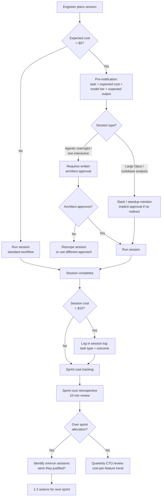

## Budget Governance

**Related to:** [Cost & Token Economics Overview](00-overview.md) — Cost Area 4 · [Governance: AI Usage Policy](../Governance/02-ai-usage-policy.md) · [Governance: Quarterly Health Review](../Governance/05-quarterly-health-review.md) · [Metrics: Session and Context Efficiency](../Metrics/00-overview.md)

---

## Overview

Budget governance for AI development spend is the organizational layer that converts individual session cost decisions into a manageable team-level expense. Without it, API spend is determined entirely by individual engineer behavior, session defaults, and sprint volume — none of which are visible to the people accountable for the engineering budget until the end-of-month invoice arrives. With it, the team has a sprint-level allocation, a monitoring structure, an approval workflow for high-cost activities, and a regular review that connects spend to output value.[^1]

The governance framework described here is calibrated for a team of 11. Larger organizations have more complex budget governance requirements; smaller teams may find parts of this framework unnecessarily formal. The underlying principle scales regardless of team size: AI API spend should be budgeted, monitored, and reviewed with the same discipline applied to other infrastructure costs — not because AI spend is especially risky, but because unmonitored costs have no mechanism for early correction, and AI session costs can spike materially in a single day of heavy agentic usage.[^2]

---

## Section 1: Establishing Sprint Budget Allocations

**Description:** Sprint budget allocation is the practice of setting an expected API spend for each sprint before the sprint begins, based on the planned work and its expected AI utilization. It converts "we will use AI this sprint" into "we expect to spend approximately $X on AI this sprint, and here is the breakdown by task type." This specificity is not primarily about cost control — it is about visibility. A team that estimates sprint AI spend has to think concretely about which tasks will use AI heavily and which will not, and that thinking produces more deliberate tool use than the alternative of running sessions with no spend context.[^3]

The allocation framework should include sprint-type tiers, since different sprint profiles generate materially different AI spend. A sprint focused on refactoring and test coverage uses AI heavily for repetitive generation tasks, primarily at Haiku and Sonnet tiers, with moderate session length. A sprint focused on new feature development uses AI more heavily at Sonnet and Opus tiers, with longer sessions and higher per-session cost. An incident response sprint uses AI unpredictably, potentially at high Opus utilization under time pressure. Each profile warrants a different budget expectation.[^2]

**Recommended Practice:**
- Define three sprint budget tiers at the start of the team's AI governance process: a standard allocation for typical sprints, a high-AI allocation (1.5× standard) for sprints with significant new feature development or architectural work, and an incident response allocation (uncapped with post-incident review) for production emergencies. Review the standard allocation quarterly as the team's AI utilization matures.[^2]
- At sprint planning, classify the sprint type and confirm the budget tier. High-AI sprints require architect approval before the sprint begins — not as a bureaucratic gate, but as a forcing function for conscious spend planning. The architect's approval conversation should cover which tasks warrant Opus tier and whether there are context optimization opportunities for expected high-cost sessions.[^3]
- Track sprint budget vs. actual spend in the team's cost monitoring dashboard. The primary value of this comparison is not catching overruns after they occur — it is building the historical data to calibrate future allocations. A team that tracks budget vs. actual for six sprints has the data to estimate future sprint costs accurately; a team that does not is always estimating from intuition.[^1]
- After each sprint, conduct a 10-minute cost retrospective as part of the engineering review: was the spend within allocation? If not, which sessions drove the overrun and were they justified? The cost retrospective produces one or two actions per sprint (e.g., "add a CLAUDE.md constraint to prevent X" or "classify Y tasks at Haiku tier") that improve the next sprint's cost efficiency.

---

## Section 2: Per-Engineer Spend Visibility

**Description:** Team-level budget governance is necessary but not sufficient — it tells the architect that total spend was $800 in a sprint, but not whether that $800 was broadly distributed across the team or driven by two engineers running unusually expensive sessions. Per-engineer spend visibility provides the denominator for evaluating whether individual session patterns are consistent with the team's model selection and context optimization norms.[^4]

Per-engineer visibility is not a surveillance mechanism — it is a feedback mechanism. An engineer who consistently spends 3× the team average per session is not necessarily misusing AI; they may be doing the most complex work in the sprint. But they also may be running sessions with unoptimized context, defaulting to Opus on tasks that do not warrant it, or running exploratory sessions that could be scoped more tightly. The visibility creates the data for a conversation; the conversation produces the learning.[^1]

**Recommended Practice:**
- Configure separate API keys per engineer (or per role category) and track usage at the key level through the Anthropic console. This is the simplest per-engineer attribution mechanism and requires no additional tooling beyond the console's native usage views.[^4]
- Share per-engineer spend summaries with the engineering team monthly — not as a ranking or performance metric, but as a team calibration tool. Engineers who see that their spend is materially above the team average have context to evaluate whether their session patterns are aligned with the team's norms. Transparency reduces outlier behavior without requiring individual correction conversations.[^3]
- Use per-engineer spend data to identify coaching opportunities rather than policy violations. An engineer consistently spending at the top of the team distribution is worth a 15-minute conversation about their session patterns — not to reduce their spend, but to understand whether their patterns are generating proportionate value and whether there are optimizations they are not aware of.[^1]
- Establish a per-session spend threshold that triggers a brief review: any session that costs above $10 (a rough proxy for a very large or very long session) should be noted in the session log with the task type and outcome. Sessions at this level are not necessarily unjustified, but they warrant enough visibility to confirm that they produced proportionate value.

---

## Section 3: Approval Workflows for High-Cost Activities

**Description:** Some AI usage patterns are predictably high-cost and warrant a lightweight pre-authorization workflow rather than retrospective review. Extended agentic sessions, full-codebase analysis, complex architectural analysis at Opus tier, and sessions that will run overnight or without active human supervision are the primary categories. Pre-authorization is not bureaucracy for its own sake — it is the mechanism by which the team ensures that high-cost activities have explicit rationale and expected value before they run, rather than after.[^2]

The approval workflow for a team of 11 should be minimal: a brief Slack message or stand-up mention ("I'm planning a full-codebase security analysis session with Opus today — expected cost $15–20, should surface the dependency audit issues from last sprint"). This framing requires the engineer to estimate cost, articulate expected value, and create awareness before running the session. The architect can redirect if the approach is misaligned; otherwise, approval is implicit in the lack of redirection.[^3]

**Recommended Practice:**
- Define a per-session spend threshold for pre-notification: any session expected to cost above $5 requires a brief team notification before it runs. This threshold covers agentic sessions, Opus-tier sessions with large contexts, and multi-hour exploratory sessions, while excluding the routine Sonnet sessions that constitute most daily usage.[^2]
- Create a lightweight approval template: "[Task]: [expected cost range] with [model tier] using [context description]. Expected output: [specific outcome]." This four-field format takes 60 seconds to complete and produces the information the architect needs to evaluate whether the session is well-planned.[^3]
- For sessions involving non-interactive agentic execution (overnight runs, CI-integrated agents with broad permissions), require written approval from the architect before the session runs. These sessions have the highest risk of unexpected cost overrun because there is no human in the loop to terminate them if scope expands unexpectedly.[^2]
- Track pre-authorized sessions vs. total high-cost sessions in the monthly cost review. If the ratio of pre-authorized to total high-cost sessions is below 70%, the approval norm is not being followed and should be reinforced — not through punishment, but through a team reminder of why the norm exists and what problem it prevents.

---

## Section 4: Connecting Spend to Value

**Description:** Budget governance that tracks spend without tracking value is accounting, not governance. The difference between $800 of AI spend that delivered a two-week feature in three days and $800 of AI spend that produced three rounds of rework and a delayed delivery is invisible if the budget review covers only the spend side. Connecting spend to output value — even informally — converts the budget review from a retrospective on a number into a retrospective on a decision.[^5]

The value side of the equation does not require precise measurement. A rough categorization of AI-primary sprint output into "delivered as expected," "delivered with significant rework," and "did not deliver" is sufficient to evaluate whether the sprint's AI spend was productive. This categorization, combined with the sprint's AI cost, provides the context for the architect's monthly cost review and the CTO's quarterly review.[^1]

**Recommended Practice:**
- At sprint retrospective, categorize AI-primary tasks by outcome: delivered on first pass, delivered after rework, or not delivered. Record this alongside the sprint's AI spend. The combination of spend and outcome data is the raw material for evaluating AI ROI at the sprint level.[^5]
- Present cost-per-feature-delivered to the CTO quarterly: total AI API spend divided by features delivered at AI-primary tasks, compared to the prior quarter. A declining cost-per-feature indicates improving efficiency; a rising cost-per-feature indicates that spend growth is outpacing output growth and warrants investigation.[^1]
- When a high-cost session does not deliver its expected outcome, conduct a brief post-session analysis: was the cost justified given what was learned? Could the session have been scoped differently to produce the same learning at lower cost? Record the analysis in the session log as a learning artifact rather than treating the session as a sunk cost.[^3]
- Review the team's AI spend distribution across task categories quarterly: what proportion of spend is on feature development vs. testing vs. refactoring vs. exploration? A spend distribution heavily weighted toward exploration and rework relative to feature delivery is a governance signal worth addressing at the architectural level.

---

## Summary of Recommended Practices

| Practice | Immediate Action | Owner |
|---|---|---|
| Sprint Budget Allocation | Define three sprint tiers; set standard allocation; track vs. actual | Architect |
| Per-Engineer Visibility | Configure per-engineer API keys; share monthly spend summaries | Architect |
| Approval Workflows | Set $5 pre-notification threshold; define approval template | Architect |
| Spend-to-Value Connection | Add outcome categorization to sprint retrospective; quarterly cost-per-feature report | Architect + CTO |

---

[^1]: Anthropic — "Best Practices for Claude Code," Claude Code Documentation, 2026. https://code.claude.com/docs/en/best-practices
    API key management and spend accountability; session logging for cost attribution; budget governance as a prerequisite for sustainable AI adoption; cost-per-value analysis framework.

[^2]: Laura Tacho (DX) — "How Are Engineering Leaders Approaching 2026 AI Tooling Budgets?" DX Blog, 2026. https://getdx.com/blog/how-are-engineering-leaders-approaching-2026-ai-tooling-budget/
    Sprint-type budget tiers; high-cost activity categories and pre-authorization rationale; agentic session cost risk without human oversight; team-size calibration for governance frameworks.

[^3]: Anthropic — "2026 Agentic Coding Trends Report," Anthropic, 2026. https://resources.anthropic.com/hubfs/2026%20Agentic%20Coding%20Trends%20Report.pdf
    Pre-session cost estimation practices in high-adopting teams; approval workflow patterns for agentic sessions; the correlation between deliberate spend planning and AI output quality.

[^4]: Nir Gazit (Traceloop) — "From Bills to Budgets: How to Track LLM Token Usage and Cost Per User," Traceloop Blog, 2025. https://www.traceloop.com/blog/from-bills-to-budgets-how-to-track-llm-token-usage-and-cost-per-user
    Per-engineer API key configuration; spend visibility as a feedback mechanism rather than surveillance; monthly spend summary formats that support team calibration without creating ranking pressure.

[^5]: DEV Community — "AI Is Creating a New Kind of Tech Debt — And Nobody Is Talking About It," March 2026. https://dev.to/harsh2644/ai-is-creating-a-new-kind-of-tech-debt-and-nobody-is-talking-about-it-3pm6
    Spend-to-value analysis for AI-primary sprints; cost-per-feature-delivered as the governance metric; the distinction between budget accounting and budget governance; quarterly CTO review framework.
