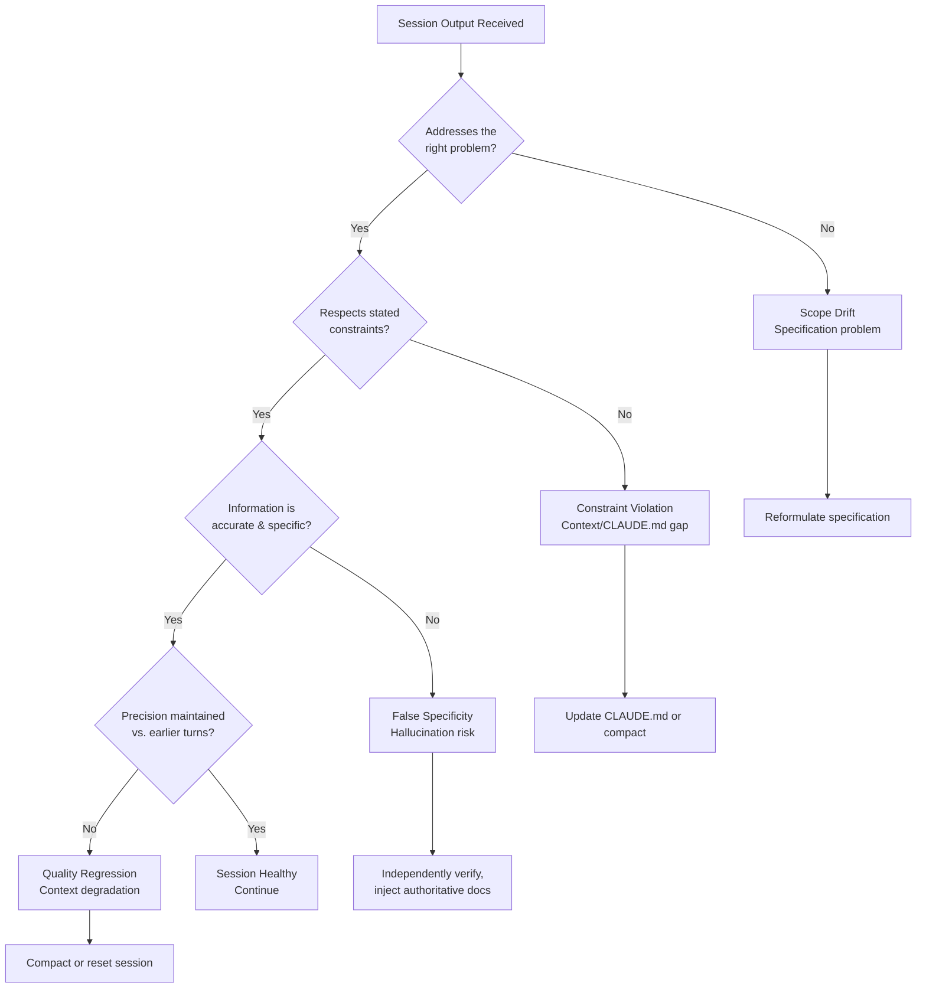

## Recognizing Session Failure Patterns

**Related to:** [Debugging & Troubleshooting Overview](00-overview.md) — Debugging Area 1 · [Workflows: Session Hygiene](../Workflows/04-session-hygiene.md) · [Workflows: Verification-Driven Development](../Workflows/05-verification-driven-development.md) · [Issues: Comprehension Debt](../Issues/01-comprehension-debt.md)

---

## Overview

A session failure recognized at turn 3 costs a fraction of a session failure recognized at turn 15. The cost differential is not just in API spend — it is in the engineering time invested in iterating on incorrect output, the cognitive load of diagnosing a failure after significant investment, and the risk that AI-generated output in the wrong direction reaches code review or merge before the failure is recognized. Early recognition is therefore the highest-leverage debugging skill in AI-assisted development: it is cheaper, faster, and lower-risk than any subsequent intervention.[^1]

The failure modes of Claude Code sessions are recognizable if engineers know what to look for. They do not manifest as obviously wrong code — they manifest as subtly misaligned code: responses that address a related but different problem, that ignore previously stated constraints, that assert facts about APIs or libraries with false confidence, or that become progressively less precise across turns. Each of these patterns has a distinct diagnostic implication and a distinct intervention. Recognizing which pattern is present determines the correct next step: reformulate the specification, reset the session, compact the context, or escalate to a different model tier.[^2]

---

## Section 1: The Four Primary Failure Signals

**Description:** Four failure signals account for the majority of Claude Code session failures that reach the engineer's attention. Each has a distinct cause and a distinct appropriate response. Learning to recognize them specifically — rather than experiencing a general sense that "the session is going badly" — reduces the time from recognition to resolution.

**Scope Drift:** The model addresses a problem adjacent to the one specified rather than the problem itself. A request to "refactor the payment service's retry logic for testability" produces a response that refactors the retry logic for performance — superficially related, technically plausible, but not what was asked. Scope drift is usually a specification problem: the task brief was ambiguous enough that the model resolved the ambiguity in a direction different from the engineer's intent.[^3]

**Constraint Violation:** The model ignores constraints established in CLAUDE.md or the session brief — adding a dependency that was explicitly prohibited, using a pattern that was explicitly excluded, or modifying a file that was declared out of scope. Constraint violation indicates that either the constraint is not effectively communicated (CLAUDE.md language is ambiguous or the constraint is buried too deep in the document) or that context degradation has reduced the model's attention to earlier context.[^4]

**False Specificity:** The model provides confident, specific-sounding information — a function signature, a configuration option, a library method — that is incorrect or fabricated. False specificity is hallucination in its most dangerous form because it is indistinguishable from correct output without independent verification. It appears most frequently in responses about external APIs, library versions, and framework behavior not present in the session's current context.[^5]

**Quality Regression:** Responses become shorter, more hedged, more generic, or less directly responsive to the specific question across successive turns. Quality regression is the primary symptom of context degradation — the model is producing plausible-looking output but with diminishing precision as the context window fills and the signal-to-noise ratio in the context declines.[^2]

**Recommended Practice:**
- At the start of each session, explicitly note which failure signals would indicate a problem with this particular task: "If the response modifies any file outside the payment service, that is scope drift — stop and reformulate." Making the expected failure signals explicit before the session starts makes them easier to recognize when they appear.[^3]
- After every third turn in a session, spend 30 seconds assessing: are the responses addressing the right problem, respecting the stated constraints, and maintaining the precision level of early turns? This brief check-in is faster than diagnosing a failure at turn 15.[^1]
- When a failure signal appears, name it explicitly in the session log before deciding on a response: "Turn 7: constraint violation — model added lodash despite CLAUDE.md prohibition. Cause: likely late in the document; moving constraint to top section." The naming habit reinforces the taxonomy and ensures that the cause is recorded for systemic prevention.[^4]
- Track which failure signals recur across sessions for the same task types or codebase areas. Recurring scope drift on a specific module suggests that the module's CLAUDE.md context is consistently underspecified. Recurring constraint violations suggest that specific constraints need to be repositioned or strengthened in CLAUDE.md.

---

## Section 2: The Two-Turn Correction Rule

**Description:** The two-turn correction rule is a practical heuristic for distinguishing normal correction iteration from session failure: if two consecutive model responses both require significant correction, stop iterating and diagnose the session state before continuing. Single-turn corrections are normal — AI output rarely meets the exact specification on the first attempt for complex tasks. Consecutive corrections indicate that something structural is wrong with the session, not that the individual prompt is inadequate.[^1]

The cost case for the two-turn rule is compelling. A session that is failing but continues for 12 turns before the engineer resets costs approximately four times as much as a session where the failure is recognized at turn 3. The quality case is equally compelling: an engineer who has been iterating on incorrect output for 12 turns has invested significant cognitive effort in a direction that will be discarded. The two-turn rule minimizes sunk cost by creating a forcing function for structured diagnosis before that investment compounds.[^2]

**Recommended Practice:**
- When a second consecutive response requires significant correction, stop and explicitly diagnose before sending a third correction. The diagnosis takes five minutes and answers: which failure signal is present, what is causing it, and is the correct intervention a reformulated prompt, a context compact, or a session reset?[^1]
- Distinguish "significant correction" from minor refinement. A response that is 90% correct and requires a small adjustment is not a correction in the sense of the two-turn rule — it is a normal refinement cycle. The two-turn rule applies when the response fundamentally misaddresses the task or violates a constraint, not when it requires incremental adjustment.[^3]
- Document two-turn rule invocations in the session log: when the rule triggered, what diagnostic was done, and what intervention was chosen. This data, accumulated over a month, reveals whether the two-turn rule is being applied consistently and whether the interventions it triggers are resolving failures effectively.[^4]
- Calibrate the two-turn rule to the task type. For highly exploratory or research-oriented sessions where early turns are inherently imprecise, a three-turn rule may be more appropriate than two. For implementation sessions with a clear specification, a one-turn rule may be warranted — if the first implementation response significantly misses the spec, diagnosis is appropriate before iterating.

---

## Section 3: Distinguishing Session Failure from Task Difficulty

**Description:** Not every difficult session is a failing session. Some tasks are genuinely complex and require multiple correct-but-incomplete responses before the solution emerges. Distinguishing between session failure (something structural is wrong with the session's ability to produce correct output) and task difficulty (the task is hard and requires extended iterative refinement) determines the correct response: session failure warrants diagnosis and intervention; task difficulty warrants patience, decomposition, and possibly model escalation.[^2]

The diagnostic test is whether corrections are converging or not. A genuinely difficult task produces responses that are incrementally closer to the target with each correction: the first response captures 60% of the requirement, the second captures 80%, the third 90%, and so on. A failing session produces responses that are not converging — each correction attempt addresses one issue but introduces another, or consistently misses the same constraint across multiple attempts.

**Recommended Practice:**
- After each correction turn, evaluate convergence: is this response closer to the target than the prior one, on a consistent trajectory? If yes, continue — the session is working. If no, apply the two-turn rule diagnostic.[^2]
- For tasks that are genuinely complex (multi-system reasoning, novel architecture, complex debugging), consider decomposing the task into smaller sub-tasks rather than asking the model to solve it as a whole. A decomposed complex task at Sonnet tier often produces better results than the same task attempted as a whole at Opus tier, because decomposition makes each sub-problem tractable rather than making each sub-problem harder by adding model capability.
- Use the task difficulty vs. session failure distinction to inform model escalation decisions. Escalating to Opus is appropriate for genuine task difficulty — the task is complex enough that Opus's additional reasoning capability is likely to help. Escalating to Opus for a session failure is usually not effective — if the session is failing because of a specification problem or context corruption, higher model capability does not fix those causes.[^5]
- When a session has been running for more than 15 turns on a task that was expected to take 5–8 turns, treat that discrepancy as a diagnostic signal: pause and evaluate whether the extra turns are evidence of task difficulty (the task was harder than expected) or session failure (the session has been going in the wrong direction and has not been recognized as failing).[^1]

---

## Section 4: Building a Team Failure Pattern Log

**Description:** Session failure patterns are not uniformly distributed across task types, codebase areas, or engineers. Some task types consistently produce scope drift; some codebase modules consistently produce constraint violations because their CLAUDE.md context is inadequate; some engineers are more susceptible to specific failure modes based on their prompting habits. A team failure pattern log — a shared record of session failures, their diagnosed causes, and the interventions that resolved them — converts individual experiences into shared knowledge.[^3]

The failure pattern log is the empirical foundation for CLAUDE.md improvements, prompt library updates, and task taxonomy refinements. A CLAUDE.md constraint added in response to a logged failure pattern is more likely to be correct and precisely targeted than a constraint added speculatively. A prompt library entry that encodes a reformulation that resolved a recurring failure is more likely to be used correctly than one that was written without reference to actual failure experience.[^4]

**Recommended Practice:**
- Add a failure pattern section to the team's monthly AI practice review (see Metrics: Retrospective Cadence). The review should cover: which failure signals appeared most frequently in the past month, which task types or codebase areas generated them, and what pattern log entries were added. This creates a regular cadence for converting accumulated failure data into governance actions.[^3]
- Structure the failure pattern log with four fields per entry: session date, task type, failure signal observed, diagnosed cause, intervention applied, and prevention added (CLAUDE.md update, prompt library entry, or task taxonomy change). The "prevention added" field is the value-capture step — without it, the log is historical record rather than governance input.[^4]
- Share the failure pattern log with new engineers during onboarding (see Learning: Engineer Onboarding). The log provides empirical, team-specific guidance on failure recognition that generic AI documentation cannot provide. A new engineer who has read the team's failure pattern log before their first sprint is significantly faster at recognizing and diagnosing session failures than one starting without that context.[^1]
- Review the failure pattern log quarterly for entries that are no longer relevant: failures that were resolved by CLAUDE.md updates that have since been generalized, failure patterns that have not recurred in two or more quarters, or failure modes that a model upgrade has addressed. Pruning stale entries keeps the log actionable rather than archival.

---

## Summary of Recommended Practices

| Practice | Immediate Action | Owner |
|---|---|---|
| Four Failure Signals | Train engineering team on scope drift, constraint violation, false specificity, quality regression | Architect |
| Two-Turn Rule | Add two-turn rule to team session norms; document in CLAUDE.md or team handbook | Architect |
| Failure vs. Difficulty | Add convergence check to correction turn habit | Engineering team |
| Team Failure Pattern Log | Create shared failure log template; add review to monthly AI practice meeting | Architect |

---

[^1]: Boris Cherny — "How Boris Uses Claude Code," January 2026. https://howborisusesclaudecode.com
 Early failure signal recognition as the highest-leverage debugging skill; cost differential between early and late failure recognition; the two-turn rule in practice; session log documentation habit.

[^2]: Anthropic — "2026 Agentic Coding Trends Report," Anthropic, 2026. https://resources.anthropic.com/hubfs/2026%20Agentic%20Coding%20Trends%20Report.pdf
 Session failure vs. task difficulty distinction; convergence as the diagnostic test; context degradation as a failure cause distinct from task complexity; escalation calibration to failure type.

[^3]: Anthropic — "Best Practices for Claude Code," Claude Code Documentation, 2026. https://code.claude.com/docs/en/best-practices
 Scope drift as a specification-quality failure; constraint violation diagnostic patterns; session brief as a failure prevention mechanism; failure pattern log as governance input.

[^4]: Anthropic — "CLAUDE.md Configuration Guide," Claude Code Documentation, 2026. https://docs.anthropic.com/en/docs/claude-code/memory
 Constraint violation causes: ambiguous CLAUDE.md language, constraint depth in document, context degradation; constraint repositioning as a violation mitigation; team failure log as CLAUDE.md update trigger.

[^5]: Simon Willison — "LLM Hallucination: A Practical Framework for 2026," simonwillison.net, March 2026. https://simonwillison.net/2026/Mar/llm-hallucination-practical-framework/
 False specificity as the most dangerous hallucination form; hallucination indistinguishable from correct output without verification; external API and library version as the highest-risk hallucination contexts.

