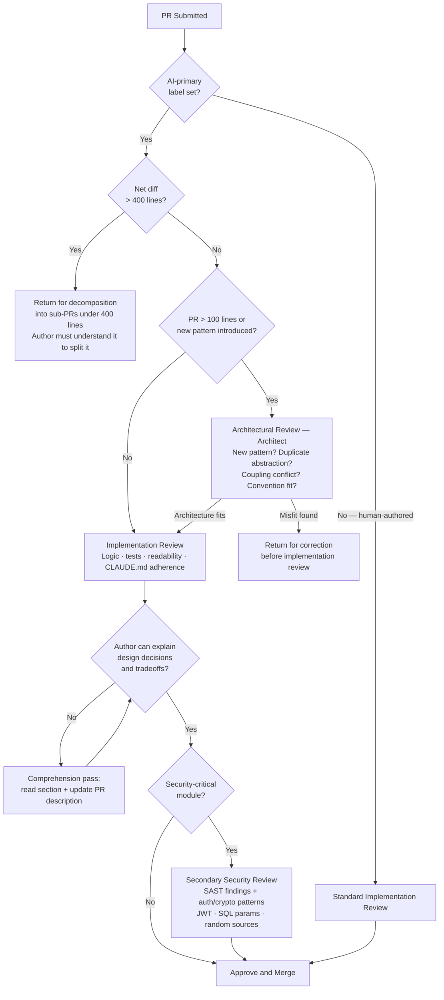

## AI Code Review Policy: Standards for AI-Generated Pull Requests

**Related to:** [Governance Overview](00-overview.md) — Policy 1 · [Issues: Review Theater](../Issues/05-review-theater.md)[^a] · [QA & Testing: Test Session Design](../QA%20%26%20Testing/01-test-session-design.md)[^b] · [Tooling: Hooks and Automation](../Tooling & Configuration/02-hooks-and-automation.md)[^c] · [Documentation: Architecture Decision Records](../Documentation/01-architecture-decision-records.md)[^d]

---

## Overview

Standard code review practices were designed for human-authored code. They assume that the reviewer can engage with the code as a representation of the author's deliberate reasoning — and that asking the author about their decisions will produce informative answers. AI-generated code breaks both assumptions: the logic embedded in it is statistical inference rather than intentional design, and the engineer who submitted it may not understand it in depth. A review process that does not adapt to these differences will catch fewer issues in AI-generated code while consuming the same reviewer time.[^1]

CodeRabbit's analysis found that AI-generated PRs had logic and correctness issues 75% more common and readability problems 3× more prevalent than human-authored ones.[^2] This is not a quality criticism of AI tools — it is a structural observation about what reviewers need to look for. The failure modes of AI-generated code (subtle logic errors, architectural misfit, comprehension gaps in the author) are different from the failure modes of human-authored code (obvious logic errors, scope creep, style inconsistency). Review policies that account for this difference produce materially better outcomes.[^3]

---

## Section 1: PR Size and Decomposition Standards

**Description:** Review quality degrades reliably above 400 lines. Reviewers lose the ability to hold the full change in working memory, begin skimming rather than reading, and miss interaction effects between sections of the PR that are only visible when the whole is considered together. AI-generated code compounds this problem: engineers who generate 600 lines in a single session may not have the deep comprehension needed to split the PR intelligently, and may merge large outputs without reviewing them with the attention that the size warrants.[^4]

The PR size problem has a practical solution that requires no additional tooling: a team norm that AI-generated output above the size threshold is split before review, with each sub-PR representing a coherent unit of functionality. This requires the author to understand the generated code well enough to partition it sensibly — which itself serves as a comprehension gate. If the author cannot split a 600-line AI output into coherent sub-PRs, that is a signal that they do not understand it well enough to be accountable for it.[^5]

**Recommended Practice:**
- Enforce a 400-line limit for AI-primary PRs. PRs exceeding this limit are returned to the author for decomposition before review begins. Include this limit in the team's PR template with an automated line count check in CI if tooling supports it.[^4]
- Require that decomposed sub-PRs be reviewable independently — each must have its own tests, a clear scope statement in the PR description, and no dependency on an unmerged sibling PR where possible. Decompositions that cannot meet this bar are candidates for reconsideration as human-primary tasks.[^5]
- For migration or refactoring tasks where size limits are genuinely impractical, require architect approval before merge along with a documented explanation of why decomposition was not feasible. These exceptions should be tracked — a pattern of refactoring PRs requiring exceptions signals a CLAUDE.md or prompting gap.[^6]
- Apply the size limit to the net diff, not to the total file changes. A PR that modifies a 1,000-line file but changes only 50 lines is a 50-line PR for review purposes. The line count that matters is what changed, not what exists.[^4]

---

## Section 2: Architectural Review vs. Implementation Review

**Description:** Code review has two distinct purposes that require different reviewers operating in different cognitive modes. Implementation review asks: does this code do what it is intended to do, are there bugs, are there security issues, is it readable? Architectural review asks: does this code belong in this module, is it consistent with the team's architectural decisions, does it create coupling or complexity that will be costly later, does it fit the patterns established for this area of the codebase?[^7]

For human-authored code, the same reviewer often conducts both — implementation correctness and architectural fit are evaluated together because human authors tend to produce code that fits the codebase's patterns (they learned them by writing in the codebase). For AI-generated code, this assumption does not hold. AI generates architecturally sound-seeming code that may not fit the specific codebase's patterns, introduce duplicate abstractions, or violate conventions that are not documented anywhere AI could learn them. Separating the two review types ensures both are done by the reviewer best positioned to evaluate each.[^3]

**Recommended Practice:**
- Require that AI-primary PRs above 100 lines receive an architectural review comment from the architect or a designated senior engineer before the implementation review begins. The architectural review evaluates fit, not correctness — it can be a brief comment rather than a full review.[^7]
- Create an architectural review checklist for AI-generated code: (1) Does this introduce a new pattern not already in the codebase? (2) Does this duplicate an existing abstraction? (3) Does this create coupling that conflicts with the module's interface contract? (4) Does this fit the error handling and logging conventions for this layer? This four-question checklist takes under five minutes and surfaces the class of issues architectural drift produces.[^8]
- When the architectural review identifies a misfit, return the PR to the author for correction before implementation review. Merging architecturally misaligned code and leaving cleanup for later is the mechanism by which AI-generated code accumulates architectural debt — catching it at review is materially less expensive than refactoring it later.[^6]
- Document recurring architectural issues from AI-generated code in CLAUDE.md: if the same pattern mismatch appears in multiple PRs across multiple engineers, it is a prompting gap that CLAUDE.md configuration can address. "Follow the repository's service layer pattern for business logic — do not introduce domain logic in controllers" in CLAUDE.md is more reliable than correcting the same issue in review repeatedly.[^1]

---

## Section 3: The Explanation Requirement

**Description:** The explanation requirement — the author must be able to explain AI-generated code at the level of design decisions and tradeoffs, not just syntax — is the primary governance mechanism for preventing fragile expertise from accumulating on the team. The February 2026 arXiv study found that engineers who could not explain their AI-generated code had a 77% failure rate on downstream maintenance tasks without AI access.[^9] The explanation requirement at review is not a quality gate about code correctness — it is a comprehension verification that determines whether the author genuinely owns the code they are shipping.[^10]

The practical challenge is that this requirement has to be enforced in review conversations rather than in automated tooling. Reviewers who ask follow-up questions in comments are doing governance work; reviewers who approve PRs they did not fully understand are creating governance debt. The cultural norm that supports this — that asking "why did this implementation choose optimistic locking here?" is a normal review question — must be established explicitly and reinforced by senior engineers who model it.[^11]

**Recommended Practice:**
- Add an explanation section to the PR template for AI-primary PRs: "Describe the design decisions in this implementation and the alternatives considered." A PR description that says only "Added authentication middleware via Claude" does not pass the explanation requirement. A description that explains the session, the pattern chosen, and why is passing the bar.[^10]
- Reviewers are explicitly empowered — and expected — to ask follow-up questions that require genuine comprehension: "Why does this use a refresh token with a 7-day TTL rather than a session cookie?" "What happens in this handler if the upstream service returns a 504?" If the author cannot answer, the PR is returned for a comprehension pass before approval.[^9]
- When a PR passes tests but the author cannot explain a specific section, require a targeted comprehension session: "Spend 20 minutes reading this section, then update your PR description with what it does and why." This converts the review into a learning event rather than a rejection — the goal is comprehension, not punishment.[^3]
- Track explanation quality as a qualitative signal in the monthly practice review. A pattern of PRs with shallow explanations, or a specific engineer consistently struggling with the explanation requirement, signals that something in the team's AI workflow structure is producing comprehension debt. Address it at the practice level, not just the individual PR level.[^11]

---

## Section 4: Security-Critical Code Review Standards

**Description:** Security-critical code — authentication, authorization, session management, payment processing, data access, cryptographic operations — warrants review standards that exceed the baseline for general code review. Veracode's Spring 2026 analysis found that 45% of AI-generated code fails security tests, with authentication bypass, injection vulnerabilities, and secrets management issues as the most prevalent categories.[^12] These failure rates persist despite significant model capability improvements — suggesting that security requires governance practices on top of model capability, not just better models.[^13]

The specific failure modes of AI-generated security code differ from those of human-authored code. AI tends to produce security implementations that are plausible-looking but incorrect in subtle ways: JWT validation that skips issuer checking, SQL parameterization that handles only string inputs, session token generation that uses non-cryptographically-random sources. These are not obvious to reviewers who are looking for security issues without specifically knowing to look for these patterns — and they do not fail tests if the tests were generated in the same session as the implementation.[^14]

**Recommended Practice:**
- Require a secondary review for all AI-generated code in security-critical modules: authentication, authorization, cryptographic operations, session management, payment processing, and data access with PII. The secondary reviewer should have security context, not just implement correctness context.[^12]
- Run SAST scanning specifically tuned to AI-generated code failure modes before human review: injection (parameterized queries, ORM misuse), secrets management (hardcoded credentials, API key exposure), authentication (JWT validation, session fixation), and API exposure (unvalidated inputs, unauthorized access paths). Use these categories as the review focus list rather than generic security review.[^14]
- When AI-generated security code passes SAST but reviewers have questions about correctness, use the writer/reviewer AI pattern specifically for security: a fresh Claude session with only the security specification and no implementation context, asked to implement the same requirement independently. Comparing the two implementations often surfaces design decisions embedded in the first that are not visible to a reviewer reading only one.[^3]
- After every security incident or security finding in AI-generated code, translate the finding into a CLAUDE.md security constraint before the retrospective closes. "All cryptographic token generation must use crypto.randomBytes — never Math.random() for security-sensitive values" added to CLAUDE.md prevents the same finding from recurring in future sessions.[^1]

---

## Section 5: Review Process Automation and Tooling

**Description:** Human review is the highest-leverage part of the AI code review process, but it is also the most time-constrained. Automation can handle the low-level and high-frequency checks — style consistency, obvious security anti-patterns, test coverage thresholds — freeing human review to focus on the judgment-intensive evaluation that automation cannot perform: architectural fit, explanation quality, security correctness at the design level.[^15]

The automation configuration is the team's first line of defense against the most common AI code quality failures. A CI pipeline that catches 80% of routine issues before human review means that human reviewers are spending their attention on the 20% that requires genuine judgment, not on the same formatting and obvious security issues repeatedly. This improves both the efficiency of human review and the overall quality outcome.[^6]

**Recommended Practice:**
- Configure CI to run automatically on all AI-primary PRs: SAST scanning (Semgrep, CodeQL, or equivalent), test coverage threshold enforcement (80% minimum for new code), duplicate code detection, and cyclomatic complexity alerts. These automated checks should block the PR before human review begins if they find issues.[^15]
- Add a PR template field that triggers the expanded review process: checking the "AI-primary" box automatically assigns the PR to the architectural review queue and includes the explanation template in the PR description. This ensures the AI-specific review process cannot be accidentally bypassed by omitting a template field.[^5]
- Use AI-assisted pre-review as a standard pre-submission step, not as a review replacement: before requesting human review, the author runs the writer/reviewer session (see Workflow 6) and addresses any findings. The review log from the writer/reviewer session should be included as a PR comment so human reviewers can see what was evaluated and what was found.[^3]
- Maintain a review metrics dashboard: PR-to-merge cycle time by origin (AI vs. human), review comment volume by PR type, and the rate of PRs returned before approval. These metrics reveal whether the AI review process is calibrated correctly — a review process that returns 40% of AI PRs before approval may be too strict or may indicate a prompting gap that is producing poor initial outputs.[^2]

---

## Summary of Recommended Practices

| Practice | Immediate Action | Owner |
|---|---|---|
| PR Size Standards | Set 400-line limit; add line count check to CI | Architect |
| Architectural vs. Implementation Review | Create architectural review checklist; assign architect review for PRs >100 lines | Architect |
| Explanation Requirement | Add design decision section to AI-primary PR template | Architect |
| Security-Critical Review | Define security-critical modules; require secondary review | Architect + Backend lead |
| Automation and Tooling | Configure SAST + coverage + complexity checks in CI | Backend lead |

---

[^1]: DEV Community — "AI Is Creating a New Kind of Tech Debt — And Nobody Is Talking About It," March 2026. https://dev.to/harsh2644/ai-is-creating-a-new-kind-of-tech-debt-and-nobody-is-talking-about-it-3pm6
    Governance through CLAUDE.md: using recurring review findings to update context configuration; the feedback loop from code review to prompting improvement.

[^2]: CodeRabbit — "State of AI Code Generation: AI vs. Human Code Report," December 17, 2025. https://www.coderabbit.ai/blog/state-of-ai-vs-human-code-generation-report
    AI PRs with 75% more logic/correctness issues and 3× readability problems; the review metrics dashboard and its relationship to review process calibration.

[^3]: Boris Cherny — "How Boris Uses Claude Code," January 2026. https://howborisusesclaudecode.com
    Writer/reviewer pattern as pre-review preprocessing: how fresh-context review sessions give human reviewers a structured finding set; architectural vs. implementation review separation.

[^4]: Graphite — "Best Practices for Managing Pull Request Size." https://graphite.com/guides/best-practices-managing-pr-size
    Research on review quality degradation above 400 lines: defect detection rates, reviewer fatigue, and interaction effect visibility as a function of PR size.

[^5]: Fannar Steinn Aðalsteinsson et al. — "Rethinking Code Review Workflows with LLM Assistance: An Empirical Study," arXiv:2505.16339, May 22, 2025. https://arxiv.org/abs/2505.16339
    PR template automation and review process triggering: how template field selection can enforce AI-specific review requirements without relying on engineer memory.

[^6]: Roman Fedytskyi — "A Safer CI Pattern for Agentic Code Review," Medium, March 2026. https://medium.com/@roman_fedyskyi/a-safer-ci-pattern-for-agentic-code-review-94a484b5e3c4
    CI pipeline as the first defense layer: how automated checks before human review improve review efficiency and quality outcome for AI-generated code.

[^7]: Ravikanth Konda — "Human-AI Collaboration in Software Teams: Evaluating Productivity, Quality, and Knowledge Transfer with Agentic and LLM-Based Tools," *International Journal of AI, BigData, Computational and Management Studies*, February 17, 2026. https://ijaibdcms.org/index.php/ijaibdcms/article/view/418
    Architectural vs. implementation review separation: how AI's tendency to produce codebase-inconsistent implementations makes architectural review a distinct step from correctness review.

[^8]: Addy Osmani — "My LLM Coding Workflow Going Into 2026," April 2026. https://addyosmani.com/blog/ai-coding-workflow/
    Four-question architectural checklist: new patterns, duplicate abstractions, coupling contracts, and convention fit as the minimum architectural review checklist for AI-generated code.

[^9]: Sreecharan Sankaranarayanan — "Mitigating 'Epistemic Debt' in Generative AI-Scaffolded Novice Programming using Metacognitive Scripts," arXiv:2602.20206, February 22, 2026. https://arxiv.org/abs/2602.20206
    77% fragile expert failure rate without structured comprehension checkpoints; the explanation requirement as the specific intervention that cuts this rate nearly in half.

[^10]: Judy Hanwen Shen and Alex Tamkin (Anthropic) — "How AI Assistance Impacts the Formation of Coding Skills," arXiv:2601.20245, January 28, 2026. https://arxiv.org/abs/2601.20245
    Active vs. passive AI engagement: the explanation requirement as a mechanism for converting passive AI acceptance into active comprehension; PR description as the documentation of the active engagement.

[^11]: Yonatan Sason — "The Black Box Problem: Why AI-Generated Code Stops Being Maintainable," *Towards Data Science*, March 6, 2026. https://towardsdatascience.com/the-black-box-problem-why-ai-generated-code-stops-being-maintainable/
    Comprehension as genuine ownership: why the PR author's inability to explain code is a governance problem, not just a skill gap; the cultural norm that makes explanation questions standard review practice.

[^12]: Veracode — "Spring 2026 GenAI Code Security Update: Despite Claims, AI Models Are Still Failing Security," March 24, 2026. https://www.veracode.com/blog/spring-2026-genai-code-security/
    45% AI security failure rate; authentication bypass, injection, and secrets management as the most prevalent categories; the case for secondary review on security-critical AI-generated code.

[^13]: Sonar (SonarSource) — "Sonar Data Reveals Critical 'Verification Gap' in AI Coding," press release, January 8, 2026. https://www.sonarsource.com/company/press-releases/sonar-data-reveals-critical-verification-gap-in-ai-coding/
    Verification gap: 96% of developers distrust AI code but only 48% verify it; the persistent gap between stated caution and actual review practice for AI-generated security code.

[^14]: Dark Reading — "AI-Generated Code Poses Security, Bloat Challenges," October 2025. https://www.darkreading.com/application-security/ai-generated-code-leading-expanded-technical-security-debt
    Plausible-but-incorrect security implementations: the specific failure modes (JWT validation, SQL parameterization, random number generation) that SAST scanning tuned to AI failure modes catches.

[^15]: CIO — "How Agentic AI Will Reshape Engineering Workflows in 2026," April 2026. https://www.cio.com/article/4134741/how-agentic-ai-will-reshape-engineering-workflows-in-2026.html
    Automation for high-frequency, low-judgment checks: how CI configuration frees human review for judgment-intensive evaluation; the efficiency argument for comprehensive pre-review automation.

[^18]: Sabrina Ramonov — "CLAUDE CODE FULL COURSE," YouTube, February 17, 2025. https://www.youtube.com/watch?v=fYX6hHC9FhQ
    - PR template configuration: how to configure Claude Code PR template fields to trigger the appropriate review process automatically based on code origin
    - Writer/reviewer pre-review workflow: the specific session configuration and prompting approach that produces review-ready finding sets before human review begins
    - CI automation setup: configuring SAST, coverage, and complexity checks as pre-review gates that handle routine findings before human review begins

[^a]: [Issues: Review Theater](../Issues/05-review-theater.md) — Review theater describes exactly what these policies exist to prevent; the failure mode and the countermeasure are paired documents.

[^b]: [QA & Testing: Test Session Design](../QA%20%26%20Testing/01-test-session-design.md) — Test session design governs what QA verifies independently; independent QA is the structural backstop when review policies are the first gate.

[^c]: [Tooling: Hooks and Automation](../Tooling & Configuration/02-hooks-and-automation.md) — Hooks enforce review policy requirements at the session layer before code reaches review; automated checks and review policy requirements are complementary enforcement levels.

[^d]: [Documentation: Architecture Decision Records](../Documentation/01-architecture-decision-records.md) — ADR references in PR descriptions are a review policy requirement; review policy depends on ADRs being current and accessible.
