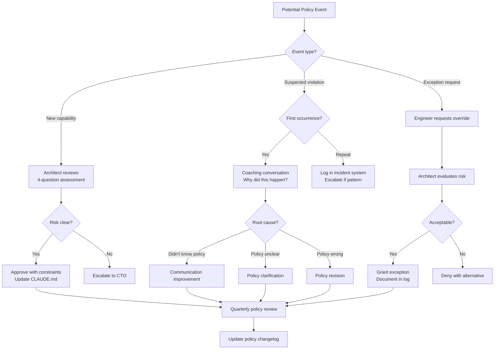

## AI Acceptable Use Policy: Authorized and Prohibited Uses of Claude Code

**Related to:** [Governance Overview](00-overview.md) — Policy 2 · [Ethics: Intellectual Property](../Ethics/01-intellectual-property.md)[^a] · [Ethics: Training Data and Privacy](../Ethics/04-training-data-privacy.md)[^b] · [Governance: Review Policies](01-review-policies.md)[^c] · [Tooling: Settings and Permissions](../Tooling & Configuration/05-settings-and-permissions.md)[^d]

---

## Overview

An acceptable use policy defines the authorized scope of Claude Code usage on the team — not to restrict legitimate productivity, but to ensure that high-risk uses are explicit and reviewed rather than accidental and invisible. Without shared standards, eight engineers using the same tool in eight different ways generates not just inconsistent outputs but inconsistent risks: a session that passes production PII to an AI model, an agentic session that modifies shared configuration without review, a tool integration that exposes sensitive environment variables — none of these require intent to create risk. They require only the absence of clear expectations.[^1]

The Pragmatic Engineer's 2026 AI tooling survey found that only 23% of teams under 20 engineers had formal AI acceptable use policies, despite near-universal individual adoption.[^2] This gap is not benign. It means high-risk uses occur without governance mechanisms to surface or address them, and that when questions arise — from a security audit, an enterprise customer questionnaire, or a production incident — the team has no documented basis for explaining what it authorized and what controls it applied. This memo establishes the policy framework that fills that gap for a team of 11.[^3]

---

## Section 1: Usage Category Definitions

**Description:** Not all Claude Code use carries equal risk, and not all use requires equal review. Treating every AI interaction as equivalent — applying identical review requirements to a comment-generation suggestion and to an agentic session that creates files across multiple modules — produces governance overhead without proportionate benefit. A tiered usage category framework allows review requirements to scale with actual risk: routine, bounded uses have lightweight governance; high-risk, broad-scope uses have proportionate oversight.[^4]

The three categories — AI-assisted, AI-primary, and agentic-delegated — differ on two dimensions: the proportion of output that is AI-generated, and the degree of human oversight during execution. AI-assisted work has human authorship with AI augmentation and continuous human oversight; AI-primary work has AI authorship with human review at completion; agentic-delegated work has AI execution over extended scope with human checkpointing rather than continuous oversight. Each escalation in scope and autonomy corresponds to an escalation in governance requirements.[^5]

**Recommended Practice:**
- Define AI-assisted use: a human engineer is the primary author; Claude Code provides inline suggestions, completions, explanations, or targeted code generation for specific functions. The engineer reviews AI suggestions before accepting them. No special review requirements beyond standard PR review.[^4]
- Define AI-primary use: Claude Code generates the first-pass implementation for a feature, module, or component; the engineer reviews and accepts the output. The PR template's AI origin field is marked "AI-primary." The AI code review policy (see Governance/01) applies.[^5]
- Define agentic-delegated use: Claude Code operates with tool access (file system writes, command execution, external service calls) to complete a multi-step task, with the engineer reviewing outputs at defined checkpoints rather than at each individual step. Agentic use requires explicit task specification in a spec.md, architect notification before a session exceeds two hours of unattended execution, and review of all outputs before any production effect.[^6]
- Define what a checkpoint is in agentic-delegated sessions: a checkpoint is a named pause point specified in the task spec where the engineer reviews the session's output before authorizing the next phase to begin. Checkpoints must occur at module boundaries (after work in one directory completes, before the session moves to the next), after any schema or shared interface change, and before any write to a file that multiple other modules depend on. The task specification for any agentic session must list its checkpoint locations explicitly — sessions that begin without defined checkpoint locations are not authorized agentic-delegated use under this policy. At each checkpoint, the engineer verifies: are the files modified what the spec listed? Does the output pass the quality gate hooks? Are the interfaces the next phase depends on correct? If any check fails, the session is paused for architect review before continuing.[^6]
- Document the category definitions in the team engineering handbook and review them at onboarding. New engineers should understand which category their work falls into before they begin using Claude Code, not after their first high-risk session.[^3]

---

## Section 2: Prohibited Uses

**Description:** Prohibited uses are the specific Claude Code behaviors that are outside the team's authorized scope regardless of category. They differ from high-risk uses that require elevated review — prohibited uses are not permitted under any review process because the risk of the behavior itself (not just the output) is unacceptable. The distinction matters: an agentic session that modifies production configuration is prohibited use, not just a high-risk use that requires architect approval. An engineer who obtains architect approval for agentic use is not thereby authorized to modify production configuration.[^7]

The prohibited use list is deliberately short. Long lists of prohibited behaviors signal that the policy designer anticipated every risk and addressed it exhaustively — a posture that is both impossible and counterproductive. A short list of clear prohibitions, combined with a tiered category framework, produces better engineer behavior than an exhaustive list that engineers stop reading. When a behavior is not on the prohibited list and does not fit a defined category, that is a signal to consult the architect for classification — not to proceed under the assumption that absence from the prohibited list implies authorization.[^1]

**Recommended Practice:**
- Prohibited: passing production personally identifiable information (PII), protected health information (PHI), or customer data into Claude Code sessions, regardless of API plan. The data minimization principle applies to AI sessions: use anonymized or synthetic data for development and debugging.[^7]
- Prohibited: running agentic sessions with write access to shared infrastructure, shared environments, or production systems outside an explicitly approved agentic use specification. The `--dangerouslySkipPermissions` flag is prohibited unless the architect has reviewed the specific session use case in advance and documented the approval.[^6]
- Prohibited: using Claude Code to generate security assessments, threat models, or penetration testing inputs for systems the engineer is not authorized to assess. AI-assisted security work on the team's own systems is authorized; AI-assisted security work on external systems requires explicit client authorization and architect review.[^8]
- Prohibited: representing AI-generated work as human-authored in contexts where provenance matters — patent applications, academic work, client-facing deliverables that specify human authorship, or grant applications. PR attribution for internal code review does not require disclosure of AI assistance (the AI origin PR field serves this purpose); external deliverables may.[^3]

---

## Section 3: New Capability Authorization

**Description:** Claude Code's capabilities are expanding continuously — new MCP server types, expanded agentic permissions, new tool integration patterns. Each new capability represents a use pattern that did not exist when the team's existing policies were written. Without a process for evaluating and authorizing new capabilities before adoption, team members independently adopt capabilities with risk profiles that the team's governance has not evaluated — and the team's effective policy surface grows faster than its governance coverage.[^9]

The new capability authorization process is not a bureaucratic gate — it is a brief conversation that ensures new capabilities are introduced with deliberate consideration. The conversation costs two minutes; an ungoverned agentic session that exceeds authorized scope costs much more. The architect, not individual engineers, is the appropriate first reviewer for new capability adoption: they have the architectural context to evaluate whether a new capability is safe to adopt, what constraints it requires, and whether it should be added to CLAUDE.md or documented in the acceptable use guidelines.[^2]

**Recommended Practice:**
- Require architect review before first use of any Claude Code capability the team has not previously used: new MCP server types, new permission profiles, new agentic delegation patterns, new hook configurations affecting shared workflows. "Previously unused" means not documented in the team CLAUDE.md or acceptable use guidelines.[^9]
- The new capability authorization conversation covers four questions: What does this capability do? What data or systems does it access? What could go wrong? What review process should govern its use? The architect documents the answers and either approves the capability with any required constraints or escalates to the CTO if the risk assessment is unclear.[^2]
- After a new capability is authorized, update the relevant CLAUDE.md configuration and the acceptable use guidelines before the capability is adopted by other team members. New capabilities adopted by one engineer without documentation tend to spread informally before governance documentation catches up.[^10]
- Review new capability adoption at the monthly practice review: which new capabilities were authorized in the prior month? Are the constraints appropriate now that engineers have used them? Have any capabilities been used outside their authorized scope? This keeps the governance coverage current rather than accumulating lag.[^1]

---

## Section 4: Data Handling in Sessions

**Description:** Claude Code sessions involve sending data to Anthropic's infrastructure for processing. Depending on the API plan and data use settings, session data may contribute to model training, may be retained for a period, and may be accessible to Anthropic for safety review. For most development work — implementing features, debugging logic, writing tests — this is unproblematic. For work involving sensitive material — unreleased product features, production database schemas, customer data, proprietary algorithms — the data handling implications warrant deliberate session management.[^11]

The relevant question is not whether data will be misused — Anthropic's data handling practices are documented and generally protective — but whether the data governance requirements the team has committed to (to customers, in security questionnaires, through compliance requirements) are satisfied by the default session configuration. An enterprise customer whose data processing agreement specifies that their data will not be shared with third parties may have a reasonable question about how their data is handled when it appears in a Claude Code session.[^12]

**Recommended Practice:**
- Use enterprise API plan settings with training opt-out for all work involving material that is not appropriate for model training: proprietary business logic, unreleased product features, customer schema details, or any material the team has committed to keep confidential under a customer agreement.[^11]
- Add session scope reminders to CLAUDE.md for sensitive modules: "This module contains pre-release features. Do not include customer-identifiable information in session prompts. Use placeholder or anonymized data for examples." This is a reminder at the point of use rather than a control — it reduces inadvertent disclosure without guaranteeing it.[^10]
- Brief new engineers on Anthropic's data handling practices during onboarding: how session data is processed, what the enterprise plan provisions are, and what categories of data require special handling. Engineers who understand how their session data is used make more deliberate decisions about what to include in sessions than those who have not thought about it.[^3]
- Review Anthropic's data use policy at least annually and whenever the team's compliance obligations change. What was acceptable under a previous policy revision may require reevaluation after an update, and compliance requirements that did not apply to the team last year may apply this year.[^12]

---

## Section 5: Policy Enforcement and Review Cadence

**Description:** A policy that is not enforced is not a policy — it is a wish list. Enforcement requires that violations are surfaced when they occur, that the team knows enforcement is happening, and that violations produce consequences proportionate to their risk. On an 11-person team, enforcement is primarily cultural rather than technical: the team culture around AI use is shaped more by how the architect and CTO respond to violations than by the policy document itself. A single well-handled violation that results in a team conversation and a CLAUDE.md update builds enforcement culture more effectively than a policy that is filed and never discussed.[^13]

The review cadence for the acceptable use policy matters as much as the initial policy content. AI tooling evolves faster than annual review cycles; a policy written in January may be inadequate by September when new capabilities have been adopted and new compliance requirements have emerged. Quarterly review at the engineering health review, combined with immediate review when new capabilities are authorized or incidents occur, keeps the policy current with the team's actual practice.[^2]

**Recommended Practice:**
- Log policy violations in the same system as security incidents: what happened, when, which policy was violated, what the resolution was, and whether the policy needs updating as a result. This log is an audit record and a learning document — patterns of violations reveal policy gaps or communication failures that individual incidents do not make visible.[^13]
- First-occurrence violations are coaching conversations, not disciplinary events. The question is: why did this happen? Did the engineer not know the policy? Was the policy unclear? Was the policy wrong for the situation? The answer determines whether the response is communication improvement, policy clarification, or policy revision.[^1]
- Review the acceptable use policy at every quarterly engineering health review. The review covers: which policy sections were invoked in the prior quarter (violations, override requests, new capability authorizations)? Are the thresholds still calibrated correctly? Have any sections become obsolete? What new use patterns require policy coverage?[^9]
- Maintain a policy changelog: when the policy changes, document what changed, why, and who approved the change. Policy versioning is the mechanism by which the team can reconstruct what was authorized at a given point in time — which matters for compliance inquiries, incident retrospectives, and demonstrating that governance is active rather than static.[^12]

---

## Summary of Recommended Practices

| Practice | Immediate Action | Owner |
|---|---|---|
| Usage Category Definitions | Document three categories and their review requirements in engineering handbook | Architect |
| Prohibited Uses | Publish prohibited use list; include in onboarding checklist | Architect + CTO |
| New Capability Authorization | Define authorization conversation format; add to architect responsibilities | Architect |
| Data Handling | Review API plan data settings; update CLAUDE.md with session scope reminders | CTO |
| Enforcement and Review | Create policy violation log; schedule quarterly policy review | Architect + CTO |

---

[^1]: DEV Community — "AI Is Creating a New Kind of Tech Debt — And Nobody Is Talking About It," March 2026. https://dev.to/harsh2644/ai-is-creating-a-new-kind-of-tech-debt-and-nobody-is-talking-about-it-3pm6
    Cultural enforcement: how team response to violations shapes the compliance culture more effectively than policy documents; the feedback loop from violations to policy improvement.

[^2]: The Pragmatic Engineer — "AI Tooling for Software Engineers in 2026," March 2026. https://newsletter.pragmaticengineer.com/p/ai-tooling-2026
    23% policy adoption rate among small teams; quarterly review cadence as a mechanism for keeping policy current with tool evolution; the new capability authorization conversation format.

[^3]: Gartner — "Predicts 2026: Software Engineering and DevSecOps," Gartner Research, January 2026. https://www.gartner.com/en/documents/predicts-2026-software-engineering-devsecops
    Onboarding policy communication: why new engineers need policy context before first use; provenance attribution requirements for external deliverables.

[^4]: Anthropic — "2026 Agentic Coding Trends Report," Anthropic, 2026. https://resources.anthropic.com/hubfs/2026%20Agentic%20Coding%20Trends%20Report.pdf
    Usage category tiering: the 0–20% fully delegatable task finding as the foundation for distinguishing AI-assisted, AI-primary, and agentic-delegated categories; review requirements scaling with scope and autonomy.

[^5]: CodeRabbit — "State of AI Code Generation: AI vs. Human Code Report," December 17, 2025. https://www.coderabbit.ai/blog/state-of-ai-vs-human-code-generation-report
    AI-primary PR definition and classification: the origin field implementation and its relationship to the AI code review policy requirements.

[^6]: Anthropic — "Security and Permissions," Claude Code Documentation, 2026. https://code.claude.com/docs/en/security-permissions
    Agentic use permission model: `--dangerouslySkipPermissions` documentation; agentic session scope and the approval requirement for write access to shared environments.

[^7]: Anthropic — "Privacy and Data Handling," Claude Code Documentation, 2026. https://code.claude.com/docs/en/privacy-data-handling
    Data minimization principle for AI sessions: PII and PHI handling requirements; the distinction between prohibited behaviors and high-risk authorized uses that require elevated review.

[^8]: Ravikanth Konda — "Human-AI Collaboration in Software Teams: Evaluating Productivity, Quality, and Knowledge Transfer with Agentic and LLM-Based Tools," *International Journal of AI, BigData, Computational and Management Studies*, February 17, 2026. https://ijaibdcms.org/index.php/ijaibdcms/article/view/418
    AI-assisted security work governance: the authorization boundary between internal system assessment and external system assessment for AI-assisted security tooling.

[^9]: Boris Cherny at Y Combinator — "Inside Claude Code With Its Creator Boris Cherny," February 17, 2026. https://www.ycombinator.com/library/NJ-inside-claude-code-with-its-creator-boris-cherny
    New capability authorization: the four-question architect review conversation; how CLAUDE.md updates formalize new capability constraints before team-wide adoption.

[^10]: Addy Osmani — "My LLM Coding Workflow Going Into 2026," April 2026. https://addyosmani.com/blog/ai-coding-workflow/
    CLAUDE.md session scope reminders: the distinction between configuration controls and point-of-use reminders; why both are needed for sensitive module handling.

[^11]: Anthropic — "Best Practices for Claude Code," Claude Code Documentation, 2026. https://code.claude.com/docs/en/best-practices
    Enterprise API plan data governance: training opt-out provisions, data retention terms, and the session configuration decisions that implement data handling policy in practice.

[^12]: Kyros — "The Vibe Coding Crisis: How AI-Generated Technical Debt Is Costing Companies Millions," March 2026. https://usekyros.ai/blog/vibe-coding-crisis-ai-technical-debt
    Annual policy review obligation: how compliance requirements evolve faster than static policy documents; the changelog as the mechanism for demonstrating active governance to auditors.

[^13]: Roman Fedytskyi — "A Safer CI Pattern for Agentic Code Review," Medium, March 2026. https://medium.com/@roman_fedyskyi/a-safer-ci-pattern-for-agentic-code-review-94a484b5e3c4
    Violation logging and audit trail: the incident log format for policy violations; how logged violations create pattern visibility that individual incidents do not.

[^14]: Dex Horthy (YC Root Access) — "Advanced Context Engineering for Agents," YouTube, August 2025. https://www.youtube.com/watch?v=IS_y40zY-hc
    - Permission model as governance mechanism: how task-level permission scoping encodes acceptable use policy directly into session behavior rather than relying on engineer memory
    - New capability authorization in practice: the specific session configuration decisions that translate a new capability authorization conversation into CLAUDE.md and settings.json constraints
    - Agentic delegation scope management: how to configure multi-step agentic sessions with checkpointing intervals that satisfy the agentic-delegated use governance requirements

[^16]: Sabrina Ramonov — "CLAUDE CODE FULL COURSE," YouTube, February 17, 2025. https://www.youtube.com/watch?v=fYX6hHC9FhQ
    - Usage category onboarding: how to introduce the three usage categories to new engineers in a way that makes policy compliance the default behavior rather than a remembered obligation
    - Session data hygiene: the specific prompt patterns and CLAUDE.md configurations that implement data handling policy at the session level
    - Acceptable use policy as living document: how the quarterly review process keeps the policy current with evolving tool capabilities and team practices

[^a]: [Ethics: Intellectual Property](../Ethics/01-intellectual-property.md) — IP and license risk is a primary category of prohibited use covered by usage policy; acceptable use boundaries are the operational form of the ethical analysis there.

[^b]: [Ethics: Training Data and Privacy](../Ethics/04-training-data-privacy.md) — Privacy constraints on what data enters AI sessions are a core usage policy requirement; the ethical analysis and the operational policy are paired.

[^c]: [Governance: Review Policies](01-review-policies.md) — Usage policy and review policy together form the complete AI governance framework; one governs what engineers do, the other governs what ships.

[^d]: [Tooling: Settings and Permissions](../Tooling & Configuration/05-settings-and-permissions.md) — Settings and permissions are the technical enforcement layer for usage policy; policy without enforcement is advisory only.
