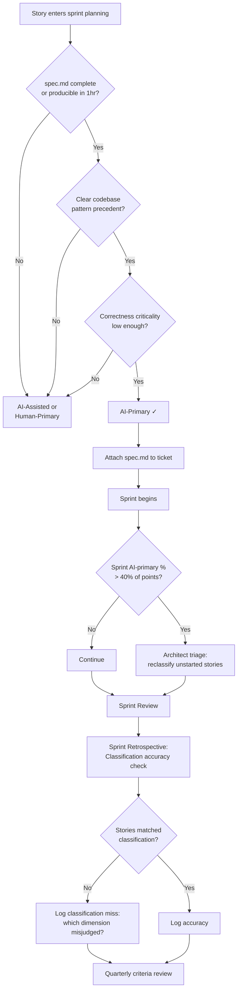

## Sprint Planning Gates: AI Readiness Classification and Velocity Management

**Related to:** [Governance Overview](00-overview.md) — Policy 3: Sprint Planning and AI Readiness Gates · [Governance: Review Policies](01-review-policies.md)[^a] · [Issues: Velocity Governance](../Issues/08-velocity-governance.md)[^b] · [Metrics: Team Health Dashboard](../Metrics/02-health-dashboard.md)[^c] · [Workflows: Task Decomposition](../Workflows/02-task-decomposition.md)[^d]

---

## Overview

Sprint velocity estimates derived from historical human-authored code break down when AI is introduced without adjustment. AI-generated code can compress certain task types dramatically — a well-specified CRUD endpoint that took a senior engineer three days now takes three hours — while doing nearly nothing for others, such as resolving an ambiguous performance regression that requires exploratory profiling and architectural judgment. A team that treats all tasks as AI-accelerated will either inflate velocity estimates and miss sprints, or underestimate the sustained human effort that remains necessary for a significant share of work.[^1]

AI readiness is not a property of engineers — it is a property of tasks. The same engineer who produces excellent AI-primary output on a well-specified data transformation module will produce poor output on an underspecified integration that requires architectural judgment about state management across two services. Sprint planning that accounts for task-level AI readiness produces more accurate velocity estimates, more realistic sprint commitments, and fewer mid-sprint corrections. This policy establishes the classification system and sprint-level governance that make that accountability possible for an 11-person team.[^2]

---

## Section 1: AI Readiness as a Sprint Planning Skill

**Description:** AI suitability is not uniform across task types, and treating it as such is the root cause of most AI-driven velocity estimation failures. Three dimensions determine whether a task is genuinely AI-ready. Specification clarity asks whether the task has a precise, verifiable definition of done — not a user story, but a specification: inputs, outputs, edge cases, integration constraints. Without specification clarity, AI generates plausible-looking output that satisfies the vague requirement in a way that fails when the real requirements surface during review or QA. Pattern precedent asks whether the codebase already contains examples of what AI needs to produce: the data access layer pattern, the error handling convention, the API response format. AI working within established patterns produces architecturally consistent output; AI working in unmapped territory produces architectural novelty that may not fit. Correctness criticality asks what the cost of an undetected error is — a cosmetic component with no business logic has low criticality, while a billing calculation or access control check has high criticality that warrants human-primary ownership regardless of specification clarity.[^3]

Sprint planning must account for all three dimensions to produce accurate velocity expectations. A task that scores well on all three — high specification clarity, strong pattern precedent, low correctness criticality — is a strong AI-primary candidate. A task with high correctness criticality but otherwise good AI scores is a candidate for AI-assisted rather than AI-primary treatment: AI generates a first draft, but human review is thorough and ownership is explicit. Sprint planning that uses only effort estimation without AI readiness assessment will systematically misallocate work, assigning AI-primary treatment to tasks that require human-primary effort and then discovering the mismatch in review or QA rather than during planning.[^4]

**Recommended Practice:**
- Add a three-dimension AI readiness assessment to the sprint planning ceremony for all stories above two story points. The assessment takes under three minutes per story and produces the classification in Section 2. Stories below two points default to AI-assisted treatment.[^3]
- When a task scores poorly on specification clarity, the sprint planning response is not to classify it as human-primary and move on — it is to either invest pre-sprint effort in producing a spec.md that raises the specification clarity score, or to explicitly budget for the specification work as a separate sprint item.[^5]
- Train the architect to facilitate the pattern precedent assessment during planning: they have the codebase context to evaluate whether the task's target area has strong, medium, or weak pattern precedent. Engineers who are less familiar with the full codebase may overestimate pattern precedent in modules they have not worked in.[^1]
- Document the AI readiness reasoning for each classified story in the sprint ticket. "AI-primary: specification complete (see spec.md in /specs/), strong pattern precedent in similar endpoints, low correctness criticality" creates accountability and a retrospective record that the quarterly classification accuracy review uses.[^6]

---

## Section 2: The AI Readiness Classification System

**Description:** The three-tier classification system — AI-primary, AI-assisted, human-primary — provides sprint planning with a consistent vocabulary for describing how a task will be worked, what review requirements apply, and how to estimate effort. AI-primary tasks are those where the engineer will prompt Claude Code to generate the first-pass implementation and review the output: the AI generates, the human verifies. AI-assisted tasks are those where the engineer is the primary author, using Claude Code for targeted assistance — generating specific functions, explaining patterns, suggesting tests — but retaining continuous authorship. Human-primary tasks are those where AI assistance is either inappropriate (correctness criticality requires end-to-end human ownership), unavailable (no applicable pattern precedent for AI to work within), or counterproductive (exploratory work where human reasoning is the primary tool and AI suggestions would misdirect it).[^7]

The prerequisite for AI-primary classification is a completed spec.md. A spec.md is not a user story — it is a technical specification that provides Claude Code with the inputs, outputs, edge cases, integration constraints, and codebase patterns it needs to produce usable first-pass output without multiple rounds of clarification. The spec.md requirement is both a quality gate and a comprehension gate: an engineer who cannot produce a spec.md does not yet understand the task well enough to own an AI-generated implementation. The investment in the spec.md typically takes 30–60 minutes and reduces the AI session time and review rework by substantially more.[^8]

**Recommended Practice:**
- Define the three classification tiers explicitly in the team engineering handbook, with one concrete example from the team's actual codebase for each tier. Abstract definitions without examples produce inconsistent classification between engineers and between sprints.[^7]
- Require that AI-primary stories have a completed spec.md attached to the sprint ticket before sprint planning closes. Stories that do not have spec.md attached at planning close are reclassified to AI-assisted until the spec is complete. The spec.md can be produced during the sprint, but the story cannot be treated as AI-primary until it exists.[^5]
- The classification ceremony during sprint planning uses a three-question rapid assessment: (1) Is there a completed spec.md or can one be produced in under an hour? (2) Does the codebase have clear existing patterns for this task type? (3) Is the correctness criticality low enough to accept AI-primary ownership with standard review? All three "yes" answers support AI-primary; any "no" answer shifts toward AI-assisted or human-primary.[^4]
- Maintain the classification as a sprint ticket field visible on the board. Mid-sprint reclassification — when a story turns out to be harder than classified — is expected and should be logged. The reclassification log feeds the retrospective calibration process in Section 4.[^6]

---

## Section 3: Sprint-Level AI Code Percentage Targets

**Description:** Individual task classification is necessary but not sufficient. A sprint where 80% of stories are classified AI-primary will accumulate rework and review debt regardless of how good the individual classifications are, because the team's review capacity is finite and the architectural coherence of a sprint's output depends on human judgment distributed across the work. The 40% cap on AI-primary tasks per sprint is not an arbitrary restriction — it is a practical limit derived from review capacity. An 11-person team with three frontend and four backend engineers can maintain review quality for AI-primary output on roughly 40% of stories; above that, review quality degrades, review cycle times lengthen, and the integration quality of the sprint's output suffers.

Monitoring the AI-primary percentage in real time during a sprint matters because classification drift accumulates mid-sprint. Engineers who planned AI-assisted work sometimes find the task is more AI-ready than expected and shift to AI-primary mid-sprint — individually reasonable decisions that collectively push the sprint above the target. A simple dashboard showing current sprint AI-primary percentage, updated as stories move through the board, makes the aggregate visible without requiring manual tracking. When the percentage approaches the cap at sprint mid-point, the appropriate response is to route the remaining unstarted AI-primary stories to AI-assisted treatment, not to hope review capacity will expand.

**Recommended Practice:**
- Set the sprint-level AI-primary cap at 40% of total story points, not story count. A sprint with three large AI-primary stories and ten small human-primary stories may be within count limits but above the review capacity limit in terms of actual output volume that needs thorough review.
- Add a sprint health indicator to the team board that shows current AI-primary percentage vs. the 40% target. The indicator should update automatically when ticket classifications are updated. Engineers can self-monitor without requiring a process gate.
- When mid-sprint tracking shows the sprint is above the 40% cap, the architect holds a brief triage: which in-progress AI-primary stories are most advanced? Those continue; unstarted AI-primary stories are reclassified to AI-assisted for the remainder of the sprint. The triage should not interrupt stories that are already in review.[^4]
- Report the sprint-level AI-primary percentage in the sprint review, alongside standard velocity metrics. The CTO uses this data at the quarterly health review to assess whether the cap is calibrated correctly. A team that consistently operates at 38–40% may benefit from a cap increase; one that frequently needs mid-sprint reduction may need a lower default target.[^6]

---

## Section 4: Retrospective Calibration of AI Readiness

**Description:** Classification systems decay without calibration. The same task type that was appropriately classified as AI-primary in one sprint may warrant reclassification as the codebase evolves, as the team's CLAUDE.md configuration improves, or as new engineers with different AI collaboration patterns join the team. Retrospective calibration — reviewing classification accuracy against actual outcomes — is the mechanism by which the classification system improves over time rather than accumulating systematic errors.[^11]

The primary retrospective signal is reclassification events: stories that were classified one way at sprint planning and had to be reclassified mid-sprint, or that were completed but produced review findings or QA failures at rates inconsistent with their classification. An AI-primary story that required three rounds of review and two QA failures was probably misclassified — either specification clarity was lower than assessed, or pattern precedent was weaker, or correctness criticality was higher. Logging these events without aggregating them produces individual learning; aggregating them across quarters produces classification system improvement that benefits the whole team.[^12]

**Recommended Practice:**
- Add a classification accuracy check to the sprint retrospective: for each AI-primary story, did the actual experience match the classification? Stories with significant review rework, QA failures, or mid-sprint reclassification are "classification misses" that the team examines briefly — what dimension was misjudged? Specification clarity? Pattern precedent? Correctness criticality?[^11]
- Log classification misses in the same system as policy violations (see Governance/04). At the quarterly review, the architect presents a classification accuracy report: how many AI-primary stories were classification misses, which dimension was most frequently misjudged, and what adjustment to the classification criteria would improve accuracy.[^6]
- Maintain a classification calibration log that tracks accuracy trends over time. Improving classification accuracy is a lagging indicator of team AI maturity — a team that starts at 70% accuracy and reaches 90% over two quarters is demonstrably improving their AI collaboration skill, not just generating more code.[^12]
- Conduct a quarterly classification criteria review — separate from the retrospective — where the architect and senior engineers review the criteria for each tier and adjust based on accumulated calibration data. This is a 30-minute annual investment per quarter that prevents the classification system from becoming misaligned with actual team practice.[^5]

---

## Section 5: Communicating AI Constraints to Product Management

**Description:** Product managers and stakeholders who observe that AI tools exist and that engineers are using them will naturally develop velocity expectations based on headlines about AI productivity gains — "10× speed," "AI writes 40% of code," "developer productivity doubles." These expectations are not malicious, but they are systematically miscalibrated for a team doing real product work with genuine correctness requirements. Without a clear explanation of why sprint planning gates exist and what they protect, product managers experience AI governance as engineering dragging its feet on productivity gains rather than as responsible management of real delivery risk.[^13]

The communication challenge is framing governance in terms that are meaningful to product stakeholders. "AI-primary task cap" is meaningless to a product manager; "sprint rework risk management" is not. The sprint planning gate is not a restriction on AI use — it is a mechanism for ensuring that AI use produces reliable velocity rather than optimistic commitments followed by mid-sprint corrections and QA failures that extend cycle times. Product managers who understand that the 40% cap prevents the rework accumulation that caused the Q3 delivery slippage will support it; product managers who experience it only as a constraint on velocity will resist it.[^14]

**Recommended Practice:**
- Prepare a two-minute sprint planning gate explanation for product stakeholders that uses outcome language: "This classification system prevents the rework accumulation we saw in Q3 by ensuring that AI generates code only for tasks where it produces reliable first-pass output. The result is more predictable sprint completion, not slower sprint velocity."[^13]
- Share the sprint AI-primary percentage metric with product managers as a sprint health indicator, alongside burn-down and velocity. Product managers who can see the percentage and understand what it measures will surface questions about specific classifications — which is productive dialogue, not interference.[^14]
- When a product manager requests velocity acceleration that would require exceeding the AI-primary cap, the CTO facilitates a conversation about tradeoffs rather than an engineering veto. The specific question is: which stories would we reclassify, and what is the rework risk we are accepting? Making the risk explicit converts an abstract governance constraint into a concrete delivery decision.[^2]
- Document the shared understanding between engineering and product in the engineering handbook: what is the sprint planning gate, what does each classification mean, and what are the velocity expectations for each tier? A written document that product managers have read is more durable than a verbal briefing that each new PM receives differently.[^3]

---

## Summary of Recommended Practices

| Practice | Immediate Action | Owner |
|---|---|---|
| AI Readiness Three-Dimension Assessment | Add three-question rapid assessment to sprint planning ceremony template | Architect |
| Classification System | Define three tiers with codebase examples in engineering handbook | Architect |
| Spec.md Prerequisite | Add spec.md attachment as a required field for AI-primary tickets at planning close | Architect |
| Sprint AI-Primary Cap | Set 40% cap; add sprint health indicator to team board | Architect |
| Mid-Sprint Cap Monitoring | Define triage protocol for above-cap sprints; assign architect as triage facilitator | Architect |
| Retrospective Calibration | Add classification accuracy check to retrospective template; log misses | Architect |
| Quarterly Criteria Review | Schedule 30-minute quarterly classification criteria review with architect + senior engineers | Architect |
| Stakeholder Communication | Prepare sprint planning gate explanation in outcome language; share with PMs | CTO |
| Product-Engineering Velocity Dialogue | Facilitate tradeoff conversation when PM requests AI-primary cap exceptions | CTO |

---

[^1]: The Pragmatic Engineer — "AI Tooling for Software Engineers in 2026," March 2026. https://newsletter.pragmaticengineer.com/p/ai-tooling-2026
    Sprint velocity miscalibration as a function of undifferentiated AI task treatment; the pattern precedent dimension and how the architect's codebase context informs readiness assessment.

[^2]: Gartner — "Predicts 2026: Software Engineering and DevSecOps," Gartner Research, January 2026. https://www.gartner.com/en/documents/predicts-2026-software-engineering-devsecops
    CTO role in AI governance communication; DORA delivery stability findings and their relationship to ungoverned AI adoption in sprint planning; the shared engineering-product governance understanding.

[^3]: Addy Osmani — "My LLM Coding Workflow Going Into 2026," April 2026. https://addyosmani.com/blog/ai-coding-workflow/
    Three-dimension AI readiness framework: specification clarity, pattern precedent, and correctness criticality as the practical dimensions that determine task-level AI suitability.

[^4]: Anthropic — "Best Practices for Claude Code," Claude Code Documentation, 2026. https://code.claude.com/docs/en/best-practices
    Specification prerequisites for AI-primary task classification; the three-question sprint planning assessment and its relationship to task decomposition and session scoping best practices.

[^5]: Boris Cherny at Y Combinator — "Inside Claude Code With Its Creator Boris Cherny," February 17, 2026. https://www.ycombinator.com/library/NJ-inside-claude-code-with-its-creator-boris-cherny
    Spec.md as a comprehension gate and quality prerequisite; why the investment in specification before AI session reduces total sprint cycle time rather than adding overhead.

[^6]: Roman Fedytskyi — "A Safer CI Pattern for Agentic Code Review," Medium, March 2026. https://medium.com/@roman_fedyskyi/a-safer-ci-pattern-for-agentic-code-review-94a484b5e3c4
    Sprint metric reporting: AI-primary percentage as a sprint health and quarterly review input; the classification miss log as a mechanism for retrospective calibration.

[^7]: Ravikanth Konda — "Human-AI Collaboration in Software Teams: Evaluating Productivity, Quality, and Knowledge Transfer with Agentic and LLM-Based Tools," *International Journal of AI, BigData, Computational and Management Studies*, February 17, 2026. https://ijaibdcms.org/index.php/ijaibdcms/article/view/418
    Three-tier classification system definitions; empirical findings on AI-primary vs. AI-assisted task outcomes; the human authorship dimension that distinguishes tiers.

[^8]: Fannar Steinn Aðalsteinsson et al. — "Rethinking Code Review Workflows with LLM Assistance: An Empirical Study," arXiv:2505.16339, May 22, 2025. https://arxiv.org/abs/2505.16339
    Spec.md as a prerequisite for AI-primary output quality; how specification completeness at planning time correlates with review round count and QA failure rates.

[^11]: Stack Overflow — "2025 Developer Survey," Stack Overflow, December 2025. https://survey.stackoverflow.co/2025/
    AI productivity misalignment by task type; the relationship between classification accuracy and team AI maturity as a lagging indicator; retrospective calibration as a learning mechanism.

[^12]: DEV Community — "AI Is Creating a New Kind of Tech Debt — And Nobody Is Talking About It," March 2026. https://dev.to/harsh2644/ai-is-creating-a-new-kind-of-tech-debt-and-nobody-is-talking-about-it-3pm6
    Classification miss logging as a debt-prevention mechanism; the aggregate signal that quarterly calibration reviews produce from individual retrospective observations.

[^13]: CIO — "How Agentic AI Will Reshape Engineering Workflows in 2026," April 2026. https://www.cio.com/article/4134741/how-agentic-ai-will-reshape-engineering-workflows-in-2026.html
    Stakeholder communication about AI governance; why product managers' AI productivity expectations are systematically miscalibrated and how to reframe governance in delivery outcome terms.

[^14]: Kyros — "The Vibe Coding Crisis: How AI-Generated Technical Debt Is Costing Companies Millions," March 2026. https://usekyros.ai/blog/vibe-coding-crisis-ai-technical-debt
    The rework accumulation mechanism that sprint planning gates prevent; product-engineering velocity dialogue as a governance practice; the 40% cap as rework risk management rather than restriction.

[^17]: Sabrina Ramonov — "CLAUDE CODE FULL COURSE," YouTube, February 17, 2025. https://www.youtube.com/watch?v=fYX6hHC9FhQ
    - Spec.md construction walkthrough: how to produce a complete specification in 30–60 minutes that gives Claude Code the context it needs for reliable AI-primary output
    - Classification system onboarding: how to introduce the three tiers to new engineers so that their first sprint uses the classification correctly without constant guidance
    - Retrospective calibration workflow: using sprint retrospective data to identify systematic classification errors and adjust the criteria for the next sprint

[^a]: [Governance: Review Policies](01-review-policies.md) — Sprint planning gates determine AI readiness classification before work begins; review policies govern what happens after; together they bracket the development cycle.

[^b]: [Issues: Velocity Governance](../Issues/08-velocity-governance.md) — The velocity-governance feedback loop is what sprint planning gates are designed to interrupt; readiness classification prevents ungoverned velocity from compounding.

[^c]: [Metrics: Team Health Dashboard](../Metrics/02-health-dashboard.md) — Health dashboard metrics are the data input to sprint planning gates; readiness classification depends on current health signals.

[^d]: [Workflows: Task Decomposition](../Workflows/02-task-decomposition.md) — Task decomposition determines what is appropriate to give to AI; sprint planning gates govern which tasks qualify for AI-primary treatment at the sprint level.
