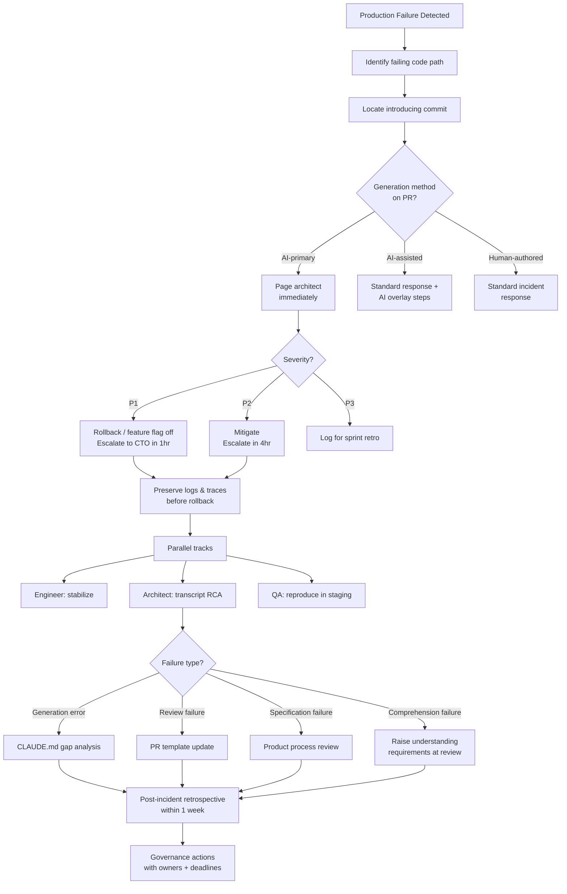

## Incident Response for AI-Generated Code Failures

**Related to:** [Governance Overview](00-overview.md) — Policy 7 · [Documentation: Runbook Standards](../Documentation/02-runbook-standards.md)[^a] · [Security: Vulnerability Response](../Security/05-vulnerability-response.md)[^b] · [Governance: Escalation Procedures](04-escalation-procedures.md)[^c] · [Metrics: Security Vulnerability Trends](../Metrics/04-security-vulnerability-trends.md)[^d]

---

## Overview

When AI-generated code fails in production, the standard incident response playbook has a gap. The first question a responder asks — "who wrote this and what were they trying to do?" — does not have a human author to consult. The session transcript exists, but it is not a commit message or a Jira comment; it requires interpretation. The comprehension debt that accumulates when AI-generated code is merged without deep human understanding becomes a liability at the moment of incident: the engineer responding may not fully understand the code that is failing, because full understanding was never the production gate in the first place.[^1]

This gap is not theoretical. Sonar's 2026 research found that 60% of developers reported shipping code they did not fully understand, and 40% reported security vulnerabilities introduced by AI-generated code that went undetected in review.[^2] These are not one-off incidents; they are structural risks that accumulate in proportion to the team's AI-assisted output velocity. A team that has raised its velocity through AI assistance without raising its incident response capability is a team that will be slower and more disoriented when AI-assisted incidents occur than it was for human-authored incidents.

This policy establishes the incident response protocol specific to AI-generated code failures: incident classification, immediate response steps, root cause analysis methodology, and post-incident governance actions. It complements the team's general incident response procedure rather than replacing it — the AI-specific protocol is an overlay on top of standard incident response, addressing the additional diagnostic and governance steps that AI-generated failures require.

---

## Section 1: Why AI-Assisted Teams Need a Specific Incident Response Protocol

**Description:** Human-authored code failures have natural first-responders: the engineer who wrote the code understands its intent, can explain its logic under pressure, and can identify the most likely failure points from memory. AI-generated code failures have none of these properties. The code may have been written by a session the responding engineer never ran; its logic may be correct but non-idiomatic in ways that make it harder to trace; and the intent behind specific implementation choices may be recoverable only from the session transcript, if it was preserved.[^3]

Comprehension debt is the mechanism. When an AI-generated PR is reviewed for correctness — does it do what was asked? do the tests pass? — but not for comprehension — does the reviewer understand the implementation well enough to debug it under time pressure? — the team has traded comprehension for velocity. In normal operation, this trade is often justified: the code works, the tests pass, and deep understanding of every implementation is not required to ship features. At incident time, the trade comes due.[^1]

The second distinct challenge is distinguishing AI-generation errors from human review failures. An AI-generated code failure has at least two possible proximate causes: the model produced incorrect code (a generation error), or the model produced correct code that a human reviewer accepted incorrectly (a review failure). These have different root causes and different remediation paths. Treating them as equivalent produces root cause analyses that miss the actual failure point and post-incident actions that address the wrong control.[^4]

**Recommended Practice:**
- Brief the engineering team and relevant product managers on the comprehension debt concept at the time this policy is adopted. Engineers who understand why AI-generated failures are harder to diagnose will follow the AI-specific incident response steps more rigorously than those who view them as bureaucratic additions to a standard playbook.[^1]
- Preserve all session transcripts for PRs that go to production. Claude Code session transcripts can be exported and stored as PR artifacts; making this standard practice means the transcript is available for incident investigation without requiring the original engineer to reconstruct the session from memory.[^3]
- Include a "generation method" field in the PR template: was this code primarily human-authored, AI-assisted (human-primary with AI support), or AI-primary (Claude-primary with human review)? This classification is the first gate for routing incidents into the AI-specific response protocol.[^2]
- Communicate to all engineers that an AI-generated code failure does not uniquely implicate the engineer who merged it — these failures are a team-level governance signal, not individual failures. This framing is essential for maintaining honest incident reporting rather than creating incentives to conceal AI origin.[^4]

---

## Section 2: Incident Classification for AI-Generated Failures

**Description:** The standard P1/P2/P3 severity classification applies to AI-generated failures, but requires additional dimensions to capture the AI-specific information needed for root cause analysis and post-incident governance. The severity classification determines the urgency of response; the AI-specific classification determines the investigation path and which governance actions are mandatory.[^4]

Severity definitions remain standard: P1 is a production outage or data integrity failure affecting customers; P2 is a significant production degradation or security vulnerability requiring urgent remediation within hours; P3 is a defect affecting a subset of users or a non-critical function that can be resolved within the sprint. What changes for AI-generated failures is the addition of a classification dimension that distinguishes whether the failure was a generation error (the model produced incorrect code), a review failure (the model produced incorrect code and review did not catch it), a specification failure (the model correctly implemented what was asked but the specification was wrong), or a comprehension failure (correct code that could not be diagnosed quickly at incident time due to insufficient human understanding).[^3]

The distinction between generation errors and review failures matters for post-incident governance. A generation error with a functioning review process — the model produced incorrect code but review caught it before production — is a near-miss with no governance action required beyond logging. A generation error that passed review and reached production is a review process failure requiring post-incident CLAUDE.md and PR template updates. A specification failure requires product management process review, not engineering review process review.[^1]

**Recommended Practice:**
- Add an AI-specific incident classification to the team's incident management template. The classification fields are: generation method (human-authored / AI-assisted / AI-primary), failure type (generation error / review failure / specification failure / comprehension failure), and session transcript availability (preserved / reconstructed / unavailable).[^4]
- For P1 and P2 incidents involving AI-primary code, the architect is automatically included in the incident response team regardless of the system affected. The architect's role is to apply the root cause analysis methodology in Section 4, which requires context that the responding engineer may not have.[^3]
- Track the distribution of failure types across all AI-generated incidents quarterly. A pattern of review failures — AI-primary code that passed review and reached production — is a signal that the review process is not calibrated to AI-generated code's failure modes. A pattern of comprehension failures is a signal that the team's understanding requirements at PR review need to be raised.[^2]
- Define escalation: all P1 incidents involving AI-primary code are escalated to the CTO within one hour of classification. P2 incidents are escalated within four hours. P3 incidents are logged and reviewed in the next sprint retrospective without real-time escalation.[^1]

---

## Section 3: Immediate Response Steps

**Description:** The immediate response steps for an AI-generated code failure follow the same structure as any production incident — stabilize, communicate, investigate — with additional steps specific to identifying the AI-generated code, locating the session transcript, and establishing whether the failure is in AI-generated or human-written code. The last point is not always obvious: a codebase where AI-assisted development is standard will have AI-generated code interleaved with human-authored code in many files, and the first responder may need to trace the failure to a specific commit and then to the PR's generation method classification before knowing which protocol applies.[^3]

The first five minutes of an AI-generated code incident are: identify the failing code path, locate the commit that introduced it, check the commit's PR for the generation method classification, page the architect if the PR was AI-primary, and disable the feature flag or roll back the deployment if the failure is P1/P2. The rollback decision should not wait for root cause identification — the decision to stabilize production is independent of the investigation that follows.[^4]

The responding engineer's immediate goal is stabilization, not comprehension. Attempting to understand AI-generated code well enough to produce an in-place fix under production pressure is the scenario where comprehension debt is most dangerous — the pressure to "just fix it" can produce a second AI-generated error on top of the first. If a clean rollback is available, it should be preferred over a hot fix unless the hot fix is trivially simple and fully understood.[^1]

**Recommended Practice:**
- Configure feature flags for all AI-primary features before they go to production. A feature flag that can be disabled in under sixty seconds is the fastest mitigation for any AI-generated failure. The cost of adding a feature flag is one to two hours; the value at incident time is the ability to stop a P1 without a deployment.[^3]
- When paging the responding engineer, include the PR link and generation method classification in the page notification. Engineers who arrive at an incident knowing it involves AI-primary code will immediately apply the correct diagnostic approach rather than discovering this mid-investigation.[^4]
- Preserve the failing state before mitigation wherever possible: capture logs, metrics, and request traces before the rollback. AI-generated failures can be intermittent or context-sensitive; the state at failure time is the primary diagnostic artifact, and it is often lost if rollback is executed without prior capture.[^2]
- For P1/P2 incidents: the responding engineer stabilizes; the architect begins root cause analysis in parallel using the session transcript; the QA engineer begins reproducing the failure in a non-production environment. These are parallel tracks, not a sequence — stabilization does not wait for root cause, and root cause investigation does not wait for stabilization.[^1]

---

## Section 4: Root Cause Analysis Specific to AI Failures

**Description:** Root cause analysis for AI-generated failures has a three-part structure that does not exist for human-authored failures: analyzing the session transcript to identify the prompt or context failure, identifying the CLAUDE.md gap or policy gap that permitted the generation error to occur, and tracing the review process failure that allowed the generated code to reach production without the error being caught.[^4]

The session transcript is the primary diagnostic artifact. A well-preserved session transcript shows: what the engineer asked for, what context was provided, what Claude produced, what the engineer accepted or rejected, and how the final output was shaped by the conversation. The transcript can reveal that the error originated in an ambiguous prompt, that critical context was absent from the session, that Claude's output included a caveat the engineer dismissed, or that the engineer accepted Claude's first output without requesting alternatives. Each of these reveals a different intervention point.[^1]

CLAUDE.md gap analysis is the second layer. If the session transcript shows that Claude generated code that violated a known constraint — a prohibited pattern, a security requirement, an architectural rule — the question is why CLAUDE.md did not prevent the generation. The answer is usually one of three: the constraint was not documented in CLAUDE.md, it was documented but not with enough specificity to govern this case, or it was documented but the session did not have CLAUDE.md context loaded. Each of these requires a different remediation.[^3]

**Recommended Practice:**
- Establish a root cause analysis template for AI-generated failures with three sections: (1) Transcript Analysis — what the session shows about where the failure originated; (2) CLAUDE.md Gap Analysis — what constraint was missing or insufficiently specified; (3) Review Process Analysis — at what step in the review process the failure should have been caught and why it was not.[^4]
- For P1/P2 incidents, the architect completes the root cause analysis template within 48 hours of incident resolution. For P3 incidents, the template is completed as part of the sprint retrospective. The completed template is attached to the incident ticket before it is closed.[^1]
- When the session transcript is unavailable — because transcript preservation was not standard practice at the time of the incident — document this as a contributing factor in the root cause analysis and add transcript preservation as an immediate governance action. Do not attempt to reconstruct the transcript from memory; note its absence and its diagnostic cost.[^3]
- Distinguish CLAUDE.md gaps from model capability limits. A CLAUDE.md gap is a constraint that was not documented; a model capability limit is a failure mode that documentation cannot prevent. The former requires a governance action; the latter requires an architectural mitigations discussion or a task classification review.[^2]

---

## Section 5: Post-Incident Governance Actions

**Description:** Post-incident governance converts the root cause analysis into durable improvements to the team's AI development practices. The mandatory governance actions for P1/P2 incidents are: CLAUDE.md update based on the gap identified in root cause analysis, PR template update if the review process failed to catch the error, and a mandatory retrospective attended by the architect, the responding engineer, and the QA engineer. Optional governance actions include policy revision (if the incident reveals a policy gap), coverage additions (if the failure was in undertested AI-generated code), and session hygiene changes (if the incident reveals a pattern in how sessions are structured).[^3]

The CLAUDE.md update is the highest-priority governance action. If the root cause analysis identified a constraint that was absent or insufficiently specified, that constraint must be added before the next AI-primary sprint begins. CLAUDE.md is the primary mechanism for preventing recurrence of generation errors; a CLAUDE.md that is not updated after an incident is a governance system that does not learn.[^1]

The PR template update addresses review process failures. If the incident reveals that reviewers consistently fail to catch a specific class of AI-generated error — security-sensitive code without security review, database operations without query performance review, async patterns without race condition analysis — a PR template checklist item that surfaces this class of review explicitly is the lowest-cost mechanism for raising review quality.[^4]

**Recommended Practice:**
- Conduct a mandatory retrospective for all P1/P2 incidents involving AI-primary code within one week of incident resolution. The retrospective agenda is: root cause analysis review (30 minutes), governance action agreement (20 minutes), owner and deadline assignment (10 minutes). The outcome is a specific list of actions with owners and completion dates, not a general agreement to "do better."[^3]
- For CLAUDE.md updates: the update should be specific enough to govern the case that caused the incident. A general addition ("write secure code") is not a CLAUDE.md update — it is a statement of aspiration. The update should specify the concrete constraint or pattern that should have prevented the generation error.[^1]
- For PR template updates: add the new checklist item as a required checkbox, not an informational note. Required checkboxes in the PR template are visible to reviewers and create a documented record of which reviews addressed the new check. Informational notes are ignored within two sprints of being added.[^4]
- Track post-incident governance action completion rates. If CLAUDE.md updates are consistently not completed within the agreed window, the governance system is not functioning and the issue should be escalated to the CTO. Governance actions that are agreed and then abandoned are worse than no governance system — they create false confidence without producing protection.[^2]

---

## Summary of Recommended Practices

| Practice | Immediate Action | Owner |
|---|---|---|
| Protocol Awareness | Brief team on comprehension debt and AI failure modes; add generation method to PR template | Architect |
| Incident Classification | Add AI-specific classification fields to incident template; establish P1/P2 escalation thresholds | Architect |
| Immediate Response | Configure feature flags for AI-primary features; add generation method to page notifications | Backend lead |
| Root Cause Analysis | Create RCA template; establish 48-hour completion window for P1/P2; require transcript preservation | Architect |
| Post-Incident Governance | Mandate retrospective for P1/P2; require specific CLAUDE.md updates; add PR template checklist items | Architect + CTO |

---

[^1]: Anthropic — "Best Practices for Claude Code," Claude Code Documentation, 2026. https://code.claude.com/docs/en/best-practices
    Comprehension debt as a structural risk in AI-assisted development; session transcript preservation as a governance artifact; CLAUDE.md update cycle following AI-generated failures; the review process calibration required for AI-primary code.

[^2]: Sonar — "AI Code Review in the Security Gate: 2026 Configuration Guide," Sonar Blog, 2026. https://www.sonarsource.com/blog/ai-code-review-security-gate-2026
    60% of developers shipping code they do not fully understand; 40% reporting AI-introduced security vulnerabilities undetected in review; structural risk accumulation proportional to AI output velocity.

[^3]: DEV Community — "AI Is Creating a New Kind of Tech Debt — And Nobody Is Talking About It," March 2026. https://dev.to/harsh2644/ai-is-creating-a-new-kind-of-tech-debt-and-nobody-is-talking-about-it-3pm6
    Comprehension debt at incident time; session transcript as the primary diagnostic artifact for AI-generated failures; the trade-off between velocity and comprehension that surfaces under incident pressure.

[^4]: Dave Patten — "The State of AI Coding Agents (2026): From Pair Programming to Autonomous AI Teams," Medium, March 2026. https://medium.com/@dave-patten/the-state-of-ai-coding-agents-2026-from-pair-programming-to-autonomous-ai-teams-b11f2b39232a
    Generation error vs. review failure distinction; AI incident classification dimensions; human accountability for AI-generated output; the role of the delegating engineer in incident response.

[^5]: Kyros — "The Vibe Coding Crisis: How AI-Generated Technical Debt Is Costing Companies Millions," March 2026. https://usekyros.ai/blog/vibe-coding-crisis-ai-technical-debt
    Financial and operational costs of AI-generated code failures; structural vs. individual failure modes; CLAUDE.md gap analysis as a root cause methodology; governance action completion rates as a system health metric.

[^a]: [Documentation: Runbook Standards](../Documentation/02-runbook-standards.md) — Runbooks are the operational artifacts incident response depends on; an incident response process without current runbooks has no execution path.

[^b]: [Security: Vulnerability Response](../Security/05-vulnerability-response.md) — Vulnerability response is a specific type of incident response for security failures; the two documents share procedures and escalation paths.

[^c]: [Governance: Escalation Procedures](04-escalation-procedures.md) — Escalation procedures are invoked during incidents; the two documents form the complete governance chain from detection to resolution to policy review.

[^d]: [Metrics: Security Vulnerability Trends](../Metrics/04-security-vulnerability-trends.md) — Vulnerability trend metrics detect the pre-incident accumulation that makes incident response necessary; monitoring is the prevention layer for incident response.
