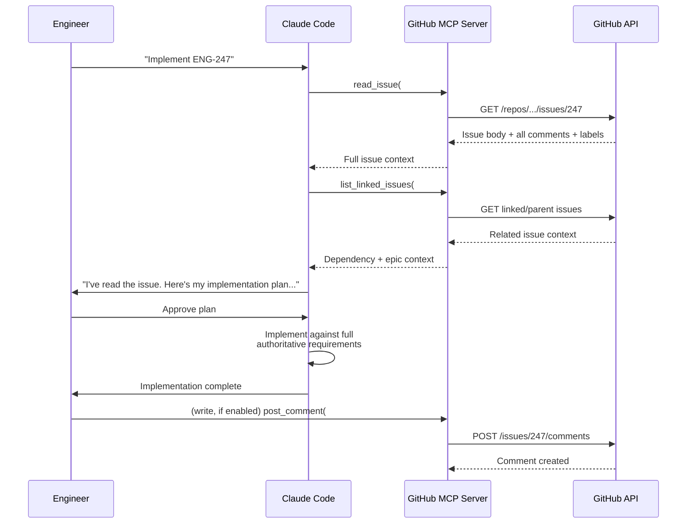

## MCP Server 1: GitHub Integration

**Related to:** [MCP Servers Overview](00-overview.md) — MCP Server 1 · [Tooling: MCP Integration](../Tooling & Configuration/03-mcp-integration.md)[^a] · [Governance: Review Policies](../Governance/01-review-policies.md)[^b] · [Workflows: Context Engineering](../Workflows/03-context-engineering.md)[^c]

---

## Overview

The official GitHub MCP server closes the loop between Claude Code sessions and the repository management layer the team already operates in. For a team of 11 — four backend engineers, three frontend engineers, one architect, one QA engineer, and two product managers — the primary cost of not having this integration is not inconvenience but context degradation: every time an engineer paraphrases an issue or a PR description into a prompt, they introduce summarization errors, omit comment history, and discard the edge-case constraints that accumulated in discussion threads. The integration eliminates that translation step entirely.

This memo goes deeper than the overview's summary. It covers the specific operations the GitHub MCP server enables, the permission model for responsible adoption, workflow patterns for each role on the team, and a rollout sequence that begins safely and expands as the team builds confidence in Claude's GitHub-mediated behavior.

---

## Section 1: What the GitHub MCP Server Enables

**Description:** The GitHub MCP server, maintained by GitHub as an official integration, exposes repository contents, issues, pull requests, branches, code search, and commit history to Claude Code sessions through the MCP protocol.[^1] The range of supported operations spans read and write, but the value case for the team begins entirely on the read side — and that is where configuration should start.

For read operations, the integration allows Claude to retrieve the full text of any issue, including its description, label set, milestone assignment, and complete comment history. For pull requests, Claude can retrieve the diff, the PR description, reviewer assignments, and existing review comments in a single operation. For code search, Claude can locate references, definitions, and usage patterns across the repository without requiring the engineer to navigate to GitHub manually.

Write operations — creating issues, opening pull requests, posting review comments, pushing commits — are available but require deliberate permission grant. The team's initial configuration should not enable write access. The risk is not that Claude will perform write operations maliciously; it is that an unintended write in a shared repository is visible to others, hard to retract cleanly, and erodes trust in Claude-mediated workflows if it happens early in adoption.[^3]

**Recommended Practice:**
- Configure the GitHub MCP server in the shared `.mcp.json` with read-only OAuth scopes: `repo:read`, `issues:read`, `pull_requests:read`, and `contents:read`. Explicitly exclude `write` and `admin` scopes from the initial configuration.[^1]
- Add a comment block to `.mcp.json` documenting which scopes are granted and why write access is excluded — this prevents a future engineer from "helpfully" adding write scopes without understanding the reasoning.[^4]
- Test the read integration in a session that involves a known issue before deploying to the full team: verify that Claude correctly retrieves the issue text, comments, and linked PRs, and that it does not attempt any write operations unprompted.
- Review GitHub MCP operation logs quarterly using GitHub's audit log to confirm that only read operations have been executed and that no credential has been used in an unintended context.[^3]

---

## Section 2: Issue-Driven Development Workflow

**Description:** The highest-value use pattern for the GitHub MCP server is anchoring implementation sessions to the issue being implemented. The current workflow — where an engineer reads the issue, mentally summarizes it, then describes the task to Claude — introduces two unnecessary losses: the engineer's summary is incomplete, and Claude starts from the engineer's interpretation rather than the authoritative source. The integration eliminates both.[^5]

A session that begins with "read issue #247 and implement the described behavior" gives Claude direct access to the original requirements, the acceptance criteria in the issue body, the edge cases documented in comments, and any linked issues that provide additional context. This is qualitatively different from a prompt that describes the same task from memory. For complex issues with significant comment history — the type where the final implementation constraint was decided in the fourteenth comment — the gap is material.[^6]

For the QA engineer, the same pattern applies to test planning: a session that reads the issue before generating a test plan will produce acceptance criteria coverage that reflects the actual requirements, not a reconstructed approximation. For product managers, reading the issue before a planning session gives Claude direct access to the documented product intent without requiring an engineer to relay it.

**Recommended Practice:**
- Establish a team convention: every implementation session that corresponds to a GitHub issue begins with Claude reading the issue before any code is written. Document this in CLAUDE.md as a required step, not a suggestion.[^4]
- When an issue has a linked Linear ticket (see [Linear Integration](04-linear-integration.md)), instruct Claude to read both before beginning. The issue and ticket often contain complementary context — the ticket has the product framing, the issue has the technical constraints and comment-accumulated edge cases.[^6]
- For sessions where multiple related issues are relevant — an epic with child issues, or a bug that references a prior bug — instruct Claude to read all relevant issues before beginning rather than retrieving them on demand mid-session. Complete context at session start produces more coherent implementations than piecemeal context retrieval.[^5]
- If an issue does not contain sufficient implementation detail (a common occurrence), instruct Claude to identify what is missing and surface those gaps before proceeding. This converts a discovery that would otherwise happen mid-implementation into a pre-implementation clarification that can be addressed with the issue author.

---

## Section 3: Pull Request Review Integration

**Description:** Pull request review is the workflow where the GitHub MCP server delivers disproportionate value for the team's QA engineer and the architect. A review session that begins by retrieving the full PR diff, the PR description, the base branch state, and all existing review comments gives Claude complete review context in a single step. The current alternative — copying a diff into a prompt or describing the PR verbally — produces reviews that are limited to the context the engineer thought to include.[^7]

The GitHub MCP server allows Claude to retrieve a PR's diff at any level of granularity: full diff, per-file diff, specific line ranges. Combined with the ability to read the issue the PR closes and any discussion threads linked in the PR body, Claude can perform a review that considers not just whether the code is correct but whether it implements what was intended. That is the more valuable half of code review, and it requires the PR context that the integration provides.[^1]

For the architect, PR review with MCP access is also an architectural consistency check: Claude can read the PR description, retrieve the ADRs stored in Google Drive (see [Google Drive Integration](03-google-drive-integration.md)) that are relevant to the changed area, and evaluate whether the implementation aligns with documented architectural decisions — without the architect needing to assemble that context manually.[^3]

**Recommended Practice:**
- Configure a standard PR review prompt that instructs Claude to read the PR diff, the PR description, the closing issue, and any linked issues before producing review feedback. Save this as a slash command or CLAUDE.md-referenced prompt template so it is available to all team members without per-session customization.[^4]
- For PRs that touch architectural boundaries — API contracts, database schema, authentication logic — instruct Claude to retrieve the relevant Drive documents before reviewing. Cross-referencing the implementation against the architectural intent elevates review quality beyond what a code-only review produces.[^7]
- Use Claude's PR review output as a first-pass filter, not a final review. Configure the workflow so Claude's review appears as a comment on the PR (write access introduced selectively for this operation), with the human reviewer's job being to assess Claude's findings rather than to independently repeat the same checks.[^3]
- Establish a feedback loop: when a human reviewer finds an issue that Claude missed, log it as a session failure case and evaluate whether a CLAUDE.md instruction or prompt refinement would have caught it. Compounding the review quality over time requires deliberate retrospection after review misses.[^5]

---

## Section 4: Write Access Introduction and Governance

**Description:** Write access to GitHub is a qualitatively different capability from read access. A session that can create issues, open pull requests, and post review comments is a session that produces artifacts visible to the entire team and potentially to external stakeholders. The technical boundary between an attended write (an engineer reviews Claude's proposed comment before it posts) and an unattended write (Claude posts directly without human review) is small but the organizational consequences are large.

The progression from read-only to write-enabled should follow a specific sequence, gated on team confidence rather than a calendar. The first write operation to introduce should be comment posting on issues — low-stakes, easily corrected, and useful for the QA engineer's workflow of posting test result summaries on completed issues. The second is draft PR creation — the PR is created in draft state, requiring a human to promote it to ready for review. The third, if needed, is PR comment posting — Claude's review comments appear under a dedicated bot account, making their AI origin visible.

Pull request creation and commit pushing should remain human-gated indefinitely: a human must review Claude's intended diff and description before the PR is opened, and must approve any commit before it is pushed. These operations are difficult to reverse cleanly if they go wrong, and the upside of full automation does not justify the downside of an erroneous push to a shared branch.

**Recommended Practice:**
- Introduce write access incrementally, one operation type at a time, with a two-week observation period before enabling the next type. Each new write operation should be used in at least ten sessions before the next is enabled.
- Use a dedicated GitHub bot account for all Claude-initiated write operations rather than individual engineer credentials. This makes Claude's actions auditable, distinguishable from human-initiated actions in the audit log, and revocable without affecting individual access.[^1]
- Configure the bot account's permissions at the repository level, not the organization level. A bot account with repository-scoped write access can only affect the repositories it has been explicitly granted access to; organization-level write access has a blast radius that is not justified by the workflow gains.
- For any PR creation workflow, require that Claude produce the PR title, description, and linked issue references for human review before the PR is opened. The engineer approves the content and triggers the create operation; Claude does not self-initiate PR creation in an unattended session.

---

## Section 5: Code Search and Codebase Navigation

**Description:** The GitHub MCP server's code search capability — searching across repository contents, finding definitions, locating usage patterns — is a complement to Claude Code's local file access rather than a replacement for it. Local file access is faster and does not require API calls; remote code search is useful for cross-repository queries, for searching in branches the engineer has not checked out locally, and for locating historical references in commits and issues simultaneously.[^6]

For a team working across multiple repositories — a common pattern for backend/frontend splits or microservice architectures — code search via the GitHub MCP server allows Claude to find references across repository boundaries without the engineer needing to manually switch contexts or maintain multiple local clones. A session implementing a shared API contract can search the backend repository for the implementation and the frontend repository for the consumer in the same step.

For the QA engineer, cross-repository search is useful for identifying test coverage gaps: searching for references to a function across the codebase reveals whether it is tested in all the contexts where it is used, or only in the context where it was initially implemented.[^7]

**Recommended Practice:**
- Use local file access (Glob, Grep, Read) as the default for in-repository navigation; reserve GitHub MCP code search for cross-repository queries and branch-specific searches that would require checking out a branch locally.
- When a session requires understanding the surface area of a change — all files that import a module, all tests that exercise a function — use GitHub code search to produce a complete inventory before beginning, rather than discovering affected areas incrementally during implementation.[^6]
- For QA sessions focused on regression risk assessment, instruct Claude to search for all usages of the changed code path before generating the test plan. Test plans written with complete usage context are more comprehensive than those written from the changed file alone.[^7]
- Log code search queries that produce unexpectedly large result sets — more than fifty matches for what seemed like a narrow query — as signals that the codebase has a cross-cutting dependency that warrants architectural attention.[^4]

---

## Summary of Recommended Practices

| Practice | Immediate Action | Owner |
|---|---|---|
| Initial Configuration | Configure read-only scopes in `.mcp.json`; document scope exclusions | Architect |
| Issue-Driven Sessions | Add issue-read convention to CLAUDE.md; validate with a pilot session | Backend lead |
| PR Review Integration | Create standard review prompt template; configure as slash command | Architect |
| Write Access | Introduce comment posting for QA first; use dedicated bot account | Backend lead + QA |
| Code Search | Document local-vs-remote search policy; use for cross-repo queries | Backend lead |

---

[^1]: GitHub — "GitHub MCP Server," GitHub Official Repository, 2025. https://github.com/github/github-mcp-server
    Full operation catalog: repositories, issues, pull requests, branches, file contents, code search. Authentication setup, OAuth scope configuration, and permission model for read vs. write access.

[^3]: Roman Fedytskyi — "A Safer CI Pattern for Agentic Code Review," Medium, March 2026. https://medium.com/@roman_fedyskyi/a-safer-ci-pattern-for-agentic-code-review-94a484b5e3c4
    Audit logging patterns for external service integrations; quarterly review practices; treating AI tool access with the same governance applied to other service dependencies.

[^4]: Anthropic — "Common Workflows," Claude Code Documentation, 2026. https://code.claude.com/docs/en/common-workflows
    Shared `.mcp.json` project configuration; CLAUDE.md patterns for documenting session-start conventions; checking AI configuration artifacts into git as team-owned resources.

[^5]: Dave Patten — "The State of AI Coding Agents (2026): From Pair Programming to Autonomous AI Teams," Medium, March 2026. https://medium.com/@dave-patten/the-state-of-ai-coding-agents-2026-from-pair-programming-to-autonomous-ai-teams-b11f2b39232a
    Context engineering as the primary discipline in agentic development; how external tool integration shifts workflows from local-only to service-aware sessions.

[^6]: Addy Osmani — "My LLM Coding Workflow Going Into 2026," April 2026. https://addyosmani.com/blog/ai-coding-workflow/
    External tool integration as context engineering; reducing manual context assembly; shared configuration artifacts as team-level productivity multipliers.

[^7]: Anthropic — "Model Context Protocol Introduction," Claude Code Documentation, 2026. https://code.claude.com/docs/en/mcp-introduction
    MCP architecture overview; permission scoping guidance; the three primary MCP security risks relevant to GitHub write access.

[^a]: [Tooling: MCP Integration](../Tooling & Configuration/03-mcp-integration.md) — MCP integration covers the general configuration discipline; this document applies it to the GitHub server specifically.
[^b]: [Governance: Review Policies](../Governance/01-review-policies.md) — GitHub MCP enables sessions to query PR context during review; it is a tool for making review policy requirements actionable within a session.
[^c]: [Workflows: Context Engineering](../Workflows/03-context-engineering.md) — GitHub MCP provides live repository context to sessions; it is a primary context engineering tool for teams whose work context lives in GitHub.
