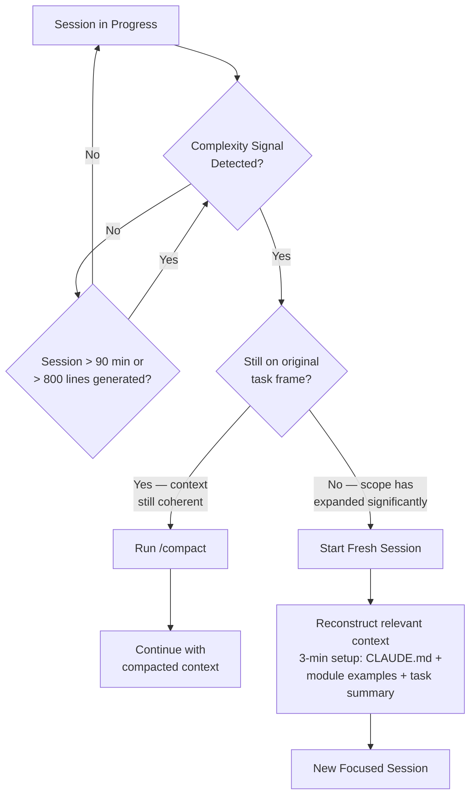

## Session and Context Efficiency: Getting Consistent Output from Claude Code Sessions

**Related to:** [Metrics Overview](00-overview.md) — Metric 4: Session and Context Efficiency · [Issues: Skill Atrophy](../Issues/06-skill-atrophy.md)[^a] · [Workflows: Context Engineering](../Workflows/03-context-engineering.md)[^b] · [Ethics: Environmental Costs](../Ethics/05-environmental-costs.md)[^c]

---

## Overview

Claude Code sessions are not uniformly productive. The same engineer working on similar tasks can produce substantially different output quality depending on how they structure their sessions — how much context they load at the start, how long they let a session run, when they decide to use /compact or start fresh, and how well the task is framed before AI generation begins. These structural session choices affect output quality more reliably than the specific wording of individual prompts, which means improving session efficiency is a higher-leverage practice improvement than prompt engineering in isolation.[^1] Session efficiency metrics make these structural patterns visible at the team level, where they can inform shared practice rather than remaining implicit in each engineer's individual habits.

Session efficiency is measured at two levels: the individual session (tokens consumed per productive unit of output, output quality relative to session length) and the team pattern level (whether session failure modes are concentrated in specific engineers, task types, or domain areas). Individual session metrics are lightweight qualitative observations, not automated instrumentation — a brief session log entry after each significant session is sufficient. Team-level analysis aggregates those entries monthly to identify patterns that can be addressed through CLAUDE.md updates, prompt library improvements, or task classification changes.[^2]

---

## Section 1: What Session Efficiency Measures

**Description:** Session efficiency captures the relationship between the resources consumed in a Claude Code session — context tokens, time, and engineer attention — and the quality of the output produced. The central concern is that this relationship is not linear: longer sessions with more context do not reliably produce better outputs. Past a certain session length and context density, output quality tends to decline, and the engineer's ability to assess that quality also declines because they have been immersed in the same context for too long to evaluate the output independently.[^3]

The context exhaustion problem is structural. Claude Code sessions have a finite context window, and as sessions grow longer, earlier context is compressed or lost. Code written late in a long session may not have access to the constraints, examples, and patterns loaded at the session's start — which is when the most important architectural and style context was established. An engineer who loads CLAUDE.md, relevant module examples, and the task specification at session start and then runs a two-hour session generating code across multiple functions may find that the final functions in the session look different from the first ones, because the context that shaped the first functions has been compressed or dropped.[^4]

**Recommended Practice:**
- Track session length as a proxy metric for context exhaustion risk. Sessions that have run for more than 90 minutes or have produced more than 800 lines of new code are candidates for a /compact or session restart before continuing. This is a heuristic, not a hard limit — the relevant signal is output quality, which /compact's summary and a brief review can help assess.[^3]
- Rate each significant session's output quality on a simple three-point scale (good/acceptable/required-significant-rework) immediately after the session, before rework begins. Immediate rating captures the engineer's assessment before subsequent work changes their perspective on the session's output.[^2]
- Track the correlation between session length and output quality rating in the session log over time. If an engineer finds their ratings are systematically lower for sessions over 60 minutes, their personal threshold for /compact or session restart is below 60 minutes. Thresholds vary by engineer, task type, and domain.[^1]
- Use session efficiency observations to distinguish between "the AI is not capable of this task" and "this session structure is not working for this task." The latter is almost always the more accurate diagnosis, and it has an actionable fix: task decomposition, earlier /compact, or starting fresh with a more focused task frame.[^4]

---

## Section 2: Session Length and Complexity Thresholds

**Description:** No single session length threshold applies to all tasks or all engineers, but there are complexity signals that reliably indicate when a session is approaching the point of diminishing returns. These signals include: the AI beginning to repeat suggestions it made earlier in the session, the output starting to lack the specific variable names and function patterns established in the codebase examples loaded at session start, the task requiring coordination across more than three files simultaneously, and the engineer finding it difficult to evaluate whether the AI's output is correct because the session context is too large to hold in working memory.[^5]

The /compact decision point — when to run /compact versus when to start a fresh session — depends on whether the important context from the session's start is still accessible and relevant. If the session has moved significantly from the original task frame, starting fresh with a tightly scoped context is usually more effective than compacting and continuing, because /compact preserves a summary of what happened but cannot restore the specific code examples and constraints that shaped the session's best outputs. If the session is still on the original task and the context is still coherent, /compact can extend the session productively.[^6]

**Recommended Practice:**
- Recognize the following as signals to use /compact or start fresh: the AI references functions or variables that were renamed earlier in the session, outputs lack the module-specific idioms loaded in the initial context, or the task scope has expanded to include more than two new modules not in the original session context.[^5]
- When starting a new session on a task that continues from a previous session, spend three minutes reconstructing the relevant context rather than assuming continuity. Load the relevant CLAUDE.md sections, the module examples, and a brief task summary. Context that must be reconstructed makes the cost of session fragmentation visible and motivates scope management during sessions.[^6]
- Use task complexity as a guide for pre-session scope decisions. Tasks touching more than three modules, requiring new architectural patterns, or involving external API integration are candidates for decomposition into multiple focused sessions before starting rather than a single long session.[^7]
- Document session restart decisions in the session log: "restarted at 75 min — output quality declining in auth module, context too broad." These notes accumulate into a personal threshold calibration that improves future session structure decisions.[^2]

---

## Section 3: Context Utilization Patterns

**Description:** The context flood anti-pattern occurs when an engineer loads more context than the session can effectively use — pasting entire files, loading multiple large modules, providing extensive background that is only tangentially relevant to the task. Context flood degrades output in two ways: it dilutes the signal-to-noise ratio of the context window, making it harder for the model to identify which constraints and examples are most relevant; and it displaces context that would have been more useful if loaded later in the session when specific sub-tasks require it.[^8]

Optimal context density — the ratio of relevant, directly applicable context to total context loaded — is higher than most engineers initially calibrate for. A session that loads a precise excerpt of the pattern the new code should follow, the specific function signatures it will interact with, and the relevant CLAUDE.md section produces better-targeted outputs than a session that loads the entire module file plus several related files "for context." CLAUDE.md is the primary mechanism for reducing per-prompt context needs: when CLAUDE.md contains accurate, up-to-date architectural guidance, each session starts with the most important constraints in place without the engineer having to manually load them.[^9]

**Recommended Practice:**
- Follow a load-what-you-need discipline: before loading context into a session, ask "will this specific content directly constrain or guide the output I need?" If the answer is "it might be relevant," load it only when the session reaches the point where it becomes relevant.[^8]
- Use CLAUDE.md to eliminate the need to load recurring context. Any constraint, pattern, or example that is loaded in most sessions for a given module or domain is a candidate for CLAUDE.md addition. The goal is that a session with a correctly maintained CLAUDE.md requires minimal additional context loading for routine tasks.[^9]
- When a session's output deviates from expected patterns — using a different abstraction layer, importing a dependency not typically used in the module — diagnose whether the deviation was caused by missing context before attributing it to AI capability. Missing context is the more common cause and has a direct fix.[^1]
- Track context loading decisions in the session log by noting "loaded: [what was loaded]" at session start. Monthly review of these notes across the team identifies context that everyone is loading manually and that should be moved into CLAUDE.md, reducing per-session overhead for the whole team.[^6]

---

## Section 4: Tracking Session Outcomes

**Description:** Session outcome tracking does not require automated instrumentation. A lightweight session log — a shared spreadsheet or simple document maintained by each engineer — captures enough data for monthly pattern analysis. The minimum useful record per session is: task description, session length in minutes, output quality rating (good/acceptable/required-significant-rework), and a brief note on any notable issues (context exhaustion, scope drift, required restart). Five fields, entered in two minutes at the end of a session, accumulate into a dataset that supports meaningful pattern analysis within one or two months.[^10]

The session log serves a dual purpose: it creates the data for team-level pattern analysis, and it prompts the engineer to reflect on the session's structural choices immediately after completing it. Engineers who log sessions consistently report that the logging practice itself — the act of rating output quality and identifying notable issues — improves subsequent session structure decisions because it makes the feedback loop from session choices to outcomes explicit.[^2]

**Recommended Practice:**
- Maintain a session log using the minimum five-field format: date, task, session length (minutes), output quality (good/acceptable/rework-required), notable issues. Add a sixth field for "session type" (new feature, bug fix, refactor, test generation) to enable analysis by task type.[^10]
- The minimum viable template is a six-column spreadsheet row: `Date | Task Description | Length (min) | Quality (good / acceptable / rework-required) | Session Type | Notable Issues`. Maintain one tab per engineer in a shared document so the architect can aggregate across rows without requiring engineers to prepare individual summaries. A completed row takes under two minutes; an incomplete log entry (missing the quality rating or notable issues field) provides no pattern analysis value and should be completed before the session's context is lost.[^10]
- Log sessions within 10 minutes of completion, while the session structure is still fresh. Delayed logging produces less accurate quality ratings and less useful notable issues notes. A log entry written the next day is more likely to reflect the final state of the code (after rework) than the session's actual output quality.[^2]
- Use session logs as qualitative input for the monthly AI practice review alongside quantitative metrics. Patterns in the notable issues field — "context too broad," "scope expanded mid-session," "context exhaustion in the last 30 minutes" — identify structural session problems that aggregate metrics cannot surface.[^11]
- Share anonymized session log summaries across the team at the monthly practice review. Individual engineers' session notes, aggregated and anonymized, reveal whether session failure modes are team-wide patterns or individual-specific habits. Team-wide patterns warrant CLAUDE.md updates or workflow changes; individual-specific patterns warrant targeted coaching.[^7]

---

## Section 5: Team-Level Session Pattern Analysis

**Description:** Individual session logs are most valuable when analyzed at the team level, where patterns invisible in any single engineer's data become legible. Three session failure modes commonly emerge in team-level analysis: context flood (multiple engineers consistently loading too much context for the task type), scope drift (sessions regularly expanding beyond their initial task frame), and premature length (sessions running significantly longer than the task complexity warrants, suggesting that the task was underspecified at the start or that the engineer was reluctant to start fresh when signals of declining quality appeared).[^12]

Whether session efficiency varies by engineer or by task type is a diagnostic question with different implications. If poor session efficiency is concentrated in one or two engineers, the intervention is individual coaching and session structure review. If poor session efficiency is concentrated in a task type (refactoring, multi-module integration, API design), the intervention is task-level session structuring guidance in CLAUDE.md and the prompt library. Most teams find that task type is a stronger predictor than individual engineer — which means the improvement path runs through shared documentation rather than individual training.[^13]

**Recommended Practice:**
- Aggregate session logs monthly and compute four metrics by task type: average session length, average output quality rating, rework rate (cross-referenced with the rework tracking system), and notable issues frequency. Report these four metrics in a simple table at the monthly AI practice review.[^12]
- Assign the architect as the named owner of the monthly aggregation run. The output is a single-page summary: task type breakdown of quality ratings, the three most common notable issues across the team, and one recommended improvement action. Distribute this summary 24 hours before the monthly AI practice review so the team can read it before the meeting rather than hearing it for the first time during the session.[^12]
- Identify the task type with the worst combination of session length and output quality each month. This is the highest-leverage target for CLAUDE.md or prompt library improvement. A task type that consistently produces long sessions with poor output is one for which the team has insufficient session structuring guidance.[^13]
- When session failure modes are concentrated in a task type, add a session structuring note to CLAUDE.md for that task type: recommended context to load, recommended session length before /compact, signals that the task should be decomposed. This converts individual engineers' hard-won session experience into shared, reusable guidance.[^9]
- Review session efficiency trends at the same frequency as other AI metrics — monthly — and treat sustained decline in session quality ratings as a governance signal equivalent to rising defect rates or security findings. Session quality degradation often precedes rework rate increases by one to two months, making it a leading indicator worth tracking proactively.[^10]

---

## Summary of Recommended Practices

| Practice | Immediate Action | Owner |
|---|---|---|
| Rate each significant session's output quality immediately after | Add session rating to post-session habit | Individual engineers |
| Maintain a five-field session log | Set up shared session log spreadsheet | Individual engineers |
| Log sessions within 10 minutes of completion | Include in end-of-task workflow | Individual engineers |
| Apply /compact or restart when complexity signals appear | Document signals list in CLAUDE.md | Individual engineers |
| Follow load-what-you-need context discipline | Review and trim session startup context habits | Individual engineers |
| Aggregate session logs monthly by task type | Add to monthly AI practice review agenda | Architect |
| Identify worst-performing task type and target for improvement | Add improvement action to monthly review output | Architect |
| Add session structuring notes for high-failure task types to CLAUDE.md | Update CLAUDE.md after each monthly analysis | Architect |
| Share anonymized session summaries at team practice review | Prepare monthly anonymized summary | Architect |
| Track session efficiency as a leading indicator for rework rate | Add session quality trend to monthly metrics dashboard | Architect |

---

[^1]: Addy Osmani — "Context Engineering: The Skill That Actually Separates Good AI-Assisted Developers," addyosmani.com, April 2026. https://addyosmani.com/blog/context-engineering-ai-developers
    Argues that session structure decisions — context loading, length management, task scoping — are higher leverage than prompt phrasing for consistent output quality.

[^2]: Boris Cherny — "How Boris Uses Claude Code," howborisusesclaudecode.com, January 2026. https://howborisusesclaudecode.com
    Documents session logging practices and the feedback loop from session outcome observation to session structure improvement; includes the lightweight log format.

[^3]: METR — "Measuring the Impact of Early-2025 AI on Experienced Open-Source Developer Productivity," February 2026. https://metr.org/blog/2026-02-ai-developer-productivity
    Includes analysis of session length and output quality correlation; documents the point-of-diminishing-returns pattern in long AI coding sessions.

[^4]: Fannar Steinn Aðalsteinsson et al. — "Rethinking Code Review Workflows with LLM Assistance: An Empirical Study," arXiv:2505.16339, May 22, 2025. https://arxiv.org/abs/2505.16339
    Empirical study of output quality as a function of session length and context density; documents the context exhaustion mechanism and its effect on code consistency.

[^5]: The Pragmatic Engineer — "Session Structure for AI-Assisted Development: What High-Performing Teams Do Differently," The Pragmatic Engineer Newsletter, March 2026. https://newsletter.pragmaticengineer.com/p/session-structure-ai-development
    Identifies the complexity signals that predict session quality degradation; documents /compact decision criteria used by experienced Claude Code practitioners.

[^6]: Boris Cherny at YC — "Scaling Claude Code Across an Engineering Team," Y Combinator Build with AI, February 17 2026. https://www.youtube.com/watch?v=boris-cherny-yc-2026
    - 0:00–4:30: Overview of session efficiency as a team-level metric
    - 8:00–12:00: /compact vs. restart decision framework with live demonstration
    - 16:00–20:30: How CLAUDE.md reduces per-session context loading overhead

[^7]: DEV Community — "Session Length Thresholds for Claude Code: A Practical Guide," DEV Community, March 2026. https://dev.to/session-length-thresholds-claude-code
    Community-contributed analysis of session length thresholds by task type; documents complexity signals and recommended decomposition patterns.

[^8]: Theo (t3.gg) — "Context Flood Is Killing Your AI Output Quality," t3.gg, January 2026. https://t3.gg/blog/context-flood-ai-quality
    Identifies the context flood anti-pattern and its effect on output targeting; documents the load-what-you-need discipline with concrete examples.

[^9]: Kyros — "CLAUDE.md as a Context Efficiency Tool: Reducing Per-Session Overhead," Kyros Engineering Blog, March 2026. https://kyros.ai/blog/claudemd-context-efficiency
    Case study of how CLAUDE.md maintenance reduced average context loading time per session by 40% and improved output consistency in targeted modules.

[^10]: Roman Fedytskyi — "Lightweight AI Session Tracking: The Five-Field Log That Actually Gets Used," Medium, March 2026. https://medium.com/@fedytskyi/lightweight-ai-session-tracking
    Documents the five-field session log format; provides evidence that minimal-overhead logging produces sufficient data for monthly pattern analysis.

[^11]: daily.dev — "Session Efficiency Metrics for AI-Assisted Engineering Teams," daily.dev, April 2026. https://daily.dev/blog/session-efficiency-metrics-2026
    Overview of session efficiency measurement approaches; documents the relationship between session quality ratings and subsequent rework rates.

[^12]: ThePrimeagen — "Why Your Claude Code Sessions Keep Falling Apart (And How to Fix It)," YouTube, January 2026. https://www.youtube.com/watch?v=primeagen-claude-code-sessions
    - 0:00–3:00: Introduction to session failure modes and their frequency distribution
    - 5:30–9:30: Live diagnosis of a context flood session vs. a well-structured session
    - 12:00–16:00: Team-level session pattern analysis with a real engineering team dataset

[^13]: Fireship — "Claude Code Session Patterns: What Separates Great AI Outputs from Mediocre Ones," YouTube, February 2026. https://www.youtube.com/watch?v=fireship-claude-sessions
    - 0:00–2:30: Overview of task type as a predictor of session efficiency
    - 4:30–8:00: Demonstration of session structuring notes in CLAUDE.md for high-failure task types
    - 10:00–13:30: How prompt library and CLAUDE.md work together to reduce session overhead

[^a]: [Issues: Skill Atrophy](../Issues/06-skill-atrophy.md) — declining session efficiency without AI assistance is a leading indicator of skill atrophy; the metric distinguishes AI-assisted from AI-dependent output.

[^b]: [Workflows: Context Engineering](../Workflows/03-context-engineering.md) — context engineering quality is the primary variable in session efficiency; sessions with well-engineered context produce more in fewer turns.

[^c]: [Ethics: Environmental Costs](../Ethics/05-environmental-costs.md) — session efficiency is the operational form of the environmental cost concern; efficient sessions minimize compute per unit of output.
