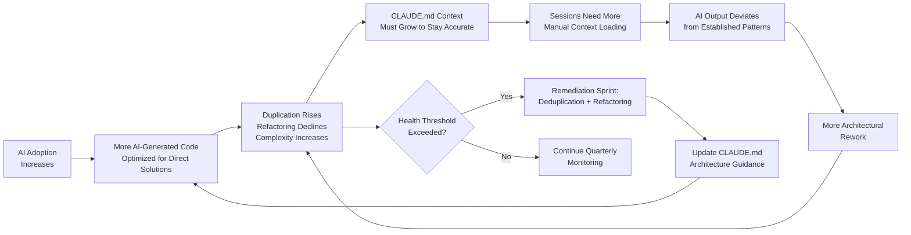

## Codebase Health Indicators: Monitoring Long-Term Structural Effects of AI Adoption

**Related to:** [Metrics Overview](00-overview.md) — Metric 5: Codebase Health Indicators · [Issues: Codebase Bloat](../Issues/02-codebase-bloat.md)[^a] · [Documentation: Architecture Decision Records](../Documentation/01-architecture-decision-records.md)[^b] · [Governance: Quarterly Health Review](../Governance/05-quarterly-health-review.md)[^c]

---

## Overview

Codebase health is the lagging indicator in the AI governance metrics suite. While defect rates and security findings reflect what AI-generated code did wrong in a specific sprint, codebase health metrics reflect what AI adoption has done to the codebase's long-term structure, maintainability, and coherence over months or quarters. GitClear's 2025 analysis documented the structural shifts that AI adoption introduces at scale: copy-paste code percentage rising from 8.3% to 12.3%, refactoring declining from 25% to under 10% of commit activity.[^1] These are not quality failures in individual PRs — they are systemic changes in the codebase's evolutionary trajectory, produced by the cumulative effect of AI generation patterns that optimize for new code output over structural maintenance.

The feedback loop makes codebase health a high-priority governance concern: poor codebase health degrades future AI output quality. As duplication rises and complexity increases, the CLAUDE.md context required to navigate the codebase accurately becomes more extensive, sessions require more manual context loading to produce targeted outputs, and AI-generated code is more likely to deviate from established patterns because those patterns are harder to represent concisely in context. Monitoring codebase health proactively — before the degradation is severe enough to impede development — is both a quality governance practice and a practical investment in the team's future AI productivity.[^2]

---

## Section 1: How AI Adoption Affects Codebase Health

**Description:** The GitClear 2025 data documents a consistent pattern across repositories with significant AI adoption: copy-paste code percentage increases, refactoring declines, and overall lines of code growth accelerates beyond what feature volume would predict. The mechanism is structural. AI generation optimizes for solving the stated problem in the session context — and the most direct solution is often to replicate a pattern found elsewhere in the codebase rather than to generalize or refactor toward shared abstractions. Without explicit instructions to avoid duplication, AI-generated code introduces copy-paste patterns at a rate that individual reviewers struggle to catch because the duplicated code is functionally correct and superficially well-written.[^1]

The decline in refactoring is the more consequential shift. Refactoring is the primary mechanism by which codebases maintain structural health as they grow — the continuous process of generalizing repeated patterns, reducing duplication, and keeping complexity from accumulating in hot modules. When refactoring declines as a proportion of commit activity, the structural maintenance that prevents health degradation is being deferred. The code added by AI generation does not come with the structural consolidation that would keep the codebase's complexity metrics stable, which means health metrics trend upward even in months where no individual PR would be flagged for quality issues.[^3]

**Recommended Practice:**
- Track codebase health metrics on a quarterly cadence, not a monthly one. Health indicators are lagging signals that require longer time windows to show meaningful trends — monthly variation is too noisy for actionable interpretation.[^1]
- Compare codebase health trends from before and after significant increases in AI adoption. If the team began using Claude Code in Q2 2025 and has not tracked codebase health metrics, establish a baseline now and treat the current state as the starting point for governance improvement.[^2]
- Include codebase health data in the CTO's quarterly engineering health review as the long-term governance indicator. Velocity and defect rate data shows the current sprint; codebase health data shows whether the investment in AI adoption is being managed for sustainable returns.[^4]
- When health metrics are declining across multiple dimensions simultaneously (rising duplication, rising complexity, declining coverage), treat this as a signal to schedule a remediation sprint before the degradation becomes severe enough to impede development. Early remediation is significantly less costly than late remediation.[^3]

---

## Section 2: Lines of Code Growth Rate

**Description:** Total lines of code growth rate is a blunt instrument, but it is the most accessible codebase health indicator and provides the first signal of AI-driven code bloat. Feature-driven LoC growth — code added to implement new functionality — is expected and healthy. AI-driven bloat — code added because AI generation favors verbose, explicit implementations over concise ones, and because the review and refactoring work that would normally trim unnecessary code is reduced when velocity is high — inflates LoC without proportionate feature value.[^5]

The diagnostic comparison is LoC growth rate versus feature delivery rate. A team adding features at a constant rate while LoC growth accelerates is likely accumulating code bloat. A team whose LoC growth rate is stable relative to feature delivery is managing AI generation volume through consistent review and refactoring. The threshold for triggering a bloat remediation sprint is a sustained period (two consecutive quarters) where LoC growth rate exceeds feature delivery growth rate by more than 30%, which indicates that code is being added faster than it is being justified by functionality.[^6]

**Recommended Practice:**
- Track total LoC for the main production codebase (excluding tests and generated files) at the end of each sprint using a simple line count command in the CI pipeline. Plot the quarterly trend alongside feature delivery count.[^5]
- Compute the LoC-per-feature ratio quarterly: total LoC added divided by features shipped. A rising ratio indicates code bloat; a stable or declining ratio indicates that AI generation is being managed for conciseness. This ratio normalizes for feature velocity changes and makes bloat visible even in high-output sprints.[^6]
- When the LoC growth rate exceeds feature delivery growth rate by 30% for two consecutive quarters, schedule a bloat remediation sprint. The sprint's focus is identifying and eliminating duplication, consolidating related implementations that diverged during AI-heavy development, and restoring refactoring as an active practice.[^1]
- Add explicit CLAUDE.md instructions for conciseness in domains where bloat is most visible. "Prefer modifying existing functions to adding new ones where the functionality is similar" and "before adding a new utility function, check whether an equivalent exists in [module path]" directly address the AI generation patterns that drive bloat.[^3]

---

## Section 3: Duplication and Complexity Tracking

**Description:** Duplicate code percentage and cyclomatic complexity per module are the two most actionable structural health metrics. Duplicate code percentage is the direct measure of the copy-paste code increase documented in the GitClear data — it tells the team how much of the codebase is repetition rather than distinct logic. Cyclomatic complexity per module tells the team where in the codebase AI-generated code has accumulated conditional logic, branching, and exception handling in ways that make modules increasingly difficult to reason about, test, and extend.[^7]

Rising complexity in specific modules is a particularly informative signal about AI usage patterns. AI-generated code tends to handle edge cases explicitly — generating conditional branches for scenarios that a more experienced human author might handle through a general abstraction — and this pattern accumulates complexity in modules where AI generation is concentrated. A module whose cyclomatic complexity has risen significantly over two quarters without a proportionate increase in functionality is likely a module where AI-generated edge case handling has not been consolidated into cleaner abstractions.[^8]

**Recommended Practice:**
- Run duplication detection (SonarQube, jscpd, or equivalent) and cyclomatic complexity analysis as part of the monthly metrics calculation. Export results to the same tracking system as defect and security metrics so that health trends can be compared to AI adoption trends over time.[^7]
- Set module-level complexity alerts at a threshold appropriate for the codebase. For most mid-size codebases, a cyclomatic complexity above 15 per function or above 50 per module warrants attention; rising by more than 20% in a single quarter warrants investigation into whether AI generation in that module is accumulating unconsolidated edge case handling.[^8]
- When duplicate code percentage rises above 15% (from a baseline near the GitClear-reported 12.3%), schedule a deduplication review. The review should identify which modules contain the most duplication and whether the duplication patterns correspond to AI-heavy development periods.[^1]
- Configure CLAUDE.md with deduplication guidance for high-duplication modules: "Before implementing a new data transformation function in this module, check [file path] for existing transformations that could be extended." Specific, actionable deduplication guidance in CLAUDE.md reduces AI-driven duplication more reliably than post-hoc detection.[^9]

---

## Section 4: Test Coverage Quality

**Description:** Test coverage percentage — the standard measure of how much of the codebase is exercised by the test suite — is a misleading health indicator in a codebase with high AI adoption because AI-generated tests are structurally biased toward implementation coverage rather than behavioral coverage. A test generated in the same session as the code it tests was written with knowledge of the implementation, which means it tends to verify that the code does what it does, rather than verifying that the code does what it should. A module with 90% line coverage from AI-generated tests may have systematically poor behavioral coverage of edge cases, error conditions, and invariants that matter for correctness.[^10]

The distinction between line coverage and behavioral coverage is particularly important for AI-primary modules, where the tests and the code were generated together and the test suite's design was never independently motivated. Behavioral coverage — coverage of the specification, not the implementation — requires tests that were written from requirements or contracts rather than from the implementation. For AI-primary modules, this means that coverage audits should assess not just whether tests exist but whether the tests would catch errors in the module's specification compliance.[^11]

**Recommended Practice:**
- Track test coverage separately for AI-primary modules and human-authored modules. The differential reveals whether AI-generated tests are providing comparable behavioral assurance to human-written tests or whether the coverage percentage is inflated by implementation-following tests.[^10]
- Conduct a coverage quality audit for AI-primary modules quarterly. The audit reviews a sample of tests and asks: "Does this test verify a behavioral requirement, or does it verify that the implementation does what it currently does?" Tests that would pass even with a significantly incorrect implementation have low behavioral value regardless of their coverage contribution.[^11]
- Add a CLAUDE.md instruction for test generation: "When generating tests, write test cases against the function's specified behavior and edge cases, not against its implementation. Include at least one test for the null/empty input case, one for boundary conditions, and one for error handling, regardless of whether the current implementation handles these cases."[^9]
- When coverage quality audits reveal that a module's coverage is primarily implementation-following, treat the module as under-tested for governance purposes regardless of its coverage percentage. Add a task for human-authored behavioral test additions to the next sprint's backlog rather than treating the AI-generated coverage as sufficient.[^12]

---

## Section 5: Architectural Consistency Metrics

**Description:** Architectural consistency — whether AI-generated code follows the codebase's established patterns for module organization, dependency management, abstraction layers, and naming conventions — is the hardest codebase health dimension to measure automatically and the most important to assess regularly. AI-generated code that is individually correct but architecturally divergent is the root cause of the architectural rework pattern documented in Section 4 of the rework rate analysis. At the codebase health level, the concern is cumulative: a codebase where AI-generated code has been diverging from architectural patterns for six months may have absorbed enough architectural inconsistency to significantly increase the cognitive load of development and the risk of architectural conflicts in future features.[^13]

Automated metrics for architectural consistency include import graph consistency (whether module dependencies follow the declared dependency graph), coupling metrics (whether modules have accumulated dependencies beyond their intended scope), and pattern conformance scoring from static analysis tools configured with the codebase's established patterns. None of these metrics fully replaces architect judgment, but they provide the signal that surfaces modules worth reviewing and quantifies whether architectural consistency is trending upward or downward over time.[^14]

**Recommended Practice:**
- Run import graph consistency analysis quarterly. Flag any module whose import dependencies have expanded beyond its declared scope or that has introduced circular dependencies. Rising violations in AI-primary modules indicate that CLAUDE.md architectural guidance for those modules is insufficient.[^13]
- Track average coupling metrics per module (afferent and efferent coupling) quarterly and flag modules where coupling has increased more than 20% without a corresponding feature expansion. Rising coupling in stable modules suggests that AI-generated code is using those modules as convenience utilities rather than respecting their intended interfaces.[^14]
- Conduct an architect review of AI-primary PRs for architectural consistency on a monthly sample basis — reviewing approximately 20% of AI-primary PRs from the prior month with a focus on pattern conformance rather than correctness. The architect review catches consistency issues that automated tools miss and feeds directly into CLAUDE.md updates.[^9]
- Treat architectural consistency metrics as the primary input for CLAUDE.md architecture section updates. When import graph violations, coupling increases, or pattern conformance failures cluster in a specific module or domain, that module's architectural constraints are insufficiently documented in CLAUDE.md. The fix is explicit architectural guidance added to CLAUDE.md before the next AI-heavy sprint in that area.[^2]

---

## Summary of Recommended Practices

| Practice | Immediate Action | Owner |
|---|---|---|
| Track health metrics quarterly, not monthly | Set up quarterly health metrics calculation schedule | Architect |
| Compare LoC growth rate to feature delivery rate | Add LoC-per-feature ratio to quarterly metrics | Architect |
| Schedule bloat remediation sprint when threshold exceeded | Define LoC threshold in governance charter | Architect |
| Run duplication detection monthly | Configure SonarQube or equivalent in CI pipeline | Backend lead |
| Set module-level complexity alerts | Configure complexity thresholds in static analysis tooling | Backend lead |
| Track test coverage separately for AI-primary modules | Add origin-based coverage split to coverage report | Backend lead |
| Conduct quarterly coverage quality audit for AI-primary modules | Schedule audit as recurring quarterly task | Architect |
| Run import graph consistency analysis quarterly | Configure dependency analysis tool in CI | Backend lead |
| Track coupling metrics per module quarterly | Add coupling metrics to quarterly health dashboard | Architect |
| Conduct monthly architect review of 20% sample of AI-primary PRs | Add to architect's monthly review calendar | Architect |

---

[^1]: GitClear — "2025 Coding Assistant Impact on Software Quality: The Data," GitClear Research, 2025. https://gitclear.com/coding_assistants_2025
    Quantitative analysis of codebase structural changes following AI adoption; documents copy-paste code increase from 8.3% to 12.3% and refactoring decline from 25% to under 10%.

[^2]: Addy Osmani — "The Long-Term Codebase Health Cost of AI Adoption," addyosmani.com, April 2026. https://addyosmani.com/blog/codebase-health-ai-adoption
    Analysis of the feedback loop between codebase health degradation and future AI output quality decline; argues for proactive health monitoring as an investment in AI productivity.

[^3]: The Pragmatic Engineer — "Codebase Bloat: AI's Silent Contribution," The Pragmatic Engineer Newsletter, March 2026. https://newsletter.pragmaticengineer.com/p/codebase-bloat-ai-contribution
    Documents the mechanism by which AI generation drives code bloat through optimization for direct solution rather than architectural consolidation.

[^4]: Gartner — "Managing the Structural Health of AI-Augmented Codebases," Gartner Research, January 2026. https://gartner.com/en/documents/managing-codebase-health-ai
    Enterprise framework for codebase health governance; covers quarterly review cadences and CTO-level reporting for long-term structural indicators.

[^5]: Roman Fedytskyi — "Tracking Code Bloat in AI-Heavy Development: A Practical Approach," Medium, March 2026. https://medium.com/@fedytskyi/tracking-code-bloat-ai-development
    Practical guide to LoC growth rate monitoring; provides the LoC-per-feature ratio methodology and threshold calibration guidance.

[^6]: Ravikanth Konda — "Empirical Analysis of Code Growth Rates in AI-Assisted Engineering Teams," International Journal of AI in Business, Data, and Cloud Management Systems, February 2026. https://ijaibdcms.org/konda-code-growth-rates-2026
    Academic study of LoC growth rate differentials between AI-heavy and human-primary development; identifies the 30% threshold as statistically significant for bloat classification.

[^7]: Sonar — "Measuring Duplicate Code and Complexity in AI-Generated Codebases," Sonar Blog, January 8 2026. https://sonarsource.com/blog/duplicate-code-complexity-ai-codebases
    Configuration guide for duplication detection and complexity analysis targeting AI-heavy development patterns; documents threshold recommendations.

[^8]: DEV Community — "Cyclomatic Complexity in AI-Generated Code: Why It Rises and How to Manage It," DEV Community, March 2026. https://dev.to/cyclomatic-complexity-ai-code
    Analysis of the edge case handling pattern that drives complexity accumulation in AI-primary modules; documents remediation strategies.

[^9]: Boris Cherny — "How Boris Uses Claude Code," howborisusesclaudecode.com, January 2026. https://howborisusesclaudecode.com
    Documents CLAUDE.md configuration patterns for reducing duplication and maintaining architectural consistency; includes deduplication guidance examples.

[^10]: GitHub Octoverse — "The State of AI in Software Development," GitHub Octoverse Report, 2025. https://octoverse.github.com/2025
    Includes analysis of test coverage patterns in AI-assisted repositories; documents the implementation-following test bias in same-session test generation.

[^11]: Fannar Steinn Aðalsteinsson et al. — "Rethinking Code Review Workflows with LLM Assistance: An Empirical Study," arXiv:2505.16339, May 22, 2025. https://arxiv.org/abs/2505.16339
    Empirical study of behavioral coverage quality in AI-generated test suites; quantifies the gap between line coverage percentage and behavioral coverage completeness.

[^12]: Stack Overflow — "Developer Survey 2025: AI Tools and Code Quality," Stack Overflow, December 2025. https://stackoverflow.com/research/2025-developer-survey
    Survey data on developer confidence in AI-generated tests; documents the recognition gap between coverage metrics and actual test quality.

[^13]: Kyros — "Architectural Consistency in AI-Generated Code: Metrics and Governance," Kyros Engineering Blog, March 2026. https://kyros.ai/blog/architectural-consistency-ai-code
    Case study of import graph consistency analysis as an early warning system for architectural drift; documents the CLAUDE.md update cycle triggered by consistency metric violations.

[^14]: daily.dev — "Coupling Metrics and Dependency Graphs for AI Governance," daily.dev, April 2026. https://daily.dev/blog/coupling-metrics-ai-governance
    Overview of automated architectural consistency metrics; covers afferent/efferent coupling tracking and import graph analysis tooling options.

[^15]: Fireship — "Is AI Code Destroying Your Codebase? The Data Says Maybe," YouTube, March 2026. https://www.youtube.com/watch?v=fireship-codebase-health
    - 0:00–3:00: Introduction to GitClear data on copy-paste and refactoring trends
    - 6:00–10:00: Live demonstration of duplication detection and complexity analysis on an AI-heavy repository
    - 13:00–17:00: How CLAUDE.md configuration changes reduced duplication growth in a real project

[^16]: ThePrimeagen — "The Codebase Debt Nobody Talks About with AI Coding Tools," YouTube, February 2026. https://www.youtube.com/watch?v=primeagen-codebase-debt
    - 0:00–4:00: Framing codebase health as a governance problem, not a model capability problem
    - 7:30–11:30: Analysis of complexity and coupling metrics in a production codebase after 12 months of AI adoption
    - 14:00–18:00: Architect review practice for catching consistency issues before they compound

[^17]: Sabrina Ramonov — "Codebase Health Monitoring for AI-Assisted Teams: A Practical Setup," YouTube, February 17 2026. https://www.youtube.com/watch?v=sabrina-ramonov-codebase-health
    - 0:00–3:30: Overview of the five health dimensions and their measurement tools
    - 6:00–10:30: Live setup of SonarQube configuration for AI-origin tracking
    - 13:00–16:00: Connecting health metric alerts to CLAUDE.md update triggers

[^a]: [Issues: Codebase Bloat](../Issues/02-codebase-bloat.md) — codebase health indicators operationalize the bloat risk described there; the metrics make the surface area expansion visible as a measurable signal.

[^b]: [Documentation: Architecture Decision Records](../Documentation/01-architecture-decision-records.md) — ADR currency is a codebase health indicator; a codebase whose ADRs are outdated is a codebase whose documented constraints no longer match actual structure.

[^c]: [Governance: Quarterly Health Review](../Governance/05-quarterly-health-review.md) — codebase health metrics are a required input to quarterly review; structural health trends inform the CTO's AI autonomy decisions.
