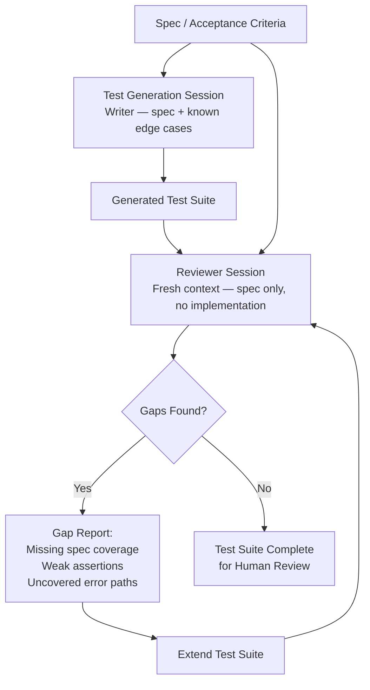

## Test Session Design for AI-Generated Code

**Related to:** [QA & Testing Overview](00-overview.md) — Area 1: Test Session Design for AI-Generated Code · [Governance: Review Policies](../Governance/01-review-policies.md)[^a] · [Issues: Review Theater](../Issues/05-review-theater.md)[^b] · [Workflows: Verification-Driven Development](../Workflows/05-verification-driven-development.md)[^c] · [Prompting: Task-Specific Prompt Patterns](../Prompting/02-task-prompt-patterns.md)[^d]

---

## Overview

The most reliable way to get bad tests from Claude Code is to append "write tests for this" to the end of an implementation session. The session already holds the implementation in context; it already made the decisions about what the code does. Tests generated in that state verify the implementation's behavior rather than the requirements' intent. They are structurally incapable of finding the bugs the implementation introduced, because the same context that generated the bugs is generating the tests.[^1]

Test session design is the discipline of treating test generation as a first-class Claude Code task with its own context requirements, inputs, and quality criteria. It applies the same structured approach used for implementation sessions — spec injection, task decomposition, clear output criteria — to the specific challenge of generating tests that can catch the failures AI-generated code tends to introduce. A well-designed test session does not just produce more tests; it produces tests that will actually fail when the implementation is wrong.

This document covers the four core practices: designing test sessions with proper inputs, applying the writer/reviewer pattern to test suites, maintaining separate session patterns for unit and integration tests, and avoiding the specific failure mode of AI-generated assertions that mirror AI-generated implementation bugs.

---

## Section 1: Designing a Test Session with the Right Inputs

**Description:** A test generation session needs three inputs that an implementation session does not require: the specification independent of the implementation, the coverage target defined in terms of behavior rather than lines, and the known edge cases and failure patterns that the team has previously documented. Without these inputs, Claude Code defaults to analyzing the implementation and writing tests that describe what it does — which is circular, not corrective.[^2]

The specification input is the most critical. When Claude Code has access to the original spec or acceptance criteria alongside the implementation, it can identify gaps: places where the implementation does something that is not in the spec, or where the spec requires something the implementation does not cover. This gap identification is the primary value of test generation — not producing test boilerplate for code paths that already work, but finding the code paths that were missed or misimplemented.[^3]

**Recommended Practice:**
- Begin every test generation session with three injected inputs: the relevant spec or acceptance criteria, the module to be tested, and any known edge cases from CLAUDE.md or the regression library. Never start a test session without the spec — it is the independent reference that makes tests more than implementation transcription.[^2]
- Define the coverage target in behavioral terms, not metric terms. "Cover all error paths defined in the spec" produces better tests than "reach 80% branch coverage." Coverage metrics are an output to verify; they are not a useful target for Claude Code to optimize toward.[^1]
- Instruct Claude explicitly not to derive test assertions from implementation internals: "Write tests that would fail if the implementation were incorrect, not tests that verify the current implementation is what it is." This instruction needs to be explicit — without it, the default behavior is to mirror implementation assumptions.[^3]
- Maintain a standing test generation prompt in `.claude/commands/generate-tests` that encodes these input requirements. Every engineer should use this command rather than composing test generation requests from scratch — consistency of inputs is more important than individual optimization.[^4]

---

## Section 2: The Writer/Reviewer Pattern Applied to Tests

**Description:** The writer/reviewer pattern — running a fresh-context session to review the output of a generating session — is as applicable to test suites as it is to implementation code. The generating session knows which failure modes it chose to cover; it cannot easily see which failure modes it did not cover, because the uncovered modes are not present in its context. A fresh-context reviewer session approaches the test suite with no knowledge of the implementation choices and can identify gaps that are structurally invisible to the generating session.[^5]

The reviewer session for a test suite has a different prompt than the reviewer session for implementation code. The reviewer is not looking for bugs in the tests themselves — it is looking for missing coverage: failure modes that exist in the spec but are not exercised by any test, edge cases that a fresh reading of the requirements surfaces, and assertions that are phrased so weakly that they would pass even if the implementation were wrong. This is gap analysis, not bug detection.[^5]

**Recommended Practice:**
- After generating a test suite, open a fresh Claude Code session with the spec, the test suite, and no implementation code. Prompt the reviewer to identify: (a) spec requirements not covered by any test, (b) boundary conditions not exercised, (c) error paths not validated, and (d) assertions that are too permissive to catch real failures.[^5]
- Do not show the reviewer session the implementation. The reviewer's independence from implementation context is the source of its value. If the reviewer sees the implementation, it will evaluate whether tests are consistent with the implementation rather than whether tests are consistent with the spec.[^1]
- Route the reviewer's gap report back to the test author — human or AI — as a required extension list. The gap report is not advisory; any gap identified by the reviewer session must be addressed before the test suite is considered complete for review.[^4]
- Document recurring gap patterns in CLAUDE.md. If the reviewer session consistently identifies missing error path coverage or missing null input tests, that pattern is a signal to update the test generation prompt to include those cases as required outputs.[^2]

---

## Section 3: Unit vs. Integration Test Session Patterns

**Description:** Unit and integration tests have fundamentally different context requirements that make a single combined test generation session a poor approach for both. Unit tests are narrow: they require deep familiarity with a single module's interface, invariants, and edge cases. Integration tests are wide: they require understanding of cross-module interactions, data flow, state management, and environment configuration. Combining both in a single session forces Claude Code to hold an amount of context that degrades the quality of both test types.[^6]

The session pattern differences are structural. A unit test session should receive the module's spec, its interface definition, and any documented invariants. An integration test session should receive the integration contract between modules, the shared state or data model, and examples of the integration paths that real user actions exercise. These are different documents; they require different session preparation; and they produce tests that serve different failure detection purposes.[^3]

**Recommended Practice:**
- Run unit and integration test generation as separate Claude Code sessions with separate inputs. Do not combine them in a single session, even for small modules. The sessions can run in parallel, but they should not share context.[^6]
- For unit test sessions: inject the module spec, the public interface definition, known invariants, and any documented failure patterns from the regression library. Target completeness within the module's boundary — every specified behavior, every error condition, every edge case in the documented range.[^2]
- For integration test sessions: inject the integration contract, the data flow specification, and representative user journeys from the product requirements. Target the seams between modules — the places where assumptions made in one module can fail to be satisfied by another.[^3]
- Maintain separate prompt templates for unit and integration test generation in `.claude/commands/`. The inputs differ enough that using the same template produces mediocre results for both. The unit test prompt optimizes for module completeness; the integration test prompt optimizes for cross-module failure detection.[^4]

---

## Section 4: Avoiding AI-Generated Assertions That Mirror Implementation Bugs

**Description:** The most insidious failure mode of AI-generated test suites is not insufficient coverage — it is incorrect assertions that pass. When AI generates both the implementation and the tests, a bug in the implementation may be consistently reflected in the test assertions. The test passes because the assertion was derived from the buggy behavior, not from the correct behavior. The bug ships to production with a passing test suite.[^1]

This failure mode is distinct from coverage gaps. Coverage tools will report 100% coverage because every line is exercised. Mutation testing will surface the problem because the assertion, when the mutation changes the implementation behavior, will still pass — the assertion never encoded what "correct" meant. The root cause is that Claude Code, when generating tests without an independent specification, naturally writes assertions that describe what the implementation currently does, which is the same as what it intends to do — and when it intends wrong, the assertions intend wrong alongside it.[^7]

**Recommended Practice:**
- Require that test assertions be derived from the spec, not from implementation inspection. In the test generation prompt, state explicitly: "All assertions must be derivable from the specification alone. Do not read the implementation to determine expected values — derive them from the requirements." This instruction materially changes assertion quality.[^1]
- Use the QA engineer to audit assertion correctness for any AI-generated test suite in a new module or after a significant AI-generated implementation. The audit should verify that expected values in assertions match the specification, not just that the tests pass.[^7]
- Add mutation testing to the CI pipeline for modules with high AI-generated test coverage. A mutation score below 50% in a module with 80% line coverage is a direct signal that assertions are mirroring implementation behavior rather than encoding correct behavior independently.[^5]
- When an incorrect assertion is found post-production — when a bug ships with a passing test that should have caught it — treat the assertion as a session design failure, not a one-time mistake. Update the test generation prompt and CLAUDE.md to prevent the same category of assertion error from recurring.[^4]

---

## Summary of Recommended Practices

| Practice | Immediate Action | Owner |
|---|---|---|
| Spec-first test session inputs | Create `.claude/commands/generate-tests` with spec injection requirement | QA Engineer |
| Behavioral coverage targets | Update test generation prompt to use behavioral coverage language | QA Engineer |
| Writer/reviewer pattern for tests | Add reviewer session step to test generation workflow documentation | QA Engineer |
| Separate unit and integration sessions | Create separate `.claude/commands/` prompts for each test type | QA Engineer |
| Assertion correctness audit | Add QA audit step to test review checklist for new modules | QA Engineer |
| Mutation testing in CI | Configure mutation testing for AI-primary modules | Backend lead |

---

[^1]: Addy Osmani — "The Productivity Paradox of AI Coding Tools," addyosmani.com, April 2026. https://addyosmani.com/blog/ai-productivity-paradox
    Tautological test generation: the mechanism by which tests derived from implementation describe behavior rather than validate requirements; spec-first session design as the structural remedy.

[^2]: Anthropic — "2026 Agentic Coding Trends Report," Anthropic, 2026. https://resources.anthropic.com/hubfs/2026%20Agentic%20Coding%20Trends%20Report.pdf
    Test session context requirements: why spec injection matters more than implementation context for test quality; known edge case injection as a coverage completeness mechanism.

[^3]: Boris Cherny — "How Boris Uses Claude Code," howborisusesclaudecode.com, January 2026. https://howborisusesclaudecode.com
    Integration test session design: cross-module failure detection as the target; user journey injection as input for integration test generation; the distinction between unit and integration session context requirements.

[^4]: Anthropic — "Best Practices for Claude Code," Claude Code Documentation, 2026. https://code.claude.com/docs/en/best-practices
    `.claude/commands/` as the canonical location for shared test generation prompts; CLAUDE.md update discipline for recurring session failure patterns; standing prompts as consistency infrastructure.

[^5]: Workflows — "06-writer-reviewer-pattern.md," ClaudeCodeReview, 2026.
    The writer/reviewer pattern: fresh-context gap analysis as the structural complement to generating sessions; reviewer session prompt design for test suite gap detection rather than bug detection.

[^6]: Fannar Steinn Aðalsteinsson et al. — "Rethinking Code Review Workflows with LLM Assistance: An Empirical Study," arXiv:2505.16339, May 22, 2025. https://arxiv.org/abs/2505.16339
    Context degradation in combined test sessions: the empirical case for separating unit and integration test generation; context scope as a determinant of test quality in AI-generated suites.

[^7]: Henry Coles — "PIT Mutation Testing," pitest.org, 2025. https://pitest.org
    Mutation testing as the detection mechanism for assertions that mirror implementation bugs; mutation score interpretation for AI-generated test suites; the relationship between assertion independence and mutation score.

[^a]: [Governance: Review Policies](../Governance/01-review-policies.md) — test session design is independent QA coverage that backs up review policy; the two are complementary gates with different ownership.
[^b]: [Issues: Review Theater](../Issues/05-review-theater.md) — independent test session design is the backstop when review theater allows defects through; QA coverage is what catches what rubber-stamp review misses.
[^c]: [Workflows: Verification-Driven Development](../Workflows/05-verification-driven-development.md) — verification-driven development and test session design share the principle that AI output must be independently verified; the workflow practice and the QA practice are aligned.
[^d]: [Prompting: Task-Specific Prompt Patterns](../Prompting/02-task-prompt-patterns.md) — test-generation prompts are a specific task prompt pattern category; the prompting patterns for generating tests are documented in relation to this QA workflow.
