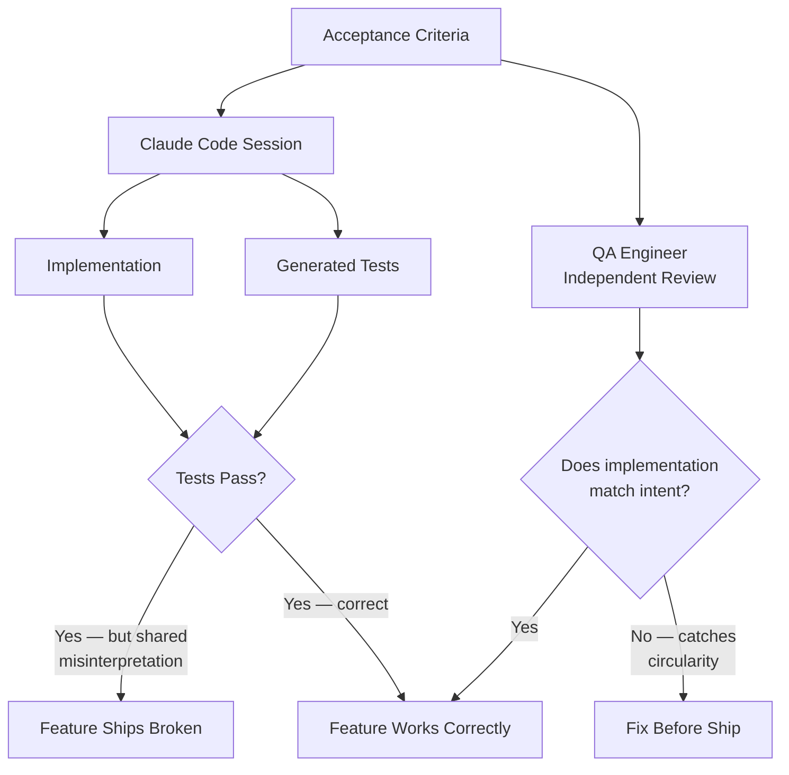

## Acceptance Criteria Automation

**Related to:** [QA & Testing Overview](00-overview.md) — Area 3: Acceptance Criteria Automation · [Workflows: Verification-Driven Development](../Workflows/05-verification-driven-development.md)[^a] · [Governance: Review Policies](../Governance/01-review-policies.md)[^b] · [MCP Servers: Linear Integration](../MCP%20Servers/04-linear-integration.md)[^c]

---

## Overview

Acceptance criteria are the specification layer closest to the product intent. When they are well-written — concrete, testable, unambiguous — they are the ideal input for test generation: they describe what the software must do from the perspective of the person who will decide whether it works. Using Claude Code to generate test cases directly from acceptance criteria, via MCP integrations with Linear or GitHub, is one of the highest-leverage applications of AI in the QA workflow. It creates traceability from ticket to test, reduces the manual effort of translating requirements into test scaffolding, and ensures that the test suite explicitly exercises what the product team has said the feature should do.[^1]

But this leverage is conditional. The same property that makes acceptance criteria useful as test generation input — they are the authoritative statement of required behavior — also creates a structural risk when AI is generating both the implementation and the tests from the same source. If Claude Code misreads an acceptance criterion, the misreading propagates into both the implementation and the generated tests. The implementation does the wrong thing; the tests confirm that the implementation does the wrong thing; the CI suite goes green; the feature ships broken. The human in the loop — the QA engineer — is the only structural break in this circularity.[^2]

---

## Section 1: Using Linear/GitHub Acceptance Criteria as Claude Session Input via MCP

**Description:** Model Context Protocol (MCP) enables Claude Code sessions to read directly from Linear tickets and GitHub issues, pulling acceptance criteria into the session context without manual copy-paste. This integration eliminates a transcription step that is both tedious and error-prone: when engineers manually summarize acceptance criteria in a prompt, they frequently omit nuances, rephrase conditions, and introduce interpretation drift before the test generation session even starts. Direct MCP injection preserves the original wording of the acceptance criteria as the session input.[^3]

The integration also creates structural traceability: when a test is generated from a Linear ticket's acceptance criteria, the connection between the ticket and the test is explicit and auditable. If the acceptance criteria change after the test is generated, the discrepancy is visible — the old test no longer matches the new criteria. This traceability is valuable during bug investigations and during product reviews where the question is "did we test what we said we would test."[^1]

**Recommended Practice:**
- Configure MCP integration with Linear or GitHub in the team's `.claude/mcp.json`. Establish a standard test generation command that accepts a ticket ID and pulls the acceptance criteria directly into the session rather than requiring manual input.[^3]
- Structure the MCP-injected test generation session to include: the ticket's acceptance criteria as the specification input, the relevant module or component as the scope, and the team's standing test structure conventions from CLAUDE.md. The acceptance criteria alone are not sufficient context for a high-quality test session.[^4]
- Require that generated tests include a comment linking them to the ticket from which the acceptance criteria were derived. This link is the audit trail that makes the traceability meaningful — a test with no ticket reference cannot be verified for criteria completeness.[^1]
- Review the ticket's acceptance criteria for testability before initiating the generation session. Criteria that are not concrete and measurable will produce vague tests. If the criteria are ambiguous, resolve the ambiguity with the product manager before generating tests — do not let AI interpret ambiguous criteria and embed the interpretation in the test suite.[^2]

---

## Section 2: Generating Test Cases Directly from Acceptance Criteria

**Description:** The mechanics of generating test cases from acceptance criteria are straightforward: inject the criteria, specify the module, instruct Claude Code to produce one or more test cases for each criterion, and require that each test case include an assertion derivable from the criterion's stated outcome. The challenge is not the mechanics — it is the quality of the acceptance criteria. Criteria that describe what the user does ("the user can filter by date") without describing what the system must do ("the filtered list must contain only items with dates in the specified range, inclusive of boundary dates") produce tests that exercise user actions but do not verify system correctness.[^5]

When criteria are well-formed, the test generation output can be high quality. A criterion that reads "given a list of 1000 items, the filter must return results within 500ms on the standard test environment" is directly testable: Claude Code can generate a performance test with the correct inputs, the correct measurement approach, and an assertion against the 500ms threshold. A criterion that reads "the filter should be fast" produces a test that exercises the filter and perhaps checks that it runs without error — which is not a performance test.[^2]

**Recommended Practice:**
- Before initiating test generation from acceptance criteria, rate each criterion for testability: is the expected outcome stated in terms that can be expressed as an assertion? Criteria that fail this check should be flagged for product manager clarification, not silently interpreted by AI.[^5]
- In the test generation session, map each acceptance criterion to one or more test cases explicitly. The session output should include a traceability matrix: "Criterion 3 → Test cases 7, 8, 9." This mapping makes gaps visible — if a criterion maps to zero test cases, it was not covered.[^1]
- Require that each generated test case include the acceptance criterion it is validating as a comment. This annotation makes test maintenance tractable: when a criterion changes, the relevant tests are immediately identifiable rather than requiring a full test suite analysis.[^3]
- Use the QA engineer to extend the generated test cases with boundary condition and failure path tests that are implied by the criteria but not explicitly stated. A criterion specifying a date range filter implies tests for empty results, for invalid date inputs, and for dates at the range boundary — these are typically absent from literal-criteria-based generation.[^4]

---

## Section 3: The Risk of Circular Validation

**Description:** Circular validation is the failure mode in which the same misunderstanding of a requirement propagates into both the implementation and the tests, and both appear correct because they are consistent with each other rather than with the requirement. It is the most significant risk in AI-assisted acceptance criteria automation, and it is structurally difficult to detect because every visible quality signal — test pass rate, coverage percentage, CI status — is green.[^2]

The mechanism is specific: Claude Code reads an acceptance criterion, forms an interpretation of what it means, generates implementation code based on that interpretation, and generates test cases based on the same interpretation. If the interpretation is correct, both the implementation and the tests are correct. If the interpretation is wrong, both are wrong in the same way. A human reviewer who did not write the original acceptance criterion and did not observe the AI's interpretation is the only way to break this circularity — they can read both the criterion and the implementation and assess whether the implementation actually satisfies the criterion as the product team intended it.[^6]

**Recommended Practice:**
- Never allow the same Claude Code session — or the same engineer — to both generate the implementation and generate the tests from the same acceptance criteria without an independent review step. The circularity lives in the shared interpretation; separating the generation tasks into different sessions helps but does not fully eliminate the risk if the same misinterpretation is probable from both sessions.[^2]
- Require that at least one person who did not author the implementation reviews the test suite against the original acceptance criteria, specifically checking whether the tests would catch the most plausible misinterpretation of each criterion. This is a different question than "do the tests cover the implementation" — it is "does the implementation cover the acceptance criterion as the product manager intended it."[^6]
- For high-stakes features, have the product manager or a QA engineer independently describe the expected behavior of the feature before reviewing the test suite. If the independent description differs from what the tests verify, the discrepancy reveals a circular misunderstanding before it ships.[^5]
- Treat post-production defects where "the tests passed but the feature was wrong" as circular validation incidents. Conduct a targeted retrospective to identify where the interpretive gap entered the system — was it in the acceptance criteria, in the AI's interpretation, or in the human review step? Document the finding in CLAUDE.md.[^4]

---

## Section 4: The QA Engineer's Role in Breaking the Circularity

**Description:** The QA engineer is the structural intervention point for circular validation. Their role in an acceptance criteria automation workflow is not to automate more — it is to provide the independent judgment that AI cannot provide. A QA engineer who reads the acceptance criteria, examines the generated test suite, and verifies that the tests would catch the most plausible misimplementations is performing a function that is irreplaceable by any combination of AI generation and automated checking.[^7]

This repositioning changes what the QA engineer does, not whether their role is needed. In a pre-AI workflow, the QA engineer spent significant time creating test case scaffolding from scratch. In an AI-assisted workflow, that scaffolding is generated. The QA engineer's time is freed from scaffolding creation and redirected toward: validating that the generated tests actually cover the product intent, identifying the implied tests that AI did not generate, and maintaining the test quality infrastructure (prompt library, regression library, CLAUDE.md test context) that governs how well AI-generated tests serve the team.[^7]

**Recommended Practice:**
- Define the QA engineer's acceptance criteria automation role explicitly: they are not the test generator — they are the independence check. Their job is to verify that AI-generated tests cover the acceptance criteria as the product team intended, not as AI interpreted them.[^7]
- Establish a QA review gate for any feature where both the implementation and the tests were primarily AI-generated from the same acceptance criteria. This gate is not a formality — it is the structural break in the circularity that prevents circular validation from shipping.[^2]
- Use the QA engineer's independent product understanding as a calibration signal: if they frequently find that AI-generated tests miss the product intent of acceptance criteria, the criteria are not well-formed for automated test generation. Feed this observation back to the product managers who author the criteria.[^5]
- Track the rate at which QA review identifies circular validation gaps over time. A declining rate suggests that the team's acceptance criteria quality and AI interpretation accuracy are improving. A stable or increasing rate is a governance signal: either the criteria quality needs improvement or the AI interpretation is structurally unreliable for the team's domain.[^6]

---

## Summary of Recommended Practices

| Practice | Immediate Action | Owner |
|---|---|---|
| MCP integration for ticket injection | Configure Linear/GitHub MCP in `.claude/mcp.json`; create test generation command | Architect |
| Testability rating before generation | Add testability check to QA pre-generation checklist | QA Engineer |
| Criteria-to-test traceability | Require criterion comment in each generated test case | QA Engineer |
| Circularity rule | Document in contribution guidelines: no solo AI generation of both implementation and tests | Architect |
| QA independence check | Add QA circularity review to feature test completion checklist | QA Engineer |
| Circular validation incident tracking | Add incident category to retrospective template; track rate monthly | QA Engineer |

---

[^1]: Anthropic — "Model Context Protocol," Anthropic, 2025. https://modelcontextprotocol.io
    MCP integration for Linear and GitHub: structured ticket injection into Claude Code sessions; traceability from acceptance criteria to generated tests; audit trail for criteria-to-test coverage verification.

[^2]: Addy Osmani — "The Productivity Paradox of AI Coding Tools," addyosmani.com, April 2026. https://addyosmani.com/blog/ai-productivity-paradox
    Circular validation as the primary structural risk of AI-assisted acceptance criteria automation; the mechanism by which misinterpretation propagates into both implementation and tests; human independence as the structural break.

[^3]: Anthropic — "Best Practices for Claude Code," Claude Code Documentation, 2026. https://code.claude.com/docs/en/best-practices
    MCP session configuration; `.claude/mcp.json` as the team configuration location for integrations; standing test generation commands with structured inputs.

[^4]: Boris Cherny — "How Boris Uses Claude Code," howborisusesclaudecode.com, January 2026. https://howborisusesclaudecode.com
    Acceptance criteria quality as a determinant of test generation quality; boundary condition and failure path extension as the QA engineer's complement to generated test scaffolding; CLAUDE.md as the registry for interpretation failure patterns.

[^5]: Kyros — "The Vibe Coding Crisis: How AI-Generated Technical Debt Is Costing Companies Millions," March 2026. https://usekyros.ai/blog/vibe-coding-crisis-ai-technical-debt
    Testability criteria for acceptance criteria: the conditions under which AI test generation from requirements is reliable versus high-risk; product manager roles in preventing circular validation.

[^6]: Fannar Steinn Aðalsteinsson et al. — "Rethinking Code Review Workflows with LLM Assistance: An Empirical Study," arXiv:2505.16339, May 22, 2025. https://arxiv.org/abs/2505.16339
    Shared misinterpretation as a failure root cause category; the empirical distribution of circular validation failures versus coverage gap failures in AI-generated test suites.

[^7]: Anthropic — "2026 Agentic Coding Trends Report," Anthropic, 2026. https://resources.anthropic.com/hubfs/2026%20Agentic%20Coding%20Trends%20Report.pdf
    QA repositioning in AI-assisted teams: from test scaffolding generation to independence check and quality gate; the QA engineer as the structural intervention for circular validation risk.

[^a]: [Workflows: Verification-Driven Development](../Workflows/05-verification-driven-development.md) — automated acceptance criteria are the verification mechanism that makes verification-driven development possible at scale; the workflow depends on the QA infrastructure this document describes.
[^b]: [Governance: Review Policies](../Governance/01-review-policies.md) — acceptance criteria completion is a review gate condition; automated verification of criteria reduces the reviewer burden for that check.
[^c]: [MCP Servers: Linear Integration](../MCP%20Servers/04-linear-integration.md) — Linear MCP can surface acceptance criteria from tickets into sessions; automated criteria execution is easier when criteria are accessible to the session that generates the code.
