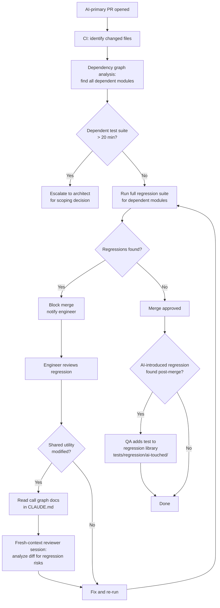

## Regression Prevention

**Related to:** [QA & Testing Overview](00-overview.md) — Area 4: Regression Prevention · [Issues: Codebase Bloat](../Issues/02-codebase-bloat.md)[^a] · [Tooling: CI/CD Integration](../Tooling & Configuration/06-cicd-integration.md)[^b] · [Governance: Review Policies](../Governance/01-review-policies.md)[^c]

---

## Overview

Regressions introduced by AI-generated code follow a different pattern than regressions introduced by human engineers. Human-authored regressions typically occur where the engineer made a mistake within the scope they understood — they changed code they were familiar with, and they missed an edge case or a downstream dependency. AI-generated regressions frequently occur outside the immediate scope of the task: a Claude Code session implementing a new feature modifies a shared utility to fit the new use case, without knowing — because it cannot see — how that utility is used in the 12 other places it is called throughout the codebase.[^1]

This is the context window limitation expressed as a regression risk. A session working on a specific feature has the feature's code in context; it has the utility's implementation in context; it does not have the utility's full call graph, the invariants that callers depend on, or the test coverage for those callers in context. It modifies the utility in a locally sensible way that breaks callers it has never seen. The regression surfaces in a CI run, in a manual test of an unrelated feature, or — worst case — in production.[^2]

Standard regression prevention practices are necessary but not sufficient for AI-generated code. This document covers four practices that address the specific regression patterns AI introduces: pre-merge regression hooks scoped to AI-touched modules, a curated regression test library, the fresh-context reviewer session as an active regression detection mechanism, and regression tracking as a distinct metric.

---

## Section 1: Why AI-Generated Code Introduces Regressions at Higher Rates

**Description:** The elevated regression rate from AI-generated code has two structural causes beyond the context window limitation. First, AI code generation is fast enough that engineers are tempted to skip the step of reading and understanding the module before asking AI to modify it. A human engineer who spends 30 minutes reading a module before modifying it develops working knowledge of its invariants, its callers, and its implicit contracts. An engineer who asks Claude Code to modify it immediately, based on a task description, bypasses that comprehension step entirely — and the AI session also bypasses it, because the session was given the task, not the module's call graph.

Second, AI-generated code tends to be locally coherent and globally inconsistent. Claude Code writes code that is clean, well-structured, and consistent with the patterns it can see in context. The patterns it cannot see — patterns in adjacent modules, patterns established in previous sessions, patterns that exist in the CLAUDE.md but were not explicitly injected into this session — are the patterns that get violated. The resulting code passes review on its own terms but breaks something it was never shown.[^1]

**Recommended Practice:**
- Require that engineers read and summarize the module's call graph and known invariants before initiating an AI session that modifies shared utilities. This comprehension step does not need to be exhaustive — a five-minute scan sufficient to produce a brief written summary is enough to surface the dependencies that the AI session needs to know about.
- Add the module's known callers and invariants to the CLAUDE.md context for that module. If the utility is used in 12 places and those usages have specific contracts, list them. This is the mechanism by which the comprehension that engineers develop through exposure is preserved as context for AI sessions.[^4]
- Track the proportion of regressions in each sprint that originated from AI-generated modifications to shared utilities versus AI-generated code in isolated modules. This breakdown identifies whether the team's shared utility documentation is sufficient — a high proportion of shared utility regressions is a CLAUDE.md coverage gap, not an AI capability limitation.[^2]
- Present the AI regression rate differential (AI-introduced vs. human-introduced) to the architect monthly. A persistent differential is a governance signal that the practices in this document need strengthening; a declining differential is evidence that they are working.[^1]

---

## Section 2: Pre-Merge Regression Test Hooks in CI

**Description:** Standard CI regression test configurations run the test suite for the modules that a PR directly modifies. This scoping is reasonable for human-authored changes, where modifications are usually contained within the engineer's explicit scope. For AI-generated changes, it is systematically insufficient: because AI may modify shared utilities as a side effect of implementing a specific feature, the regression tests that need to run are for all callers of any modified utility, not just for the directly modified module.[^5]

Pre-merge regression hooks for AI-primary PRs should use a broader scoping strategy: identify all changed files, identify all modules that depend on those files, and run the full regression test suite for all dependent modules before merge. This produces a larger CI footprint for AI-primary PRs, but the cost is justified by the regression pattern AI introduces. A 15-minute CI run that catches a regression before merge is far cheaper than a post-production regression investigation.[^5]

**Recommended Practice:**
- Configure a CI workflow that, for PRs tagged as AI-primary, runs the full regression suite for all modules with a dependency on any changed file. Use dependency graph analysis (supported by most modern CI platforms) to compute the dependent module set automatically rather than maintaining manual dependency lists.[^5]
- Tag AI-primary PRs consistently using the origin classification field in the PR template (documented in the Metrics section). The CI system uses this tag to select the broader regression hook rather than the standard module-scoped run.[^4]
- Set a time budget for the expanded regression hook: if the dependent module set for a given PR is so large that running its full test suite exceeds a 20-minute threshold, escalate to the architect for a scoping decision rather than running without the tests. The choice is between a longer CI run and an undetected regression — that is a decision for a human, not a default.[^6]
- Track the proportion of regressions caught by the pre-merge hook versus the standard CI run over time. A hook that catches no regressions over several months may be over-scoped; a hook that catches multiple regressions per sprint is providing clear value and should not be relaxed.[^2]

---

## Section 3: Maintaining a Regression Test Library for AI-Touched Modules

**Description:** Not all regression tests belong in the standard test suite. Some tests are specifically designed to catch the failure modes that AI tends to introduce — modifications to shared utility interfaces, violations of cross-module invariants, changes to behavior that callers implicitly depend on. These tests may be too narrow for the standard test suite (they protect specific invariants rather than full features) but too important to leave uncovered. A dedicated regression test library for AI-touched modules is the home for this category.[^7]

The library is curated and maintained by the QA engineer. After every regression incident caused by AI-generated code, the QA engineer adds tests to the library that would have caught the regression before it shipped. Over time, the library becomes a living record of the failure modes AI has actually introduced in this codebase — and a concrete prevention mechanism for every recurrence of those failure modes.[^7]

**Recommended Practice:**
- Create a dedicated test directory for the regression library, separate from the standard test suite: `tests/regression/ai-touched/`. Organize it by module, with a brief comment on each test documenting the specific incident or failure mode it prevents.[^7]
- After every AI-introduced regression incident, the QA engineer is responsible for adding at least one test to the library before the sprint closes. This rule converts regression incidents into permanent prevention — the library grows continuously without requiring a separate audit process.[^6]
- Include the regression library in the CI run for all PRs that touch the relevant modules, not just AI-primary PRs. Human engineers modifying an AI-touched module should also run the library tests — the regression risks identified by AI usage apply to anyone modifying the affected code.[^5]
- Review the regression library quarterly for test coverage gaps: are there module categories or failure mode types that the library does not cover? A library that has grown organically from incidents will have gaps in areas where no incident has yet occurred. Proactive coverage for high-risk modules — authentication, data access, shared business logic utilities — should be added before the first incident, not after.[^4]

---

## Section 4: Fresh-Context Reviewer Sessions as Regression Detection

**Description:** The fresh-context reviewer session — a new Claude Code session with no knowledge of the implementation choices, given the code and the spec to review — is a regression detection mechanism as well as a code quality mechanism. A reviewer session that is given the diff of a PR alongside the full test suite for affected modules can identify whether any of the changes plausibly breaks behaviors that the test suite covers — not by running the tests, but by reasoning about the code changes and their potential effects on callers.[^8]

This is a high-value application of the reviewer session for AI-primary PRs modifying shared utilities. The reviewer session can be explicitly prompted: "Review this diff for potential regressions. Identify any callers or dependent modules whose behavior could be affected by these changes. List specific test cases from the regression library that should be verified before this PR merges." The session functions as a pre-CI triage step that focuses human and automated attention on the highest-risk potential regressions.[^8]

**Recommended Practice:**
- For AI-primary PRs that modify shared utilities, add a reviewer session step before the CI run: provide the diff, the module's call graph documentation, and the current regression library for the module. Ask the reviewer session to identify: (a) callers that might be affected, (b) invariants that might be violated, (c) existing tests that should be checked, and (d) any behaviors not currently covered by tests that the change could break.[^8]
- Include the reviewer session's regression concerns as a comment on the PR before human review begins. This focuses the human reviewer's attention on the specific regression risks identified rather than requiring them to re-analyze the diff from scratch.[^4]
- When the reviewer session identifies a potential regression not covered by any existing test, treat this as a regression library addition opportunity. Before the PR merges, add the test to the library. The reviewer session's finding becomes a permanent prevention measure.[^7]
- Track the reviewer session's regression detection rate: how often does the reviewer session identify a regression risk that the standard CI run would not have caught? A high detection rate confirms the reviewer session is providing value; a low detection rate may indicate the regression library is already comprehensive or the reviewer session prompt needs improvement.[^6]

---

## Summary of Recommended Practices

| Practice | Immediate Action | Owner |
|---|---|---|
| Module comprehension before AI session | Add to contribution guidelines: summary-before-modify rule for shared utilities | Architect |
| CLAUDE.md caller and invariant documentation | Audit shared utilities; add caller lists to CLAUDE.md | Architect + Backend leads |
| Pre-merge regression hook for AI-primary PRs | Configure dependency-scoped CI workflow triggered by AI-primary PR tag | Backend lead |
| Regression library creation | Create `tests/regression/ai-touched/`; document library contribution rule | QA Engineer |
| Post-incident library additions | Add to incident retrospective checklist: library test required before sprint close | QA Engineer |
| Reviewer session for shared utility PRs | Add reviewer session step to PR workflow documentation | QA Engineer |

---

[^1]: GitClear — "2025 Coding on Copilot: 2023 Data Shows Downward Pressure on Code Quality," GitClear Research, 2025. https://www.gitclear.com/coding_on_copilot_data_shows_ais_downward_pressure_on_code_quality
    AI-generated regressions as a pattern distinct from human-generated regressions; local coherence and global inconsistency as the structural cause; shared utility modification as the primary regression mechanism.

[^2]: Kyros — "The Vibe Coding Crisis: How AI-Generated Technical Debt Is Costing Companies Millions," March 2026. https://usekyros.ai/blog/vibe-coding-crisis-ai-technical-debt
    Regression rate increase in AI-heavy teams; the compounding cost model for regression incidents; tracking AI-introduced regression rate as a governance metric distinct from total regression counts.

[^4]: Anthropic — "Best Practices for Claude Code," Claude Code Documentation, 2026. https://code.claude.com/docs/en/best-practices
    CLAUDE.md documentation of module callers and invariants; PR origin classification tags for CI workflow selection; regression library as a CLAUDE.md supplement for AI session context.

[^5]: Yue Liu et al. — "Debt Behind the AI Boom: A Large-Scale Empirical Study of AI-Generated Code in the Wild," arXiv:2603.28592, March 30, 2026. https://arxiv.org/html/2603.28592
    Pre-merge regression test coverage gaps: the case for dependency-scoped CI runs for AI-generated PRs; survivorship of AI-introduced issues that standard CI scoping misses.

[^6]: Anthropic — "2026 Agentic Coding Trends Report," Anthropic, 2026. https://resources.anthropic.com/hubfs/2026%20Agentic%20Coding%20Trends%20Report.pdf
    CI time budget governance for expanded regression hooks; the cost comparison between longer CI runs and post-production regression investigations; proactive library expansion for high-risk modules.

[^7]: Boris Cherny — "How Boris Uses Claude Code," howborisusesclaudecode.com, January 2026. https://howborisusesclaudecode.com
    Regression test library design and maintenance: curated tests for AI-specific failure modes; post-incident library contribution as a continuous prevention mechanism; library organization by module and incident.

[^8]: Workflows — "06-writer-reviewer-pattern.md," ClaudeCodeReview, 2026.
    Fresh-context reviewer sessions as regression detection: prompt design for shared utility regression analysis; reviewer session output as pre-CI triage input; regression concern comments as human review focus mechanisms.

[^a]: [Issues: Codebase Bloat](../Issues/02-codebase-bloat.md) — regression risk compounds as codebase surface area grows; bloat and regression prevention are paired concerns because expanded surface area is harder to regression-test completely.
[^b]: [Tooling: CI/CD Integration](../Tooling & Configuration/06-cicd-integration.md) — regression suites run in CI/CD pipelines; the integration document describes the pipeline infrastructure that regression prevention depends on.
[^c]: [Governance: Review Policies](../Governance/01-review-policies.md) — regression impact assessment is a review requirement for changes to shared components; the review policy includes regression scope evaluation.
