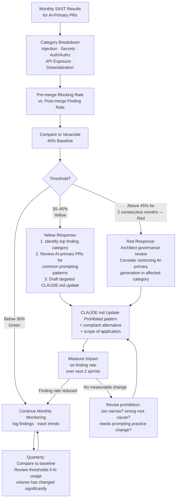

## Security Vulnerability Trends: Governing AI-Generated Code for Security Outcomes

**Related to:** [Metrics Overview](00-overview.md) — Metric 3: Security Vulnerability Trends · [Issues: Security Vulnerabilities](../Issues/04-security-vulnerabilities.md)[^a] · [Security: SAST and DAST Integration](../Security/02-sast-dast-integration.md)[^b] · [Governance: Incident Response](../Governance/07-incident-response.md)[^c] · [Governance: Quarterly Health Review](../Governance/05-quarterly-health-review.md)[^d]

---

## Overview

Veracode's March 2026 security analysis found that 45% of AI-generated code fails automated security tests — a rate that has remained essentially stable across two years of significant model capability improvements. The stability of this figure is the most important data point for AI security governance: model improvements have not reduced AI security failure rates, which means the primary lever for improvement is not waiting for better models. The lever is governance — specifically, how AI generation is configured, reviewed, and restricted for security-sensitive operations. Teams that treat their AI security outcomes as a function of model quality are waiting for something that is not coming; teams that treat them as a function of governance practice have a tractable improvement path.

Tracking security vulnerability trends separately for AI-generated code serves two purposes: it makes the security cost of AI adoption legible in terms that can be compared to velocity benefits, and it creates the signal needed to improve governance practice over time. A team that does not track AI-specific security findings does not know whether its AI adoption is widening or closing the security gap — it only finds out when something goes wrong. Trend tracking converts that latent risk into visible metrics that support proactive intervention before the incident occurs.

---

## Section 1: Security Metrics Baseline

**Description:** The Veracode finding — 45% AI security failure rate, stable across model generations — establishes the baseline against which team-specific rates should be compared. Teams below the baseline are benefiting from governance practices that are better than the industry average; teams at or above the baseline may be relying on model capability for security assurance in a way that Veracode's data suggests is not warranted. The argument that "the new model version handles security better" is not supported by the aggregate data: model improvements have shifted the nature of findings but not their overall frequency, which means governance — not model selection — is the primary differentiator.

The stability of the 45% rate across model generations also has implications for how teams should respond when they see short-term improvements in their security metrics after a model upgrade. A two-sprint reduction in security findings following a new model release is likely noise or temporary; a six-month reduction following a CLAUDE.md update targeting a specific vulnerability category is likely a governance improvement. Teams should be skeptical of model-driven explanations for metric changes and systematic about tracking governance-driven ones.

**Recommended Practice:**
- Establish a security finding baseline for AI-primary PRs in the first month of tracking before implementing any governance improvements. The baseline is what governance improvement will be measured against; starting interventions before the baseline is established makes it impossible to attribute improvements to specific changes.
- Compare the team's AI security failure rate to the Veracode 45% baseline at the quarterly engineering health review. A rate above 45% indicates that governance is below the industry average and should be treated as urgent; a rate below 30% indicates that governance practices are meaningfully better than average and the team should document what is working.[^3]
- When discussing security metrics with the CTO, distinguish between pre-merge blocking rate (findings caught by SAST before merge) and the estimated post-merge residual rate (estimated findings that passed all pre-merge checks). The second number is harder to compute but more consequential for actual security posture.
- Treat governance as the primary security lever, not model selection. When the team's security failure rate is high, the first intervention should be reviewing CLAUDE.md security prohibitions and SAST configuration, not upgrading to a newer model.

---

## Section 2: What to Measure

**Description:** Security metrics for AI-generated code operate on two dimensions: the pre-merge blocking rate (how many AI-primary PRs are blocked by SAST findings before merge) and the post-merge finding rate (how many merged AI-primary PRs are subsequently found to contain security issues through audit, incident analysis, or follow-up scanning). These two metrics tell different parts of the story: rising pre-merge blocking rates indicate that AI generation is producing more security issues, but that they are being caught; rising post-merge finding rates indicate that security issues are passing pre-merge checks and entering production.

The category breakdown of findings — injection vulnerabilities, secrets and credential management, authentication and authorization, API exposure, deserialization — is more actionable than aggregate counts. A team whose injection finding rate is declining but whose secrets management finding rate is rising has a specific practice gap to address, not a general AI security problem. Category-level tracking enables targeted CLAUDE.md updates and focused verification practice improvements rather than blanket restrictions that reduce AI utility without proportionate security benefit.

**Recommended Practice:**
- Track both pre-merge blocking rate and post-merge finding rate for AI-primary PRs separately from human-authored PRs. The differential is the governance signal: if AI-primary PRs have a 3× higher post-merge finding rate than human-authored PRs, the gap is the governance target.
- Break security findings into at least five categories monthly: injection (SQL, command, template), secrets management (hardcoded credentials, exposed API keys), authentication and authorization (broken auth, IDOR, privilege escalation), API exposure (unvalidated input, excessive data exposure), and deserialization issues. Report category-level trends alongside aggregate totals.
- Use trending snapshots rather than point-in-time reports for governance decisions. A single sprint with elevated injection findings may reflect a specific feature's complexity; three consecutive sprints with rising injection findings in AI-primary PRs reflects a systematic governance gap that requires intervention.
- Report the ratio of pre-merge blocking to post-merge findings as a measure of scanning effectiveness. A ratio where most findings are caught pre-merge indicates that the scanning setup is working; a ratio where most findings are post-merge indicates that the SAST configuration may be insufficiently tuned for AI-generated code patterns.

---

## Section 3: Integrating SAST into the AI Workflow

**Description:** Standard SAST integration applies scanning to all PRs at merge time and reports findings to the engineering team. This baseline is necessary but not sufficient for AI-generated code, for two reasons. First, AI-primary PRs have a systematically higher security finding rate than human-authored PRs, which means uniform scanning configuration treats high-risk and low-risk PRs identically. Second, SAST results reported to the engineering team at merge time are used for blocking decisions but not fed back into the AI session that produced the code, missing an opportunity to use the scan findings as context for AI-assisted remediation.

Configuring SAST specifically for AI-primary PRs means applying stricter rule sets, lower confidence thresholds, and additional category coverage to PRs tagged as AI-primary at the PR template stage. This is not a significant tooling investment for most SAST platforms — it is typically a label-based rule configuration. The payoff is a pre-merge blocking rate that reflects the actual risk profile of AI-primary code rather than treating it identically to human-authored code.

**Recommended Practice:**
- Configure a separate SAST scan profile for AI-primary PRs with lower confidence thresholds and broader category coverage than the default human-authored profile. Most SAST platforms (Sonar, Veracode, Semgrep) support label-based scan configuration; the AI-primary PR template label is the trigger.
- Generate a category-based finding report for each AI-primary PR scan, not just a pass/fail result. A report that shows "0 high severity, 2 medium severity (both secrets management)" gives the AI session writer context to remediate before merge rather than requiring a separate rework cycle.
- Feed SAST scan results into the Claude Code review session when vulnerabilities are found. Paste the category-based finding report into the context of a follow-up session with the instruction: "These are the security findings from the automated scan of this PR. Identify whether each finding is a true positive, and if so, generate the remediation." This converts SAST output from a blocking signal into actionable context for the AI reviewer.
- Configure secrets detection scanning as a mandatory pre-commit gate for all code regardless of origin. Secrets management is the category most reliably preventable through tooling rather than review — a pre-commit hook running a secrets scanner catches hardcoded credentials before they ever enter a PR.[^3]

---

## Section 4: Threshold-Based Response Protocols

**Description:** Security metrics without response thresholds are observation systems rather than governance systems. A governance system specifies what metric values trigger what responses, who is responsible for each response, and what the escalation path looks like when responses do not resolve the triggering condition. Without these specifications, security metrics generate reports that are read at retrospectives and do not produce action until an incident forces it — at which point the historical data shows the trend that was visible months earlier.[^10]

The threshold structure for AI security metrics should have at least two levels: yellow (elevated trend requiring review and a targeted CLAUDE.md update) and red (sustained elevation requiring a governance pause — restricting AI generation in the affected category or module until the finding rate returns to baseline). The yellow threshold prevents the red threshold from being the first intervention; the red threshold ensures that sustained elevation has a defined response that does not require a new decision at each review.

**Recommended Practice:**
- Define yellow and red thresholds for the pre-merge AI security finding rate and document them in the team's governance charter. Example thresholds: yellow at 30% of AI-primary PRs triggering at least one SAST finding; red at 45% (the Veracode baseline) for two consecutive months. Adjust based on the team's baseline once it is established.[^10]
- When the yellow threshold is crossed, assign a targeted review action: identify the top finding category for that month, review recent AI-primary PRs in that category for common prompting patterns, and draft a CLAUDE.md update addressing the pattern. The yellow threshold should produce a specific action item, not just a note in the retrospective.
- When the red threshold is crossed for two consecutive months, escalate to the architect for a governance review. The escalation should include: the finding category distribution, the CLAUDE.md updates implemented in response to the yellow threshold, and a recommendation for whether AI-primary generation should be restricted in specific categories or modules pending remediation.
- Review thresholds annually or after any significant change in AI usage patterns (new models, new domains, significant team growth). Thresholds calibrated for a team generating 20% of code with AI may need adjustment when the team is generating 60% of code with AI.

---

## Section 5: The Connection Between Security Trends and CLAUDE.md

**Description:** The feedback loop from security finding to CLAUDE.md update is the most direct mechanism by which governance improves AI security outcomes over time. When a finding category appears repeatedly in AI-primary PRs across multiple engineers — not in one engineer's session but as a team-wide pattern — it is evidence that the AI model's default behavior for that category is insufficient and that explicit configuration is required. A CLAUDE.md prohibition that says "Never hardcode credentials or use string concatenation for SQL queries" addresses the root cause of recurring finding categories rather than relying on per-session vigilance.

The evidence that a finding category warrants a CLAUDE.md update is category frequency: if secrets management findings appear in AI-primary PRs in three or more of six consecutive monthly reviews, the category has demonstrated that it is a systematic gap, not a one-time issue. The CLAUDE.md update should describe the prohibited pattern, provide an example of the compliant alternative, and specify the module or context in which the prohibition applies. Overly broad prohibitions that restrict AI behavior across contexts where the issue does not arise reduce AI utility without proportionate security benefit.

**Recommended Practice:**
- After each monthly security review, identify any finding category that has appeared in AI-primary PRs in three or more of the past six months. Treat these persistent categories as candidates for CLAUDE.md prohibition additions.
- Write CLAUDE.md security prohibitions in the format: prohibited pattern, compliant alternative, scope. Example: "Do not hardcode database credentials or API keys in source files. Use environment variables accessed through the config module (src/config/env.ts). Applies to all modules." The compliant alternative is as important as the prohibition — without it, the AI may produce different but still non-compliant code.
- Track the impact of each CLAUDE.md security update on the finding rate for the targeted category. A CLAUDE.md update that produces no measurable reduction in the targeted category within two sprints should be reviewed — either the prohibition is too narrow, the compliant alternative is not specific enough, or the root cause is in prompting practice rather than CLAUDE.md configuration.
- Share CLAUDE.md security prohibition additions with the full engineering team as part of the monthly practice review. Engineers need to understand what prohibitions exist and why — a prohibition without explanation is a rule; a prohibition with its security finding history is a teaching.

---

## Summary of Recommended Practices

| Practice | Immediate Action | Owner |
|---|---|---|
| Establish AI security finding baseline before intervening | Schedule a one-month baseline measurement period | Backend lead |
| Configure separate SAST profile for AI-primary PRs | Update SAST configuration with AI-primary label trigger | Backend lead |
| Track pre-merge blocking rate and post-merge finding rate separately | Add two-row breakdown to monthly security metrics report | Backend lead |
| Break findings into five categories monthly | Update SAST reporting template with category columns | Backend lead |
| Feed SAST results into Claude Code review sessions | Document the AI-remediation session workflow | Backend lead |
| Configure pre-commit secrets detection gate | Install and configure secrets scanner as pre-commit hook | Backend lead |
| Define yellow and red governance thresholds | Document thresholds in team governance charter | Architect |
| Assign action items at yellow threshold | Update retrospective agenda template with threshold response | Architect |
| Escalate to architect governance review at red threshold | Define escalation path in governance charter | Architect |
| Add CLAUDE.md prohibition for persistent finding categories | Review CLAUDE.md after each monthly security analysis | Architect |

---

[^3]: CodeRabbit — "AI-Generated Code Security Patterns: What 470 PRs Reveal," CodeRabbit Blog, December 17 2025. https://cloudsecurityalliance.org/blog/2025/07/09/understanding-security-risks-in-ai-generated-code
 Statistical analysis of security findings across AI-generated and human-authored PRs; documents finding category distributions and severity differentials.

[^10]: OWASP — "AI Agent Security Cheat Sheet," OWASP Cheat Sheet Series, 2025. https://cheatsheetseries.owasp.org/cheatsheets/AI_Agent_Security_Cheat_Sheet.html
 Case study of implementing threshold-based security governance in a mid-size engineering team; documents the yellow/red escalation framework in practice.

[^a]: [Issues: Security Vulnerabilities](../Issues/04-security-vulnerabilities.md) — vulnerability trends operationalize the accumulation risk described there; tracking trends converts a qualitative concern into a measurable governance signal.

[^b]: [Security: SAST and DAST Integration](../Security/02-sast-dast-integration.md) — SAST/DAST scan results are the primary data source for vulnerability trend metrics; the scanner feeds the trend signal.

[^c]: [Governance: Incident Response](../Governance/07-incident-response.md) — vulnerability trend deterioration is a leading indicator that should trigger escalation before an incident occurs; the metric informs when incident response thresholds are being approached.

[^d]: [Governance: Quarterly Health Review](../Governance/05-quarterly-health-review.md) — security trend metrics are a required input to quarterly health review; the CTO decision about AI autonomy level depends on the security trend signal.
