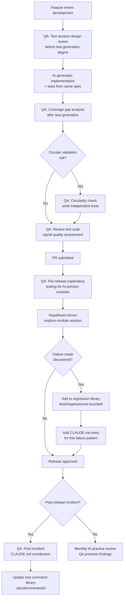

## QA Engineer Workflow with Claude Code

**Related to:** [QA & Testing Overview](00-overview.md) — Area 5: QA Engineer Workflow with Claude Code · [Documentation: Runbook Standards](../Documentation/02-runbook-standards.md)[^a] · [Governance: Review Policies](../Governance/01-review-policies.md)[^b] · [QA & Testing: Test Session Design](01-test-session-design.md)[^c] · [Metrics: AI Code Quality](../Metrics/01-ai-code-quality.md)[^d]

---

## Overview

The most common misconception about AI-assisted development and QA is that AI test generation reduces the need for a QA engineer. The opposite is true in practice. As AI generates more code and more tests, the signal quality of those tests — their ability to catch real failures rather than just describe current behavior — becomes a function of how well the team's testing practices are governed. That governance is the QA engineer's job. A team with no QA engineer and high AI adoption has fast test generation and no quality assurance; a team with a well-positioned QA engineer has fast test generation and a structured quality gate.

The QA engineer's workflow changes materially in an AI-assisted team. Less time is spent on test case scaffolding; more time is spent on test session design, coverage gap analysis, regression library maintenance, and the governance of how the whole team generates tests. Their contributions to CLAUDE.md and to the team's `.claude/commands/` library have leverage across every engineer's sessions — a well-designed test generation command used by seven engineers produces test quality improvements at a team-wide scale, not just for one engineer's modules.[^2]

This document covers the four core workflow areas: the QA engineer's repositioned role as a quality gate, using Claude Code for exploratory testing scripts, owning the team's test command library, and governing CLAUDE.md contributions for testing.

---

## Section 1: The QA Engineer as Quality Gate, Not Test Generator

**Description:** In a pre-AI workflow, a significant portion of QA time was spent on activities that AI can now do well: generating test case scaffolding, writing boilerplate test structure, producing test cases for well-specified happy paths. The QA engineer's comparative advantage is not in generating test boilerplate — it is in the judgment-intensive activities that AI performs poorly: assessing whether a test suite would actually catch the failures that matter, identifying the implied tests that are not in the acceptance criteria, and breaking the circular validation that occurs when AI generates both code and tests from the same source.[^3]

Repositioning the QA engineer as a quality gate rather than a test generator is not a demotion — it is an elevation to the work that produces the most value. A QA engineer who is spending 60% of their time writing test scaffolding that AI could generate is underutilized. A QA engineer who is spending 60% of their time on coverage gap analysis, regression library curation, test session design, and circularity breaking is providing a function that cannot be automated and that directly determines whether the team ships working software.

**Recommended Practice:**
- Explicitly document the QA engineer's role in the team's contribution guidelines as "quality gate and testing infrastructure owner" rather than "test author." This framing signals to the full team — including product managers and the architect — what the QA engineer's work is and why it is not reducible to test count.
- Define the QA quality gate checkpoints in the development workflow: (a) test session design review before a major feature's test generation begins, (b) coverage gap analysis review after test generation completes, (c) circularity check for features where both implementation and tests are AI-generated, and (d) regression library update after any AI-introduced regression incident.[^3]
- Track the QA engineer's time allocation quarterly: what proportion is spent on judgment-intensive activities (gap analysis, session design, regression library, CLAUDE.md contributions) versus mechanical activities (test scaffolding, CI triage, documentation formatting)? A QA engineer who is AI-assisted in the right ways should have a rising proportion of judgment-intensive work over time.[^2]
- Include the QA engineer in the architect-led monthly AI practice review. Their observations about test quality trends, session design failures, and regression library growth are governance data that the architect needs to make informed decisions about CLAUDE.md updates and session design standards.[^4]

---

## Section 2: Using Claude Code for Exploratory Testing Scripts

**Description:** Exploratory testing — testing that is not guided by predefined test cases but by the tester's hypothesis-driven investigation of how the system might fail — is one of the QA engineer's highest-value activities and one of the hardest to scale. Claude Code can accelerate exploratory testing by generating targeted exploration scripts: scripts that probe boundary conditions, stress specific error paths, generate unusual input combinations, and exercise the race conditions and state management edge cases that unit tests typically do not reach.

The key distinction is that exploratory test scripts are generated with the QA engineer's hypotheses as input, not with the spec or the implementation. The QA engineer says: "I suspect this module has problems with concurrent access to the session cache during high-load scenarios. Generate a test script that exercises this." The session is guided by human expertise about where to look, not by implementation analysis of what to verify. This is the combination that is most effective: AI execution speed directed by human judgment about failure likelihood.

**Recommended Practice:**
- Maintain a standing exploratory testing session prompt in `.claude/commands/explore-module` that accepts: the module to explore, the QA engineer's hypothesis about failure modes, and the relevant environment configuration. The prompt should instruct Claude Code to generate scripts that deliberately attempt to trigger the stated failure modes rather than to verify correct behavior.
- Before a major release, run exploratory testing sessions for every AI-primary module: provide the module, the list of AI-generated features, and a standing list of failure mode categories (concurrency, error path handling, boundary inputs, state management, timeout behavior). Generate scripts for each category and review the results with the engineer who owns the module.[^6]
- Use the QA engineer's domain expertise to direct exploratory session coverage toward the failure modes most likely in the team's specific codebase. A payment processing module warrants exploratory sessions focused on concurrency and partial failure states; an API gateway warrants sessions focused on authentication bypass and rate limiting edge cases.[^3]
- Document exploratory testing findings in the regression library, not just in Jira or Linear. A failure mode discovered through exploratory testing is a candidate for a permanent regression test — the exploratory session that discovers a bug is the predecessor to the regression test that prevents its recurrence.[^7]

---

## Section 3: QA Ownership of the Team's Test Command Library

**Description:** The `.claude/commands/` directory is the team's shared prompt infrastructure. For testing, it contains the commands that all engineers use when generating test suites, running coverage gap analysis, and writing exploratory scripts. The quality of these commands — their input requirements, their output structure, their embedded guidance — determines the quality of AI-generated tests across the entire team. This is governance infrastructure, and governance infrastructure should be owned by the person whose job is test quality.[^2]

When test generation commands are authored and maintained by individual engineers optimizing for their own convenience, they tend to become minimal: they generate tests quickly, they do not impose input requirements, and they do not embed the judgment about coverage quality that the QA engineer has developed. When the QA engineer owns the library, the commands reflect the team's actual quality standards: they require spec input, they specify coverage targets in behavioral terms, they prompt for edge case documentation, and they include the instructions that prevent the most common AI test generation failure modes.[^2]

**Recommended Practice:**
- Assign the QA engineer explicit ownership of the following commands in `.claude/commands/`: `generate-tests`, `analyze-coverage-gaps`, `explore-module`, `review-test-suite`, and any module-specific test generation templates. Ownership means authorship, maintenance, and the right to define the required inputs and output format.[^2]
- Establish a quarterly command review process: the QA engineer reviews all testing commands against the failure patterns observed in the prior quarter. Commands that did not prevent observed failures need revision; commands that consistently produce high-quality output should be promoted as templates for new command development.[^4]
- Version-control the commands explicitly and include a brief comment at the top of each command file documenting: the command's purpose, its required inputs, its output format, and the failure modes it is designed to prevent. This documentation makes the commands legible to engineers who did not author them and traceable for retrospective analysis.
- When a new failure mode is identified through gap analysis, regression incidents, or circular validation events, the QA engineer adds guidance to the relevant command before the next sprint begins. The command library is a living artifact, not a one-time setup.[^3]

---

## Section 4: QA-Driven CLAUDE.md Contributions

**Description:** CLAUDE.md is the primary context injection mechanism for Claude Code sessions: it tells every session what the team's standards are, what patterns to follow, and what pitfalls to avoid. For testing, CLAUDE.md can encode the team's known edge cases, documented failure patterns, regression library entries, and test session conventions — all of the accumulated QA knowledge that should influence every AI-generated test in the codebase. Without QA-driven CLAUDE.md contributions, this knowledge lives in the QA engineer's head and in retrospective documents, but not in the sessions that generate tests.[^8]

QA contributions to CLAUDE.md are structured differently than architectural or implementation contributions. They tend to be: "When generating tests for the payment module, always include a test for partial payment state after a network timeout," or "The session management module has three documented edge cases from production incidents: [list]. Always include tests for these cases when modifying session.ts." These entries are specific, actionable, and directly connected to real failure history — they are more valuable than general testing guidance because they encode what has actually failed in this codebase.[^8]

**Recommended Practice:**
- Establish a QA-driven CLAUDE.md contribution process: after every post-production incident, regression event, or coverage gap analysis session that reveals a recurring gap, the QA engineer adds an entry to CLAUDE.md in the relevant module or feature section. The entry should describe the failure mode and the test it requires in concrete terms.[^8]
- Organize CLAUDE.md testing entries by module rather than by general principle. "Always test null input handling" is less useful than "the UserPreferences module has production incidents from null preference maps — always test the case where preferences is an empty map and where it is null." Specificity is the quality signal that distinguishes high-value CLAUDE.md entries from generic guidance.[^4]
- Review the QA section of CLAUDE.md quarterly at the monthly AI practice review: are the entries current? Do they reflect the team's current failure mode profile? Entries for modules that have been deprecated or significantly refactored should be updated or removed — stale CLAUDE.md context is worse than no context because it generates tests for a system that no longer exists.
- Treat CLAUDE.md QA entries as the long-term memory of the QA function. When a new engineer joins the team, reading the CLAUDE.md testing entries for the modules they will work on is a faster way to learn the codebase's historical failure patterns than reading all historical incident reports. The entries are the distillation of QA knowledge into actionable session context.[^2]

---

## Summary of Recommended Practices

| Practice | Immediate Action | Owner |
|---|---|---|
| QA quality gate role definition | Update contribution guidelines with quality gate checkpoints | Architect |
| QA in monthly AI practice review | Add QA engineer as standing participant in monthly practice review | Architect |
| Exploratory testing command | Create `.claude/commands/explore-module` with hypothesis-driven prompt | QA Engineer |
| Pre-release exploratory sessions | Add exploratory testing for AI-primary modules to release checklist | QA Engineer |
| Test command library ownership | Formally assign QA engineer ownership of all testing commands | Architect |
| Quarterly command review | Schedule quarterly command library review in team calendar | QA Engineer |
| Post-incident CLAUDE.md contributions | Add CLAUDE.md entry to incident retrospective checklist | QA Engineer |
| Module-specific CLAUDE.md test entries | Audit existing modules; add QA entries for high-risk modules | QA Engineer |

---

[^2]: Anthropic — "Best Practices for Claude Code," Claude Code Documentation, 2026. https://code.claude.com/docs/en/best-practices
 `.claude/commands/` as governance infrastructure; CLAUDE.md as the session context layer for team standards; command ownership as a quality governance assignment; QA engineer as testing infrastructure owner.

[^3]: Anthropic — "2026 Agentic Coding Trends Report," Anthropic, 2026. https://resources.anthropic.com/hubfs/2026%20Agentic%20Coding%20Trends%20Report.pdf
 QA workflow checkpoints in AI-assisted development: test session design review, coverage gap analysis, circularity checking; the governance cadence for a QA engineer on an 11-person team with high AI adoption.

[^4]: Boris Cherny — "How Boris Uses Claude Code," howborisusesclaudecode.com, January 2026. https://howborisusesclaudecode.com
 Command library versioning and documentation standards; CLAUDE.md contribution process from session failures; the relationship between command quality and team-wide test generation quality.

[^6]: Kyros — "The Vibe Coding Crisis: How AI-Generated Technical Debt Is Costing Companies Millions," March 2026. https://usekyros.ai/blog/vibe-coding-crisis-ai-technical-debt
 Pre-release exploratory testing scope for AI-primary modules; failure mode category coverage as the organizing framework for exploratory sessions before major releases.

[^7]: QA & Testing — "04-regression-prevention.md," ClaudeCodeReview, 2026.
 Regression library as the destination for exploratory testing discoveries; the connection between exploratory testing findings and permanent regression prevention; post-incident library contribution as the standard practice.

[^8]: Yue Liu et al. — "Debt Behind the AI Boom: A Large-Scale Empirical Study of AI-Generated Code in the Wild," arXiv:2603.28592, March 30, 2026. https://arxiv.org/html/2603.28592
 CLAUDE.md as long-term memory for QA knowledge: encoding failure history into session context; module-specific testing entries as higher-value context than general testing principles; the survivorship of AI-introduced issues in codebases lacking QA-driven session context.

[^a]: [Documentation: Runbook Standards](../Documentation/02-runbook-standards.md) — QA engineers are primary runbook consumers; their workflow defines what runbook detail level is operationally sufficient.
[^b]: [Governance: Review Policies](../Governance/01-review-policies.md) — QA engineer workflow is independent of but complementary to the review policy workflow; the two are parallel quality gates.
[^c]: [QA & Testing: Test Session Design](01-test-session-design.md) — test session design is the foundational QA practice that the full QA engineer workflow is built around; the two documents describe the practice and its workflow integration.
[^d]: [Metrics: AI Code Quality](../Metrics/01-ai-code-quality.md) — QA engineer workflow generates the defect and coverage data that quality metrics aggregate; the workflow is the primary data source for quality measurement.
