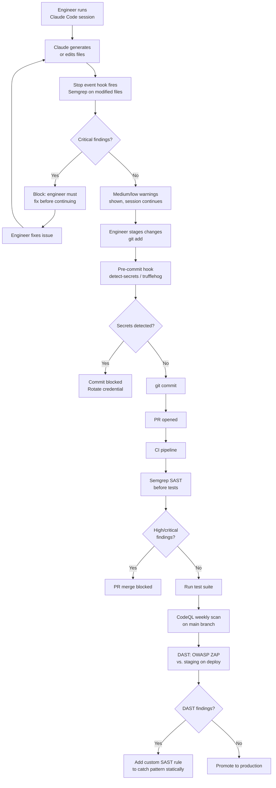

## SAST and DAST Integration

**Related to:** [Security Overview](00-overview.md) — Security Area 2 · [Issues: Security Vulnerabilities](../Issues/04-security-vulnerabilities.md)[^a] · [Tooling: CI/CD Integration](../Tooling & Configuration/06-cicd-integration.md)[^b] · [Tooling: Hooks and Automation](../Tooling & Configuration/02-hooks-and-automation.md)[^c] · [Metrics: Security Vulnerability Trends](../Metrics/04-security-vulnerability-trends.md)[^d]

---

## Overview

Static Application Security Testing (SAST) and Dynamic Application Security Testing (DAST) are not new tools — most engineering teams have some version of both. What AI-assisted development changes is how urgently both are needed and how they must be configured to produce reliable results. A SAST configuration calibrated for human-written code is not calibrated for AI-generated code. AI produces a higher volume of code per engineer-hour than human writing does, AI produces that code with a higher vulnerability rate, and AI generates vulnerability patterns that human reviewers are particularly unlikely to catch because the surrounding code is idiomatic and plausible-looking. Automated scanning exists precisely for this situation: high-volume, hard-to-manually-audit code that must still meet security standards before it ships.[^1]

Sonar's 2026 research documented that AI-generated code contains security vulnerabilities at 2.74 times the rate of human-written code. For a team of 11 where AI generates approximately 42% of committed code, that ratio produces a materially different expected vulnerability rate than the team's pre-AI baseline. Security tooling that was right-sized for the pre-AI risk profile may be significantly under-configured for the current one. The calibration question — not just "do we have SAST" but "is our SAST configured to catch what AI actually produces" — is the relevant engineering question in 2026.[^1]

The integration architecture for a small AI-assisted team has three layers: pre-commit hooks that catch obvious issues before they reach the repository, CI pipeline scanning that runs on every PR with blocking thresholds for critical findings, and DAST against staging environments for API endpoints. Claude Code's hook system provides a fourth layer — session-level scanning that can run before AI-generated code even reaches the pre-commit stage. Together these layers create defense in depth: a vulnerability that passes one layer has multiple subsequent opportunities to be caught before production.

---

## Section 1: Why AI-Generated Code Needs Automated Scanning More Urgently

**Description:** The argument for SAST has always been that human code review does not catch all security issues — reviewers are time-constrained, attention varies, and some vulnerability patterns are genuinely hard to recognize without tooling. AI adoption intensifies each of these pressures. PR volume increases as AI accelerates code generation. Reviewer attention is diluted across more PRs. And AI-generated code introduces vulnerability patterns that are particularly difficult to recognize by inspection: code that is syntactically correct, stylistically conventional, and functionally plausible — but which passes user input to a database query without parameterization, or which implements authentication logic with a subtle bypass condition that only appears under specific input sequences.[^2]

Veracode's Spring 2026 analysis found that across flagship AI models, 45% of AI-generated code failed security tests. That failure rate has not improved despite significant model capability improvements — suggesting that the vulnerability introduction mechanism is structural to how these models generate code, not an artifact of early-generation capability limitations. Teams waiting for model improvements to close the security gap are waiting for a solution that current trends do not support. Automated scanning is the available solution.[^3]

**Recommended Practice:**
- Deploy SAST on all PRs, not only on PRs flagged as AI-primary. There is no reliable automated mechanism to distinguish AI-generated from human-written code at the PR level; treating all code as requiring SAST is the consistent and operationally simpler policy.[^1]
- Configure SAST blocking thresholds at high severity for all PRs, with critical findings blocking merge immediately. Downgrade a finding to non-blocking only through a documented exception with architect approval — not through a configuration change that silently reduces coverage.[^3]
- Review SAST false positive rates quarterly. A SAST configuration with a high false positive rate will be worked around by engineers rather than addressed. The goal is a signal-to-noise ratio that makes SAST findings credible, not a configuration that produces the most possible findings.[^4]
- Document the SAST tooling choice, version, and rule set configuration in the team's engineering handbook. A security tool that is not documented is a tool that the next engineer to configure the CI pipeline may omit or misconfigure without realizing it.

---

## Section 2: SAST Tooling Choices and CI Integration

**Description:** Three SAST tools are widely used in the environments most relevant to the team's stack: Semgrep (fast, highly configurable, strong community rule sets, free tier for small teams), CodeQL (GitHub-native, deep semantic analysis, particularly strong on Java and JavaScript, free for open-source and GitHub Advanced Security plans), and Snyk Code (strong dependency and code vulnerability correlation, developer-friendly UI, subscription pricing). Each has meaningful differentiation for a small team. Semgrep's speed and configurability make it well-suited for CI integration where scan time is a developer experience constraint. CodeQL's semantic analysis depth makes it the better choice for periodic deep scanning of complex logic. Snyk Code's dependency correlation is valuable when the team wants a single tool that covers both SAST and SCA (Software Composition Analysis).[^4]

For a team of 11 without a dedicated security engineer, tool selection should prioritize maintainability over comprehensiveness. A single well-configured tool that runs reliably on every PR and produces findings engineers act on is more valuable than three tools with overlapping coverage that generate alert fatigue and are eventually disabled. The recommended starting configuration is Semgrep in CI with a curated rule set, supplemented by CodeQL for quarterly deep scans of security-critical modules.

**Recommended Practice:**
- Configure Semgrep in CI with the `p/security-audit`, `p/owasp-top-ten`, and `p/secrets` rule sets as a starting baseline. Add custom rules for team-specific patterns (authentication logic conventions, ORM query patterns) as the team's experience with AI-generated vulnerabilities accumulates.[^4]
- Integrate the CI SAST step before the test step, not after. Failing on a security finding before spending compute on tests is the correct priority order: a PR that fails security scanning should not proceed to test execution regardless of test result.[^5]
- Run CodeQL as a scheduled workflow (weekly) against the main branch rather than on every PR, to capture the semantic vulnerability patterns that require deeper analysis than per-PR Semgrep scanning provides. Schedule deep scans outside peak working hours to avoid competing with developer CI runs.[^4]
- Archive SAST findings in the team's vulnerability log (see Security Overview — Area 5) to track finding trends over time. A SAST tool that produces findings that are never tracked is not contributing to the team's security improvement; it is producing noise that will eventually be tuned out.

---

## Section 3: Claude Code Hooks for Pre-Commit SAST

**Description:** Claude Code's hook system allows the team to insert scanning steps at defined points in the AI development workflow. The Stop event hook — which runs after Claude Code completes a task and before control returns to the engineer — is the appropriate insertion point for pre-commit SAST on AI-generated code. This hook runs scanning before the engineer even stages the generated code for commit, providing a feedback layer that is earlier and faster than the CI pipeline scan. For the category of findings that would fail CI anyway, catching them in the hook eliminates the round-trip of commit, push, CI failure, fix, re-commit, re-push.[^6]

The hook architecture also addresses a behavioral gap: some engineers will not run a SAST scan manually before staging AI-generated code, but will act on findings that appear automatically in the terminal immediately after generation. The hook makes the right behavior the default behavior rather than the effortful behavior. This is a workflow design principle that applies beyond SAST — the most reliably followed security practices are the ones that happen automatically, not the ones that depend on individual discipline under time pressure.

**Recommended Practice:**
- Configure a Stop event hook in `.claude/settings.json` that runs `semgrep --config p/security-audit` on the files Claude Code modified in the session. Restrict the scan to modified files rather than the full repository to keep hook execution time under 30 seconds.[^6]
- Have the hook report findings in a format engineers can act on immediately — not just a pass/fail signal but the specific file, line, rule, and a brief remediation note. Engineers are more likely to fix a finding when the finding tells them what to do than when it tells them only that something is wrong.
- Configure the hook to block Claude Code from proceeding to the next task if critical findings are present. Non-blocking warnings are appropriate for medium and low findings; critical findings should require resolution or explicit acknowledgment before the session continues.[^6]
- Document the hook configuration in CLAUDE.md so that engineers setting up new local environments install it as part of onboarding: `## Required Hooks: Run 'claude code setup hooks' before your first session to install the team's standard SAST hooks.`

---

## Section 4: DAST for AI-Generated API Endpoints

**Description:** SAST finds vulnerabilities in the code as written — it cannot find vulnerabilities that only appear at runtime, under specific input conditions, or at the interface between components that are individually valid but interact insecurely. DAST addresses this gap by sending requests to a running application and observing responses. For AI-generated API endpoints, DAST is particularly valuable because AI-generated authorization logic is one of the most common sources of security failures that SAST cannot detect: the code that implements authorization may be syntactically correct and statically valid, but may fail to enforce access controls correctly under the range of request conditions DAST will test.[^3]

DAST tooling for a small team has a different configuration profile than enterprise DAST: the goal is not comprehensive web application scanning of a production surface but targeted automated testing of AI-generated API endpoints in a staging environment before promotion to production. OWASP ZAP (open source), Burp Suite Community Edition, and Snyk's API security scanning are all viable at small-team scale and budget. The integration point is the staging promotion gate: new API endpoints should pass a DAST scan against staging before the PR is eligible for production deployment.

**Recommended Practice:**
- Configure OWASP ZAP or equivalent in a scheduled CI workflow that runs against the team's staging environment after each deploy. Focus the scan scope on API endpoints that were added or modified in the most recent deploy rather than running a full application scan on each cycle.[^5]
- For AI-generated API endpoints handling authentication, authorization, or sensitive data, require a manual DAST review session in addition to the automated scan before the PR is approved for production promotion. The automated scan covers the known vulnerability pattern library; the manual session covers the endpoint's specific logic in ways that automated tools may not.[^3]
- Include DAST findings in the same vulnerability log and triage process as SAST findings (see Security Overview — Area 5). Separating DAST and SAST findings into different tracking systems creates a consolidation gap where the aggregate vulnerability picture is invisible to the team.[^1]
- When DAST identifies a vulnerability class that AI is systematically generating — e.g., missing authorization checks on a class of endpoints — add a SAST custom rule that catches the pattern statically in future PRs. The feedback loop from DAST findings to SAST rules is how the team's automated security coverage improves over time rather than remaining static.

---

## Summary of Recommended Practices

| Practice | Immediate Action | Owner |
|---|---|---|
| SAST Urgency Calibration | Review current SAST configuration against AI vulnerability rate; adjust blocking thresholds | Backend lead |
| SAST CI Integration | Deploy Semgrep with OWASP and security-audit rule sets; integrate before test step | Backend lead |
| Pre-Commit Hook | Configure Stop event hook for Semgrep on modified files; add to onboarding docs | Backend lead |
| DAST for APIs | Configure OWASP ZAP against staging environment; add to staging promotion gate | QA engineer |

---

[^1]: Sonar — "State of Code Developer Survey Report: The Current Reality of AI Coding," SonarSource Blog, 2026. https://www.sonarsource.com/blog/state-of-code-developer-survey-report-the-current-reality-of-ai-coding
 2.74× vulnerability rate for AI-generated code; the calibration argument for adjusting SAST configurations to the actual risk profile of AI output; 42% AI code penetration in adopting repositories.

[^2]: Dark Reading — "AI-Assisted Development: The Security Risks Nobody Is Managing," October 2025. https://www.darkreading.com/application-security/ai-assisted-development-security-risks
 Velocity-driven review dilution; the plausibility problem for AI-generated vulnerable code; why human code review is insufficient as the sole security gate for AI-generated output.

[^3]: Veracode — "Spring 2026 GenAI Code Security Update: Despite Claims, AI Models Are Still Failing Security," March 24, 2026. https://www.veracode.com/blog/spring-2026-genai-code-security/
 45% security test failure rate; the structural nature of AI vulnerability generation; DAST for authorization logic gaps in AI-generated API endpoints.

[^4]: Semgrep — "Semgrep Supply Chain and SAST Documentation," Semgrep, 2026. https://semgrep.dev/docs/
 Semgrep rule set configuration; `p/security-audit`, `p/owasp-top-ten`, and `p/secrets` rule sets; custom rule authoring for team-specific vulnerability patterns.

[^5]: Roman Fedytskyi — "A Safer CI Pattern for Agentic Code Review," Medium, March 2026. https://medium.com/@roman_fedyskyi/a-safer-ci-pattern-for-agentic-code-review-94a484b5e3c4
 CI pipeline architecture for AI-generated code security: the argument for SAST before test execution; staging promotion gates and DAST integration patterns.

[^6]: Anthropic — "Claude Code Hooks Reference," Claude Code Documentation, 2026. https://code.claude.com/docs/en/hooks
 Stop event hook configuration; `.claude/settings.json` syntax; hook blocking behavior for critical findings; modified-file scope restriction for scan performance.

[^a]: [Issues: Security Vulnerabilities](../Issues/04-security-vulnerabilities.md) — SAST/DAST integration is the primary automated detection mechanism for the vulnerability classes described there; scanning converts the qualitative risk into a detectable signal.

[^b]: [Tooling: CI/CD Integration](../Tooling & Configuration/06-cicd-integration.md) — SAST/DAST tools are integrated through CI/CD pipelines; the two documents describe the security tool and its pipeline deployment.

[^c]: [Tooling: Hooks and Automation](../Tooling & Configuration/02-hooks-and-automation.md) — SAST scanning can be triggered as a pre-commit hook for fast feedback; the hook integration provides session-time detection before pipeline runs.

[^d]: [Metrics: Security Vulnerability Trends](../Metrics/04-security-vulnerability-trends.md) — SAST/DAST scan results feed the vulnerability trend metrics; the scanner is the data source for the security health signal on the dashboard.
