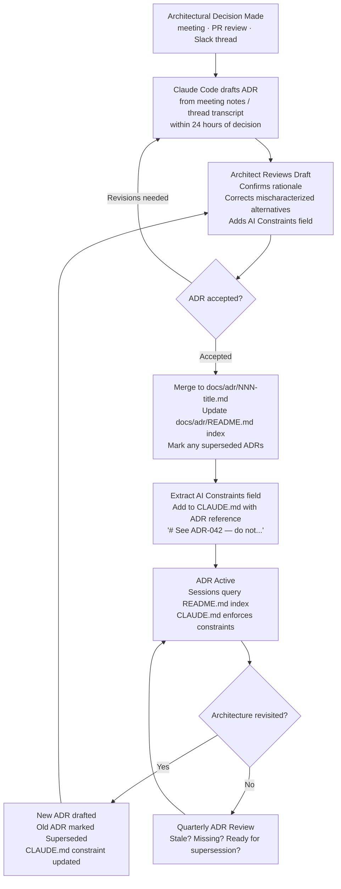

## Architecture Decision Records in AI-Assisted Teams

**Related to:** [Documentation Overview](00-overview.md) — Area 1: Architecture Decision Records · [Issues: Architectural Drift](../Issues/03-architectural-drift.md)[^a] · [Tooling: CLAUDE.md Configuration](../Tooling & Configuration/01-claude-md-configuration.md)[^b] · [Governance: Review Policies](../Governance/01-review-policies.md)[^c] · [Workflows: Context Engineering](../Workflows/03-context-engineering.md)[^d] · [Documentation: Rationale Capture](04-rationale-capture.md)[^e]

---

## Overview

Architecture Decision Records exist to solve a specific problem: important decisions about a system's structure get made and then forgotten. The engineers who made them leave, contexts change, and the team is left with conventions they cannot explain and constraints they do not understand. ADRs are the discipline that prevents this — they capture not just what was decided but why, making the codebase legible to future maintainers who were not present for the decisions.[^1]

In AI-assisted development, this problem is structurally worse and the solution more urgent. Claude Code operates on the context of the current session. It does not know about the architectural decision made three months ago that ruled out the approach it is about to suggest. It does not know that the team chose event sourcing after evaluating and rejecting the simpler CRUD approach, or that the authentication service is intentionally decoupled for a specific compliance reason. Without ADRs that are accessible during AI sessions, every session risks contradicting or eroding past decisions — and the engineers in the session, who may not have been present for the original decision, may not catch it.[^2]

ADRs also become more important because AI generates code faster than human architectural review can evaluate it. When output is slow, an unarticulated decision still persists because the human who made it is still in the room. When output is fast, undocumented decisions are overwritten before anyone notices. The team that keeps pace with AI output requires ADRs not as a documentation best practice but as an operational safeguard.

---

## Section 1: Why ADRs Matter More in AI-Assisted Development

**Description:** The standard argument for ADRs — that they preserve institutional knowledge for future maintainers — applies with greater force when AI is generating significant portions of the codebase. There are three distinct failure modes that ADRs prevent in AI-assisted teams. First, session amnesia: each Claude Code session starts without knowledge of past sessions, and without accessible ADRs, will regenerate alternatives that were already evaluated and rejected. Second, accelerated architectural drift: AI-generated code naturally drifts toward training data patterns, which may not match the team's deliberate architectural choices; ADR-enforced constraints in CLAUDE.md are the primary countermeasure. Third, review blindness: engineers reviewing AI-generated PRs may not recall the architectural decision that makes the PR's approach incorrect; an ADR reference in the PR surfaces the relevant context at the right moment.[^3]

The compounding effect is what makes session amnesia particularly damaging. A team that makes an architectural decision without documenting it will find that the next AI session contradicts it, requiring correction; the correction may itself introduce a new undocumented micro-decision; and after six months of AI-assisted development, the codebase contains a palimpsest of contradicted and re-contradicted decisions that no individual engineer can fully reconstruct.[^4]

**Recommended Practice:**
- Establish ADR creation as a mandatory output of any architectural discussion that affects the codebase structure, API design, data model, infrastructure configuration, or cross-service integration. The threshold question is: "Would a future session need to know this to avoid regenerating an already-rejected alternative?"[^1]
- Require an ADR reference or a new ADR in the PR description for any AI-primary PR that introduces a new pattern, modifies an existing architectural convention, or touches a component covered by an existing ADR. The link is the mechanism that connects AI output to the decision record.[^5]
- Brief the team on the three failure modes ADRs prevent — session amnesia, architectural drift, review blindness — so engineers understand that ADRs are not documentation overhead but operational infrastructure for AI-assisted development.[^2]
- Assign the architect as the ADR owner: the architect reviews all new ADRs before merge, maintains the ADR index, and is responsible for identifying when a PR requires a new ADR that the PR author did not produce.[^3]

---

## Section 2: ADR Format for AI-Assisted Teams

**Description:** Standard ADR formats — the Nygard format, MADR, Y-Statements — were designed for human readers. They capture context, decision, and consequences. For AI-assisted teams, this format needs one additional field that did not exist before AI-generated code became common: an explicit statement of what Claude should never change about this component. Without this field, CLAUDE.md must carry all architectural constraints without connecting them to their decision provenance. With this field, the ADR both documents the decision for humans and provides the constraint formulation that belongs in CLAUDE.md.[^1]

The AI-constraints field is not just documentation — it is the source of truth for CLAUDE.md entries. When an ADR is created, the architect extracts the constraint from the ADR and adds it to CLAUDE.md with a reference back to the ADR. When an ADR is superseded, the corresponding CLAUDE.md constraint is updated. This creates a maintained, auditable connection between architectural decisions and the AI session constraints that enforce them.[^6]

**Recommended Practice:**
- Adopt the following ADR template for the team: **Status** (proposed/accepted/superseded), **Date**, **Context** (what situation prompted the decision), **Decision** (what was decided, in plain language), **Rationale** (why this option over the alternatives considered), **Consequences** (what changes as a result, including known downsides), **AI Constraints** (what Claude Code should never change, add, or remove about this component, in the exact language to be placed in CLAUDE.md).[^1]
- Store ADRs as numbered markdown files in a `docs/adr/` directory in the repository: `001-repository-pattern.md`, `002-authentication-service-decoupling.md`, and so on. This makes them accessible to Claude Code via the repository context without requiring a separate MCP lookup.[^5]
- When superseding an ADR, mark the old ADR as superseded with a reference to the new ADR rather than deleting or modifying it. The history of decisions is as valuable as the current decision — future sessions and onboarding engineers need to know what was rejected and why, not just what was ultimately chosen.[^3]
- Include a brief ADR review step in the quarterly engineering health review: are there recent architectural decisions that lack ADRs? Are any ADRs overdue for supersession because the codebase has evolved past them? This prevents the ADR record from becoming stale faster than it is maintained.[^4]

---

## Section 3: Making ADRs Accessible from Claude Code Sessions

**Description:** An ADR that engineers can read but Claude cannot access solves only half the problem. Claude Code sessions that begin without knowledge of the ADR record will still contradict documented decisions — the contradiction will be caught in review, but the cost of that catch is higher than prevention. Making ADRs accessible within sessions — so that the session can query them before generating code in an affected area — converts ADRs from passive documentation into active session constraints.[^7]

There are two mechanisms for making ADRs session-accessible. The first, and most direct, is storing ADRs in the repository's `docs/adr/` directory so they are part of Claude Code's working context when the session is open in that repository. The second, for teams whose ADRs live in Google Drive or Confluence alongside other documentation, is configuring the relevant MCP server to make the ADR folder queryable. Both mechanisms require that ADRs be well-indexed — a single ADR index file listing all ADRs with one-line summaries enables Claude Code to identify which ADRs are relevant to a given task before reading them in full.[^8]

**Recommended Practice:**
- Maintain a `docs/adr/README.md` ADR index file that lists all ADRs by number, title, status, and a one-line summary of the decision. This file is the primary entry point for Claude Code ADR lookup — include a CLAUDE.md instruction: "Before generating code in any component covered by an ADR, read docs/adr/README.md and identify relevant decisions."[^6]
- For teams using Google Drive as their primary documentation store, configure the Google Drive MCP server and add the ADR folder to the accessible paths. Add a CLAUDE.md instruction that directs sessions to query the ADR folder when beginning work on significant features: "Query the ADRs folder in Google Drive before beginning implementation of new patterns or changes to existing architectural components."[^8]
- When opening a Claude Code session for a significant implementation task, include the relevant ADR numbers in the session opening context: "I'm implementing the user notification service. Relevant ADRs: 004 (event-driven architecture), 007 (notification service boundaries). Read these before beginning." This explicit pre-load is more reliable than expecting the session to discover ADR relevance automatically.[^7]
- Test ADR accessibility quarterly: open a fresh Claude Code session in the repository and ask it to list the architectural decisions it can find. If it cannot enumerate the ADRs, the accessibility mechanism is not functioning — fix it before it matters in a production-affecting session.[^2]

---

## Section 4: Using Claude Code to Draft ADRs

**Description:** The discipline of ADR creation breaks down primarily because of the lag between the decision and the documentation. Architectural decisions are made during fast-moving discussions, code reviews, and Slack threads — contexts where the intention to document is present but the immediate time to do it is not. By the time an engineer returns to write the ADR, the nuance of the discussion has faded, the alternatives considered are harder to reconstruct, and the rationale has partially merged with the outcome in memory.

Claude Code can draft ADRs from the raw material of decision discussions — meeting notes, Slack thread exports, PR comment threads, and architecture meeting transcripts. The draft will not be publication-ready: it will require architect review to confirm the rationale, correct mischaracterized alternatives, and add the AI Constraints field. But a draft that is 70% right and requires 15 minutes of review is produced and reviewed more often than a blank template that requires 45 minutes of writing from scratch. Reducing the per-ADR creation cost is the primary mechanism for improving ADR adoption rate.[^1]

**Recommended Practice:**
- Define a standard ADR drafting prompt: "Read the following [meeting notes / Slack thread / PR comments] and draft an ADR using our template (docs/adr/TEMPLATE.md). Focus on accurately representing the alternatives that were considered and the reasons the chosen option was preferred. Flag any points where you are uncertain about the rationale." This prompt produces usable drafts rather than generic documentation.
- Assign the responsibility for initiating the ADR draft to the session participant who owned the architectural decision — typically the architect. The architect triggers the Claude Code drafting session within 24 hours of the decision meeting and then reviews the draft before adding it to the PR that implements the decision.[^4]
- For decisions made during PR review (as opposed to formal architectural discussions), include an ADR drafting step in the PR merge criteria: if a significant architectural point was decided in PR comments, the architect drafts an ADR from those comments before merge. PR comment threads are the most common location of undocumented architectural decisions in fast-moving teams.[^5]
- When Claude Code drafts an ADR, include the AI Constraints field draft in the prompt output, then transfer it directly to CLAUDE.md as part of the ADR acceptance step. This creates a consistent workflow: decision discussion → ADR draft → architect review → ADR merge + CLAUDE.md update. No decision escapes the loop without both artifacts being produced.[^6]

---

## Summary of Recommended Practices

| Practice | Immediate Action | Owner |
|---|---|---|
| ADR Creation Threshold | Define the threshold question; add ADR requirement to AI-heavy PR template | Architect |
| ADR Format | Adopt AI-team template with AI Constraints field; store in docs/adr/ | Architect |
| ADR Index | Create docs/adr/README.md; add CLAUDE.md instruction for ADR lookup | Architect |
| MCP Accessibility | Configure Google Drive MCP for ADR folder if using Drive; test accessibility quarterly | Architect |
| ADR Drafting | Define standard drafting prompt; assign drafting responsibility to architect | Architect |
| CLAUDE.md Linkage | Transfer AI Constraints field to CLAUDE.md at ADR acceptance; maintain reference back | Architect |

---

[^1]: Michael Nygard — "Documenting Architecture Decisions," Cognitect, November 2011. https://cognitect.com/blog/2011/11/15/documenting-architecture-decisions
 Original ADR format rationale and template structure; the foundational argument for why decisions rather than architectures need documentation; the Nygard fields that all ADR variants derive from.

[^2]: Anthropic — "Best Practices for Claude Code," Claude Code Documentation, 2026. https://code.claude.com/docs/en/best-practices
 Session context limitations and CLAUDE.md as the mechanism for carrying architectural decisions across sessions; the three failure modes that ADRs prevent in AI-assisted development.

[^3]: Addy Osmani — "My LLM Coding Workflow Going Into 2026," April 2026. https://addyosmani.com/blog/ai-coding-workflow/
 Architectural drift toward training data norms as a specific risk in AI-assisted teams; ADR-enforced constraints in CLAUDE.md as the primary countermeasure; the architect's role in ADR ownership.

[^4]: Yue Liu et al. — "Debt Behind the AI Boom: A Large-Scale Empirical Study of AI-Generated Code in the Wild," arXiv:2603.28592, March 30, 2026. https://arxiv.org/html/2603.28592
 Compounding decision entropy in AI-assisted codebases: how undocumented micro-decisions accumulate into an incomprehensible palimpsest; quarterly ADR review as a maintenance practice.

[^5]: Fannar Steinn Aðalsteinsson et al. — "Rethinking Code Review Workflows with LLM Assistance: An Empirical Study," arXiv:2505.16339, May 22, 2025. https://arxiv.org/abs/2505.16339
 ADR references in PR review: how linking AI-generated code to the relevant ADR at review time prevents architectural drift from passing through the review gate undetected.

[^6]: Anthropic — "Model Context Protocol," Anthropic, 2025. https://www.anthropic.com/news/model-context-protocol
 MCP as the mechanism for making external documentation stores queryable within Claude Code sessions; the Google Drive MCP configuration for ADR accessibility; CLAUDE.md and MCP as complementary context layers.

[^7]: Dex Horthy (YC Root Access) — "Advanced Context Engineering for Agents," YouTube, August 2025. https://www.youtube.com/watch?v=IS_y40zY-hc
 Context engineering for AI sessions: how pre-loading ADR context before beginning implementation prevents the session from contradicting documented decisions; the explicit pre-load pattern.

[^8]: Boris Cherny at Y Combinator — "Inside Claude Code With Its Creator Boris Cherny," February 17, 2026. https://www.ycombinator.com/library/NJ-inside-claude-code-with-its-creator-boris-cherny
 Repository structure as session context: how docs/adr/ placement within the repository makes ADRs part of the working context; the index file as the primary ADR discovery mechanism for sessions.

[^a]: [Issues: Architectural Drift](../Issues/03-architectural-drift.md) — ADRs are the primary countermeasure to architectural drift; the three failure modes identified here (session amnesia, drift, review blindness) map directly to that issue's documented patterns and root causes.

[^b]: [Tooling: CLAUDE.md Configuration](../Tooling & Configuration/01-claude-md-configuration.md) — ADR AI Constraints fields are the source of truth for CLAUDE.md entries; the two artifacts are maintained together, with each ADR acceptance triggering a corresponding CLAUDE.md update.

[^c]: [Governance: Review Policies](../Governance/01-review-policies.md) — ADR references in PR descriptions are a review policy requirement; the PR review workflow depends on ADRs being current, accessible, and linked at the time of review.

[^d]: [Workflows: Context Engineering](../Workflows/03-context-engineering.md) — pre-loading ADR context before sessions is a core context engineering pattern; ADR accessibility via docs/adr/README.md and MCP is a prerequisite for that workflow functioning correctly.

[^e]: [Documentation: Rationale Capture](04-rationale-capture.md) — rationale capture extends ADR discipline to AI-generated decisions that do not rise to ADR threshold; the two practices are complementary and together close the full documentation gap in AI-assisted teams.
