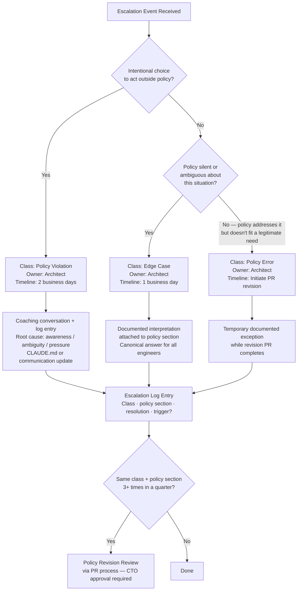

## Escalation Procedures: Override Requests, Violation Handling, and Policy Revision

**Related to:** [Governance Overview](00-overview.md) — Policy 4: Escalation and Override Procedures · [Governance: Review Policies](01-review-policies.md)[^a] · [Governance: Incident Response](07-incident-response.md)[^b] · [Metrics: Security Vulnerability Trends](../Metrics/04-security-vulnerability-trends.md)[^c]

---

## Overview

A policy without escalation paths is not actually a policy — it is an aspiration that places the full compliance burden on individual engineers making real-time judgment calls without a defined way to surface uncertainty. When engineers encounter situations the policy does not clearly address, or tasks that seem to require something the policy prohibits, the absence of a legitimate escalation path produces two failure modes: they proceed with the prohibited or ambiguous behavior without surfacing it, or they abandon the productivity benefit entirely rather than navigate an undocumented exception process. Both outcomes are worse than a functioning escalation system.[^1]

Escalation procedures serve a governance function beyond individual violation handling. The aggregate pattern of escalations — which policies are invoked most frequently, which situations generate the most edge case requests, which override requests repeat across multiple engineers — is a signal about policy quality. A policy that generates ten override requests in a quarter is either wrong for the team's actual work, unclear in its boundaries, or failing to capture a legitimate use pattern that should be authorized. Treating escalations only as individual compliance events, rather than as system feedback, wastes the most valuable information the governance system generates.

---

## Section 1: Why Escalation Procedures Are Governance Infrastructure

**Description:** The conventional view of escalation is reactive: an engineer did something questionable, the issue is escalated, it is resolved. This framing misses the structural role escalation paths play in making policies sustainable. A policy without escalation paths creates pressure toward silent violations. Engineers who encounter a policy boundary in the middle of a task — the spec requires a behavior the policy restricts, the deadline is tomorrow, no one is explicitly watching — will make one of three decisions: stop and surface the issue through undefined channels, proceed quietly and hope it is not noticed, or work around the restriction in a way that technically complies but violates the intent. A clearly defined escalation path makes the first option costless and the other two unnecessary.[^3]

Escalation paths also function as policy feedback channels. Engineers who use escalation regularly — because the process is quick, non-punitive, and produces useful responses — generate the signal data that reveals where policy is working and where it is not. Engineers who experience escalation as bureaucratic, slow, or risky will suppress the signal, and governance decisions will be made with incomplete information about actual team practice. The goal is a team culture where escalating an edge case is a normal professional act, not a confession.[^4]

**Recommended Practice:**
- Define the escalation path in the engineering handbook: who receives escalations (architect for most cases; CTO for policy category changes and security incidents), what information to include (situation description, policy section invoked, proposed alternative), and what the response timeline expectation is (architect response within one business day for non-emergency cases).[^1]
- Normalize escalation explicitly in team culture: senior engineers and the architect should model it by escalating their own edge cases through the defined process rather than resolving them informally. When engineers observe that senior team members use the escalation system, it signals that using it is competent professional behavior.[^3]
- Log every escalation regardless of outcome: a brief record of what was escalated, what class it was (Section 2), how it was resolved, and whether it triggered a policy review. This log is the raw material for the pattern detection work in Section 4.
- At team onboarding, walk through the escalation process with a concrete example. Abstract explanations of escalation paths are less effective than a five-minute walkthrough: "Here is a real situation that came up last quarter, here is how it was escalated, here is what happened." New engineers who have seen a completed escalation cycle are far more likely to use the system correctly than those who have only read the policy.[^5]

---

## Section 2: The Three Escalation Classes

**Description:** Not all escalations are alike. Conflating a policy violation — where an engineer did something outside authorized use — with an edge case — where the policy is genuinely ambiguous — with a policy error — where the policy is wrong for a legitimate need — produces responses that are miscalibrated in all three directions. Violations require coaching and possibly documentation; edge cases require architectural interpretation and possible policy clarification; policy errors require the policy revision process in Section 5. Treating violations as edge cases is lenient in the wrong direction; treating edge cases as violations is punitive in the wrong direction; treating policy errors as violations is governance dysfunction.[^6]

The three-class system gives the architect the framework to route escalations appropriately from the moment they arrive, rather than determining the class during the resolution process. The class determines the owner, the timeline, and the output. Policy violations are resolved with a coaching conversation and a log entry. Edge cases are resolved with an architectural interpretation that is documented and attached to the relevant policy section. Policy errors are resolved with a policy revision request that goes through the PR process in Section 5. An engineer who escalates all three correctly receives three different responses — and that consistency builds trust in the escalation system.[^7]

**Recommended Practice:**
- Define the three classes in the engineering handbook with clear distinguishing questions: Was this an intentional choice to act outside policy? (Likely a violation.) Is the policy silent or ambiguous about this specific situation? (Likely an edge case.) Does the policy explicitly address this situation but in a way that doesn't fit a legitimate engineering need? (Likely a policy error.)[^6]
- Policy violation escalations are owned by the architect, resolved within two business days, and produce a coaching conversation and a log entry. The resolution focuses on understanding why the violation occurred — lack of awareness, policy ambiguity, deadline pressure — and producing a specific countermeasure: updated CLAUDE.md, clearer policy language, or team communication.[^3]
- Edge case escalations are owned by the architect, resolved within one business day, and produce a documented interpretation attached to the relevant policy section. The interpretation becomes the canonical answer to that edge case for all engineers, not just the one who escalated. If the same edge case appears three or more times, it is a signal to add explicit language to the policy.[^7]
- Policy error escalations are owned by the architect, resolved by initiating the policy revision process in Section 5, and communicated to the team as a policy update in progress. Engineers whose legitimate work is blocked by a policy error receive a documented temporary exception while the revision is completed, which prevents the policy error from creating compliance pressure toward silent violation.[^4]

---

## Section 3: Override Request Process

**Description:** Some policy constraints are appropriate for the general case but impractical for specific legitimate needs. A security-critical code review requirement that mandates a secondary reviewer works well when the secondary reviewer is available — but what happens when the secondary reviewer is on leave and a time-sensitive security patch is needed? The answer should not be "violate the policy quietly" or "wait indefinitely." It should be a documented temporary override that satisfies the governance intent through alternative means, creates a clear audit record, and feeds the policy improvement signal rather than suppressing it.[^8]

The override request process serves two purposes. For the requesting engineer, it provides a legitimate path to proceed when a policy constraint is genuinely impractical for their specific situation. For the governance system, it surfaces the pattern data that reveals where policies need adjustment. An override request that is approved and well-documented is governance data; a policy violation that is never surfaced is governance blindness. Building a culture where requesting an override is the professional default — rather than quietly circumventing a policy — requires that the override process be fast enough to be practical and non-punitive enough to be used.[^9]

**Recommended Practice:**
- The override request format is a three-part document attached to the relevant sprint ticket: (1) Use Case — what specific work requires exceeding the policy constraint and why; (2) Policy Exceeded — which policy section, which specific requirement, and in what way the requirement cannot be satisfied in the standard form; (3) Risk Assessment — what risk the policy requirement was designed to mitigate, and what alternative mitigation the engineer proposes in lieu of the standard requirement.[^8]
- The architect reviews override requests within four hours for requests flagged as blocking active work, and within one business day for non-blocking requests. The architect either approves the override with any additional conditions, refers it to the CTO for cases with security or compliance implications, or denies it with a specific explanation of why the alternative mitigation is insufficient.[^9]
- Approved overrides are time-limited: they authorize the specific use case for the duration of the sprint, not indefinitely. At the end of the sprint, the override expires unless renewed. Time-limited overrides prevent temporary exceptions from becoming permanent unofficial policy.[^5]
- Track approved overrides in the same log as edge case escalations. When the same override request pattern recurs across multiple engineers or multiple sprints, the architect initiates a policy revision: the policy is requiring overrides because it is miscalibrated for the team's actual work, and the recurrence is the signal to fix it.

---

## Section 4: Pattern Detection in Violations and Overrides

**Description:** Individual violations and override requests are data points; aggregate patterns are signals. An engineer who requests an override because a secondary reviewer is unavailable is an individual operational issue. Five engineers who request overrides for the same secondary reviewer availability reason across a quarter is a signal that the secondary reviewer pool is too small for the volume of security-critical AI-generated code the team is producing — a structural issue that individual override approvals cannot fix. Pattern detection turns the escalation log from a compliance record into a governance diagnostic tool.[^10]

The failure mode is treating the log as only a compliance record and never aggregating it. Teams that log violations and overrides without reviewing the aggregate typically discover systemic issues late — after a pattern has produced enough individual incidents to become visible without deliberate review. A quarterly log review that explicitly looks for repeating patterns — same policy section, same escalation class, same alternative scenario — catches systemic issues at a scale where they can be addressed with policy adjustment rather than requiring incident response.

**Recommended Practice:**
- At the monthly practice review, the architect presents a brief log summary: how many escalations occurred in the prior month, which class they belonged to, which policy sections were most frequently involved. This is a five-minute agenda item, not a deep analysis — the goal is visibility, not investigation.[^10]
- Define pattern detection thresholds: three or more edge case escalations citing the same policy section within a quarter triggers a policy clarification review; three or more override requests citing the same policy constraint within a quarter triggers a policy recalibration review; two or more policy violations with the same proximate cause within a quarter triggers a communication or CLAUDE.md update.
- The quarterly log review is distinct from the monthly summary: it is a 30-minute structured analysis using the full quarter's data, looking for patterns that are invisible in any single month. The architect prepares the analysis; the CTO attends to provide input on whether detected patterns warrant policy revision or resource changes.
- Document the outcome of every pattern detection finding: what pattern was detected, what investigation it triggered, and what change resulted (policy clarification, policy revision, resource addition, communication update, or no action with reasoning). Undocumented findings that produced no action are indistinguishable from findings that were never reviewed.[^5]

---

## Section 5: Policy Revision and Versioning

**Description:** Policy revision is governance in action — the mechanism by which the team's documented commitments stay calibrated with its actual practice. A policy that was right twelve months ago may be miscalibrated today because AI tool capabilities have changed, the team's codebase has evolved, new compliance requirements have appeared, or the team has learned from experience which constraints produce value and which produce friction without benefit. The question is not whether the policy should change — it will — but whether the change happens deliberately and traceably or accidentally and invisibly.

The PR process for governance documents is not bureaucratic overhead — it is the mechanism by which policy changes are reviewed before they take effect, communicated to the team, and preserved in version history so that questions about what was authorized at a specific point in time can be answered. A governance policy that is edited in place without a PR has no review, no communication, and no history. A governance policy that is revised via PR has architect and CTO review, an automatic team notification when merged, and a git history that answers audit questions without requiring anyone to remember.[^13]

**Recommended Practice:**
- All policy changes, including minor clarifications, go through the repository's standard PR process. The PR description explains what changed, why (with reference to the escalation log entry or quarterly review finding that triggered the revision), and what the effective date is. No policy changes are made by direct commit to main.
- Policy PRs require review from at least the architect and the CTO before merge. For changes that affect AI-primary task classification, sprint percentage caps, or compliance-related requirements, review from a second senior engineer is required in addition to architect and CTO review.[^13]
- Maintain a changelog section at the top of each governance document: a reverse-chronological list of changes, each with a date, a one-sentence description, and a link to the PR. Engineers who want to understand what changed and when can read the changelog without searching git history.[^7]
- Communicate policy changes to the team at the next available touchpoint — sprint planning, standup, or a dedicated Slack message — with a brief explanation of what changed and why. Engineers who discover policy changes by reading a commit log rather than hearing about them from a colleague do not feel like stakeholders in the governance system; they feel like subjects of it.[^4]

---

## Summary of Recommended Practices

| Practice | Immediate Action | Owner |
|---|---|---|
| Escalation Path Documentation | Define architect and CTO as escalation owners with response timelines in engineering handbook | Architect |
| Escalation Culture Modeling | Senior engineers model escalation use at next team incident or edge case | Architect |
| Three Escalation Classes | Add class definitions with distinguishing questions to engineering handbook | Architect |
| Violation Coaching Protocol | Define coaching conversation format for policy violations; log all outcomes | Architect |
| Override Request Format | Publish three-part override request template; add to sprint ticket template | Architect |
| Override Review Timeline | Architect commits to four-hour review for blocking override requests | Architect |
| Escalation Log | Create shared escalation log with class, policy section, resolution, and policy trigger fields | Architect |
| Monthly Log Summary | Add five-minute escalation log summary to monthly practice review agenda | Architect |
| Pattern Detection Thresholds | Define three-occurrence thresholds for each class; document in engineering handbook | Architect |
| Policy PR Requirement | Enforce PR process for all governance document changes; no direct commits to main | Architect |
| Policy Change Communication | Communicate all policy changes at next team touchpoint with explanation | Architect |
| Policy Revision Approval | CTO review required for all policy PRs before merge | CTO |
| Quarterly Log Review | Attend quarterly log review to interpret patterns requiring resource or priority decisions | CTO |

---

[^1]: Anthropic — "Best Practices for Claude Code," Claude Code Documentation, 2026. https://code.claude.com/docs/en/best-practices
 Escalation path design as a prerequisite for sustainable governance; the two failure modes produced by absent escalation paths: silent violations and productivity abandonment.

[^3]: DEV Community — "AI Is Creating a New Kind of Tech Debt — And Nobody Is Talking About It," March 2026. https://dev.to/harsh2644/ai-is-creating-a-new-kind-of-tech-debt-and-nobody-is-talking-about-it-3pm6
 Cultural escalation normalization: how senior engineer modeling of escalation behavior shapes team culture; the coaching conversation as a non-punitive violation response mechanism.

[^4]: Roman Fedytskyi — "A Safer CI Pattern for Agentic Code Review," Medium, March 2026. https://medium.com/@roman_fedyskyi/a-safer-ci-pattern-for-agentic-code-review-94a484b5e3c4
 Escalation as policy feedback; the governance dysfunction produced when engineers experience escalation as risky; time-limited overrides as a mechanism for preventing exception drift.

[^5]: Boris Cherny at Y Combinator — "Inside Claude Code With Its Creator Boris Cherny," February 17, 2026. https://www.ycombinator.com/library/NJ-inside-claude-code-with-its-creator-boris-cherny
 Onboarding escalation process with concrete examples; approved override expiration policy; undocumented pattern detection findings as governance blindness.

[^6]: Ravikanth Konda — "Human-AI Collaboration in Software Teams: Evaluating Productivity, Quality, and Knowledge Transfer with Agentic and LLM-Based Tools," *International Journal of AI, BigData, Computational and Management Studies*, February 17, 2026. https://ijaibdcms.org/index.php/ijaibdcms/article/view/418
 Three-class escalation framework: distinguishing violation, edge case, and policy error through empirical team governance study; miscalibrated responses and their downstream effects.

[^7]: Fannar Steinn Aðalsteinsson et al. — "Rethinking Code Review Workflows with LLM Assistance: An Empirical Study," arXiv:2505.16339, May 22, 2025. https://arxiv.org/abs/2505.16339
 Edge case interpretation as policy documentation; the canonical answer function of escalation resolutions for all engineers; policy versioning and the changelog format.

[^8]: Addy Osmani — "My LLM Coding Workflow Going Into 2026," April 2026. https://addyosmani.com/blog/ai-coding-workflow/
 Override request design: the three-part format (use case, policy exceeded, risk assessment) as a documentation structure that satisfies both engineer and governance needs.

[^9]: Anthropic — "Security and Permissions," Claude Code Documentation, 2026. https://code.claude.com/docs/en/security-permissions
 Override approval timeline requirements; CTO referral for security and compliance implications; the practical speed requirement that makes override culture sustainable.

[^10]: Kyros — "The Vibe Coding Crisis: How AI-Generated Technical Debt Is Costing Companies Millions," March 2026. https://usekyros.ai/blog/vibe-coding-crisis-ai-technical-debt
 Monthly escalation log summary as a five-minute practice review agenda item; pattern detection as a governance diagnostic rather than a compliance exercise.

[^13]: CIO — "How Agentic AI Will Reshape Engineering Workflows in 2026," April 2026. https://www.cio.com/article/4134741/how-agentic-ai-will-reshape-engineering-workflows-in-2026.html
 PR-based policy governance: audit trail, review enforcement, and communication notification as the three functions the PR process provides for governance document changes.

[^a]: [Governance: Review Policies](01-review-policies.md) — Escalation procedures handle cases where review policy requirements create friction or are disputed; the two documents form the policy and exception framework.

[^b]: [Governance: Incident Response](07-incident-response.md) — Incident response triggers escalation procedures when AI-generated code failures reach production; escalation and incident response are sequential phases of the same governance chain.

[^c]: [Metrics: Security Vulnerability Trends](../Metrics/04-security-vulnerability-trends.md) — Security vulnerability trends are a leading indicator that should trigger escalation before incidents occur; metrics inform when escalation thresholds are being approached.
