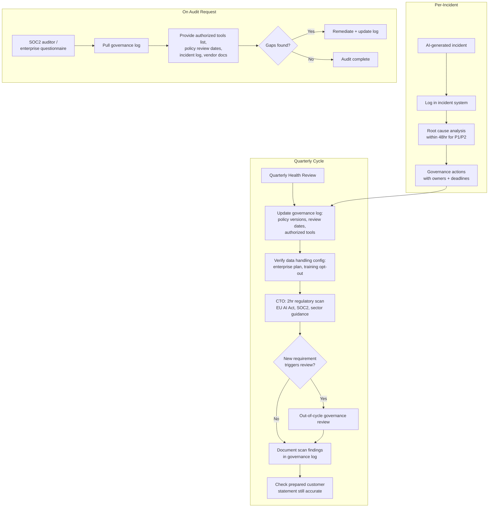

## Compliance and Audit: AI Governance Documentation for Security and Regulatory Requirements

**Related to:** [Governance Overview](00-overview.md) — Policy 6: Compliance and Audit Requirements · [Ethics: Training Data and Privacy](../Ethics/04-training-data-privacy.md)[^a] · [Ethics: Intellectual Property](../Ethics/01-intellectual-property.md)[^b] · [Security: Security Review Checklist](../Security/06-security-review-checklist.md)[^c] · [Governance: AI Usage Policy](02-ai-usage-policy.md)[^d]

---

## Overview

Teams that adopt AI development tools without proactive documentation create a compliance liability that grows silently. The compliance questions around AI code generation are arriving faster than most small teams are preparing for them — through enterprise customer security questionnaires, SOC 2 Type II audit cycles, and an evolving regulatory landscape that has not yet stabilized but is clearly moving toward documentation requirements for AI tool use in software development. A team that has been using Claude Code for eighteen months without a governance log, without vendor documentation on file, and without a prepared statement on AI practices will spend far more on reactive compliance remediation than the proactive documentation cost.[^1]

Compliance for AI tool use is not primarily about restricting what engineers do — it is about being able to demonstrate what the team authorizes, what controls are in place, and how the team responds when something goes wrong. The governance system this policy set establishes is already producing the necessary artifacts: session policies, review standards, escalation logs, and quarterly health reviews. Compliance and audit requirements are satisfied largely by organizing and preserving what good governance practice already generates, not by creating entirely separate compliance documentation tracks. This policy describes how to maintain governance artifacts in a form that satisfies compliance and audit requirements.[^2]

---

## Section 1: The Evolving Compliance Landscape for AI Tools

**Description:** The compliance landscape for AI development tools is expanding across three distinct channels simultaneously. SOC 2 Type II audits are increasingly including AI tool use in their scope: auditors are asking about data inputs to AI sessions, access controls on AI tool integrations, and whether AI-generated code receives security testing equivalent to human-authored code. Enterprise customer security questionnaires — typically part of vendor onboarding or annual renewal reviews — are adding standard sections on AI development practices, asking whether AI tools are used, what data they access, and what oversight controls exist. The EU AI Act, though primarily targeting high-risk AI systems, has provisions for AI used in consequential software that apply to some development contexts and are being interpreted broadly by enterprise legal teams conducting vendor due diligence.

Each of these channels creates documentation requirements that are different in form but substantially overlapping in content. A SOC 2 auditor wants to see that the team has formal AI use policies and that those policies are followed; an enterprise security questionnaire asks whether AI tools process customer data; an EU AI Act compliance review asks whether AI-generated code undergoes human review. The governance documentation this policy set establishes answers all three categories of inquiry. The teams that spend the most on compliance remediation are those that have not connected their governance practices to their compliance documentation — they have both, but separately, and cannot demonstrate the connection when asked.

**Recommended Practice:**
- Audit your current compliance obligations annually and specifically identify whether they include questions that implicate AI tool use. Security certifications (SOC 2, ISO 27001), regulatory requirements (HIPAA for health-adjacent work, PCI-DSS for payment processing), and enterprise customer agreements may all contain provisions that become relevant when AI tools are used in development.
- Review the EU AI Act's implications for your product's risk category, not just for your development tools. If your product includes AI-generated code in systems that affect individuals' access to services, employment, or safety, the compliance scope is broader than the development tool question. This review belongs at the CTO level.[^5]
- Proactive documentation is substantially cheaper than reactive compliance remediation. The governance log described in Section 2 takes approximately two hours per quarter to maintain and satisfies most AI compliance inquiries. Post-incident documentation — reconstructing what the team was doing with AI tools after an audit finding — takes far longer and produces lower-quality evidence.[^1]
- Monitor AI-specific compliance guidance from your certification bodies: SOC 2 auditors are developing AI-specific question sets; ISO standards bodies are updating relevant standards. Assign regulatory monitoring responsibility explicitly (Section 5) so that new requirements are captured before they become findings rather than after.[^6]

---

## Section 2: The AI Governance Log as a Compliance Artifact

**Description:** The AI governance log is the central compliance artifact for AI tool use. It is a living document that records the team's AI governance state at any point in time: which tools are authorized, which policies govern their use, who owns each policy, when each policy was last reviewed, what overrides have been granted, and what incidents have been recorded. A governance log with this information can answer the vast majority of SOC 2 audit questions and enterprise security questionnaire items about AI development practices in under an hour — compared to days of document reconstruction when no log exists.[^7]

The governance log serves two audiences simultaneously. Internal governance uses it to verify that the team's practices are current and that policies have active owners. External compliance uses it to demonstrate that the team has formal AI governance and that governance is actively maintained — not a policy document written once and never reviewed. The same log, maintained for internal governance purposes, produces the external compliance evidence. The marginal cost of making the governance log audit-ready is small; the compliance risk of not having it is large.[^8]

**Recommended Practice:**
- Maintain the AI governance log as a living document in the repository under `/Governance/`. It should contain: the list of authorized AI tools with authorization date and authorizing owner; the list of governing policies with current version, last review date, and policy owner; a link to the override history (from the escalation log in Governance/04); a link to the incident log; and a summary of data handling commitments (enterprise API plan status, training opt-out configuration).[^7]
- Update the governance log after every quarterly health review to reflect current policy versions, last review dates, and any changes to authorized tools or data handling configuration. A governance log that is accurate as of the last quarterly review satisfies the "actively maintained" standard most auditors apply.
- Format the governance log for external readability, not just internal use. When an enterprise customer or auditor requests AI governance documentation, the governance log should be readable by a non-engineer: clear section headings, plain-language descriptions of what each policy covers, and dates that make the review cadence visible. A log that is only intelligible to the engineering team is not usable for external compliance purposes.[^8]
- Store the governance log with version control so that the history of governance decisions is preserved. An auditor may ask what the team's AI policies were at a specific date — a git-tracked document can answer that question; a wiki page or shared document with no version history cannot.[^2]

---

## Section 3: Vendor Documentation and Contractual Obligations

**Description:** Using Claude Code creates a vendor relationship with Anthropic that has compliance implications. Enterprise customers and auditors will ask whether the team has reviewed the vendor's security documentation, whether there are contractual protections for data handled in AI sessions, and whether the vendor's compliance posture is consistent with the team's own compliance commitments. These questions require more than knowing Anthropic's name — they require having reviewed Anthropic's SOC 2 attestation, understanding the data processing terms in the API agreement, and knowing whether a business associate agreement or similar instrument is needed for the team's use context.[^10]

The data processing agreement question is frequently underestimated by small teams. A team that has committed to customers that their data will not be shared with third-party vendors without disclosure may have created a contractual obligation that affects which data can appear in Claude Code sessions. The question is not whether Anthropic will misuse the data — it is whether the team's contractual commitments have been satisfied by its data handling practices. This is a CTO-level review, not an engineering judgment call, because the relevant obligations are in contracts that the CTO has signed.[^11]

**Recommended Practice:**
- Obtain and file Anthropic's current SOC 2 Type II attestation report. Auditors and enterprise customers frequently request vendor security certifications; having the attestation on file allows the team to respond to these requests without a delay. Review the attestation for any scope limitations or exceptions that are relevant to the team's use case.[^10]
- Review the API terms of service and data processing provisions annually and whenever the team's use pattern materially changes (e.g., expanding to agentic use, adding new modules that handle sensitive data). The CTO owns this review; the architect can flag changes to tool use patterns that may trigger a review before the annual date.[^5]
- For teams working in HIPAA-adjacent contexts — health records, clinical data, patient identifiers — evaluate whether a business associate agreement with Anthropic is required before any PHI-adjacent data enters a Claude Code session. When in doubt, the answer is to use anonymized data in sessions (as the Acceptable Use Policy requires) and consult legal counsel before proceeding.[^11]
- Maintain a vendor documentation file that includes: Anthropic's current SOC 2 attestation (with issue and expiry dates noted), the current data processing terms (linked to the specific API agreement version), and any BAA or equivalent instrument if applicable. Update this file at the annual policy review and whenever vendor documentation is refreshed.

---

## Section 4: Customer-Facing Disclosures and Security Questionnaires

**Description:** Enterprise customers are increasingly asking direct questions about AI tool use as part of vendor security assessments. These questions range from simple existence queries ("do you use AI tools in software development?") to detailed practice assessments ("what data is passed to AI systems, what oversight exists for AI-generated code, and what controls prevent AI-generated security vulnerabilities from reaching production?"). Without a prepared, accurate, and consistently delivered answer, enterprise sales cycles are slowed by security review delays and engineers in different deals give inconsistent answers that undermine customer confidence.[^12]

The prepared statement about AI code generation practices is not a marketing document — it is an accurate description of the team's governance practices that can be delivered consistently across all customer security reviews. Its accuracy depends on governance practices being genuinely in place. A team that claims quarterly review and policy-governed AI use in its customer disclosure but has neither is creating a misrepresentation risk that far exceeds the compliance benefit. The prepared statement should describe only what is actually practiced.[^13]

**Recommended Practice:**
- Prepare a standard AI development practices statement that covers the six questions enterprise customers most commonly ask: (1) Do you use AI code generation tools? (2) What data do AI tools access? (3) Is customer data ever included in AI sessions? (4) What review process applies to AI-generated code? (5) What security testing applies to AI-generated code? (6) What governance oversight exists for AI tool use? The prepared statement answers all six accurately and concisely.[^12]
- Store the prepared statement in the team's sales and RFP response repository alongside other security documentation. It should be retrievable by anyone responding to a security questionnaire, not only by engineers who were involved in writing the governance policies. Consistent delivery requires accessible documentation.[^13]
- The distinction between tool use disclosure and code attribution disclosure matters for customer communication. Enterprise customers are asking whether AI tools are used in your development process (tool use disclosure) — not whether specific lines of code were AI-generated (code attribution disclosure). The former is a standard security and governance question; the latter is a product liability and IP question with different implications. Be clear about which question you are answering.[^6]
- Update the prepared statement after any significant governance policy change or tooling change. A prepared statement that describes last year's practices, when the team has since adopted agentic use or changed its data handling configuration, is a compliance liability. The governance log update after each quarterly review (Section 2) should include a check that the prepared statement is still accurate.

---

## Section 5: Regulatory Monitoring and Response

**Description:** The regulatory environment for AI tools in software development is actively evolving, and the team cannot evaluate its compliance status against a fixed reference point. The EU AI Act is being implemented with sector-specific guidance that affects software development companies differently depending on their product domain; US executive orders on AI have produced agency-specific guidance that is being incorporated into federal contractor requirements; sector regulators in finance, healthcare, and critical infrastructure are developing AI-specific requirements faster than horizontal frameworks are being finalized. Without an assigned responsibility for tracking these developments, the team discovers new requirements when they appear as audit findings or customer demands — rather than with enough lead time to respond thoughtfully.[^14]

Regulatory monitoring is not a full-time responsibility for an 11-person team — it is a quarterly scanning activity. The CTO should subscribe to three to five authoritative sources that cover AI regulatory developments relevant to the team's product domain, and budget approximately two hours per quarter to review what has changed and determine whether any new requirement triggers a governance review. That two-hour quarterly investment prevents the scenario where a material regulatory change is missed for two or three quarters and then requires emergency policy remediation.[^15]

**Recommended Practice:**
- Assign regulatory monitoring responsibility to the CTO explicitly, not implicitly. A responsibility that is everyone's is no one's. The CTO's regulatory monitoring obligation should appear in the governance overview document with a defined cadence: two hours of regulatory scanning per quarter, with a brief summary presented at the quarterly health review of any material developments.[^14]
- Maintain a short list of authoritative regulatory monitoring sources: the EU AI Act implementation tracker from the European AI Office, relevant US agency guidance (NIST AI RMF updates, sector-specific agency publications), and two or three industry organizations that aggregate AI regulatory developments for software companies. The list should be curated to avoid both coverage gaps and information overload.[^15]
- Define the trigger conditions for a governance review based on regulatory developments: a new requirement that affects data handling in AI sessions, a new compliance certification requirement that includes AI tool scope, or a material change to the EU AI Act's implementation guidance for software development. When a monitoring scan identifies a trigger condition, the CTO initiates an out-of-cycle governance review rather than waiting for the next quarterly review.[^5]
- Document the regulatory monitoring activity: what was scanned, what was found, whether a governance review was triggered, and what the outcome was. A CTO who cannot demonstrate that regulatory monitoring occurred is in a worse compliance position than one who scanned, found nothing material, and documented the finding. The documentation of active monitoring is itself a compliance artifact.

---

## Summary of Recommended Practices

| Practice | Immediate Action | Owner |
|---|---|---|
| Annual Compliance Obligation Audit | Identify all current compliance obligations that implicate AI tool use | CTO |
| EU AI Act Product Risk Assessment | Evaluate product domain against EU AI Act risk categories | CTO |
| Governance Log Creation | Create AI governance log document with all required fields in /Governance/ | Architect |
| Governance Log Update Cadence | Add governance log update to the quarterly health review checklist | Architect |
| Governance Log Formatting | Format governance log for external readability; test with a non-engineer reader | Architect |
| Vendor SOC 2 Attestation | Obtain Anthropic's current SOC 2 attestation; file with vendor documentation | CTO |
| Data Processing Agreement Review | Review API data processing terms; determine BAA applicability | CTO |
| Vendor Documentation File | Create and maintain vendor documentation file with issue dates and expiry tracking | CTO |
| Prepared Customer Statement | Draft six-question AI development practices statement; file in RFP repository | CTO |
| Statement Currency Check | Add prepared statement accuracy check to governance log quarterly update | Architect |
| Regulatory Monitoring Assignment | Assign CTO regulatory monitoring responsibility in governance overview document | CTO |
| Regulatory Monitoring Sources | Identify and subscribe to three to five authoritative regulatory monitoring sources | CTO |
| Regulatory Monitoring Documentation | Document quarterly scanning activity and findings in governance log | CTO |

---

[^1]: Veracode — "Spring 2026 GenAI Code Security Update: Despite Claims, AI Models Are Still Failing Security," March 24, 2026. https://www.veracode.com/blog/spring-2026-genai-code-security/
 Compliance cost comparison: proactive documentation vs. reactive remediation; the growing scope of AI tool use in SOC 2 audit frameworks; security testing requirements for AI-generated code.

[^2]: Anthropic — "Data Usage and Privacy," Claude Code Documentation, 2026. https://code.claude.com/docs/en/data-usage
 Governance log as compliance artifact; version control for governance documents as an audit history mechanism; data handling commitments and their documentation requirements.

[^5]: Anthropic — "Claude Code Permissions," Claude Code Documentation, 2026. https://code.claude.com/docs/en/permissions
 CTO-level obligations for data processing review and BAA applicability assessment; regulatory monitoring trigger conditions; agentic use expansion as a data handling review trigger.

[^6]: Sonar (SonarSource) — "Sonar Data Reveals Critical 'Verification Gap' in AI Coding," press release, January 8, 2026. https://www.sonarsource.com/company/press-releases/sonar-data-reveals-critical-verification-gap-in-ai-coding/
 Compliance monitoring for certification body updates; tool use disclosure vs. code attribution disclosure distinction; the six common enterprise security questionnaire questions about AI development.

[^7]: Anthropic — "Best Practices for Claude Code," Claude Code Documentation, 2026. https://code.claude.com/docs/en/best-practices
 Governance log content requirements: authorized tools, governing policies, policy owners, override history, incident log; the single-document compliance evidence function.

[^8]: Roman Fedytskyi — "A Safer CI Pattern for Agentic Code Review," Medium, March 2026. https://medium.com/@roman_fedyskyi/a-safer-ci-pattern-for-agentic-code-review-94a484b5e3c4
 Governance log external readability requirements; the audit-ready formatting standard that makes internal governance documentation usable for external compliance purposes.

[^10]: CodeRabbit — "State of AI Code Generation: AI vs. Human Code Report," December 17, 2025. https://www.coderabbit.ai/blog/state-of-ai-vs-human-code-generation-report
 Vendor SOC 2 attestation requirements in enterprise security reviews; the vendor documentation file and its maintenance cadence.

[^11]: Ravikanth Konda — "Human-AI Collaboration in Software Teams: Evaluating Productivity, Quality, and Knowledge Transfer with Agentic and LLM-Based Tools," *International Journal of AI, BigData, Computational and Management Studies*, February 17, 2026. https://ijaibdcms.org/index.php/ijaibdcms/article/view/418
 Data processing agreement analysis for AI vendor relationships; HIPAA-adjacent context evaluation; contractual obligations and their relationship to AI session data handling.

[^12]: CIO — "How Agentic AI Will Reshape Engineering Workflows in 2026," April 2026. https://www.cio.com/article/4134741/how-agentic-ai-will-reshape-engineering-workflows-in-2026.html
 Enterprise customer AI development practice questionnaires; prepared statement function in sales cycles; consistent delivery requirement across multiple customer interactions.

[^13]: Kyros — "The Vibe Coding Crisis: How AI-Generated Technical Debt Is Costing Companies Millions," March 2026. https://usekyros.ai/blog/vibe-coding-crisis-ai-technical-debt
 Prepared statement accuracy requirement; misrepresentation risk when governance disclosure exceeds governance practice; the compliance benefit of accurate rather than aspirational statements.

[^14]: DEV Community — "AI Is Creating a New Kind of Tech Debt — And Nobody Is Talking About It," March 2026. https://dev.to/harsh2644/ai-is-creating-a-new-kind-of-tech-debt-and-nobody-is-talking-about-it-3pm6
 Regulatory monitoring as a CTO responsibility; the cost of discovering new AI requirements as audit findings vs. monitoring outputs; EU AI Act implementation pace.

[^15]: METR — "Autonomy Evaluation Resources," METR, February 2026. https://metr.org/measuring-autonomous-ai-capabilities//
 AI regulatory landscape assessment for software development; sector-specific guidance development pace; the monitoring sources curated to avoid coverage gaps and information overload.

[^a]: [Ethics: Training Data and Privacy](../Ethics/04-training-data-privacy.md) — Data privacy compliance is a primary audit category; the ethical analysis of what enters AI sessions maps directly to the compliance documentation requirements here.

[^b]: [Ethics: Intellectual Property](../Ethics/01-intellectual-property.md) — IP and license compliance is a recurring audit requirement; what the ethics section identifies as risk, this section documents as the audit evidence trail.

[^c]: [Security: Security Review Checklist](../Security/06-security-review-checklist.md) — Security checklist completion is a compliance artifact; the checklist provides the per-PR evidence that the security compliance requirements here demand.

[^d]: [Governance: AI Usage Policy](02-ai-usage-policy.md) — Usage policy is the policy document that compliance audits assess adherence to; these two documents are the policy and the audit framework for the same governance scope.
