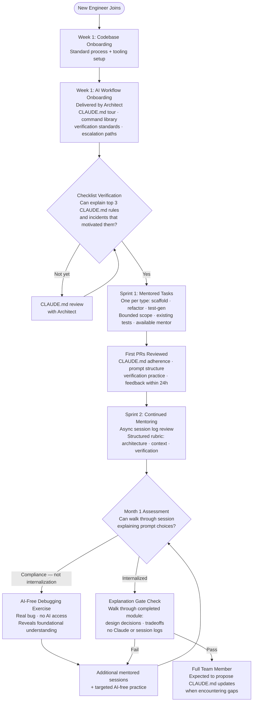

## Engineer Onboarding: Ramping Into AI-Assisted Development

**Related to:** [Learning Overview](00-overview.md) — Practice 1 · [Documentation: Knowledge Transfer](../Documentation/03-knowledge-transfer.md)[^a] · [Tooling: CLAUDE.md Configuration](../Tooling & Configuration/01-claude-md-configuration.md)[^b] · [Governance: AI Usage Policy](../Governance/02-ai-usage-policy.md)[^c] · [Issues: Skill Atrophy](../Issues/06-skill-atrophy.md)[^d]

---

## Overview

Onboarding a new engineer onto a team that uses Claude Code heavily is a different problem than onboarding onto a team that does not. Traditional onboarding transfers codebase knowledge, process knowledge, and domain knowledge. AI-assisted onboarding must transfer all of those plus a fourth category: AI workflow knowledge — how the team uses Claude Code, what standards govern AI sessions, why specific CLAUDE.md rules exist, and how to interact with AI tools in ways that build rather than mask foundational understanding. Without this fourth transfer, new engineers default to their previous AI habits, which may be effective in other contexts but inconsistent with the team's practices.[^1]

This memo covers the structure of an AI workflow onboarding program for a small team, the artifacts that make onboarding tractable, the mentor relationship that transfers tacit knowledge that documentation cannot, and the first-sprint task design that establishes good habits before poor ones form. It also covers the signals that indicate onboarding succeeded — and the signals that indicate it did not, while there is still time to address the gap.

---

## Section 1: The AI Workflow Onboarding Checklist

**Description:** New engineers cannot be expected to derive the team's AI workflow practices from general knowledge or from reading the codebase. The CLAUDE.md, the command library, the hook configuration, and the verification standards represent accumulated team-specific knowledge that must be actively transferred. An onboarding checklist makes this transfer explicit and verifiable — each item on the checklist represents knowledge the engineer should have before their first AI-assisted PR.[^2]

The checklist should have five sections: the CLAUDE.md walkthrough (covering what each rule addresses and why it exists), the command library walkthrough (covering when to use each command and what good output looks like), the verification standards (what must be checked before a session is complete), the permission hygiene briefing (how to read permission prompts rather than approving them reflexively), and the escalation paths (what to do when a session produces unexpected results).[^3]

**Recommended Practice:**
- Create a structured AI workflow onboarding document alongside the standard codebase onboarding checklist. The two checklists should be completed in sequence, not simultaneously — the codebase onboarding provides context that makes the AI workflow onboarding more meaningful.[^1]
- Assign the architect as the default deliverer of the AI workflow onboarding. The architect knows the CLAUDE.md rationale better than anyone else on the team and can explain not just what the rules are but why specific incidents or patterns motivated each one. This context is not documented and cannot be transferred by reading alone.[^4]
- Make the onboarding checklist verifiable: each item should have a completion criterion (not "understood CLAUDE.md" but "can explain the three highest-priority CLAUDE.md rules and the incidents that motivated them"). This converts the checklist from a to-do list into a competency verification.[^2]
- Schedule the AI workflow onboarding as a calendar event within the first week, not as an optional reading assignment. Engineers who are onboarding to a new codebase have a limited attention budget; scheduling the onboarding forces it to happen rather than deferring indefinitely.[^5]

---

## Section 2: Foundational Artifacts for New Engineers

**Description:** New engineers need access to three artifacts before their first AI-assisted session: the CLAUDE.md (what instructions govern all sessions), the command library in `.claude/commands/` (what reusable prompts are available), and a session log from an experienced team member's recent session (what a well-structured session looks like in practice). The first two are documentation; the third is the only artifact that shows rather than tells.[^3]

Session logs are an underused onboarding asset. A log from a session that completed a similar task to what the new engineer will work on — showing the prompt structure used, the corrections made, the verification steps applied, and the output produced — transfers workflow knowledge that no checklist item can fully convey. It also sets realistic expectations: new engineers who have not seen a real session often have either inflated or deflated expectations about what AI-assisted development looks like in practice.[^6]

**Recommended Practice:**
- Maintain a `docs/onboarding/` directory with three curated session logs: a feature scaffolding session, a refactoring session, and a security review session. Annotate each log with comments explaining why specific prompts were structured as they were and what the alternatives would have produced.[^3]
- Include a brief "CLAUDE.md tour" as part of the `.claude/README.md`: each major CLAUDE.md rule with a one-sentence explanation of the incident or pattern that motivated it. New engineers who understand why rules exist are more likely to follow them and more likely to propose updates when they encounter situations the rule does not address well.[^4]
- Create a "first week tasks" list of AI-assisted tasks that were specifically chosen for their instructional value: one task per type (scaffolding, refactoring, test generation) using the team's standard commands, on modules with good test coverage, with an available mentor for the session.[^1]
- Share the prompt retrospective notes from the last quarterly AI practice review as part of onboarding. These notes document which prompt patterns the team has found effective and which have produced poor output — real team experience that is not in any documentation.

---

## Section 3: The Mentor Relationship

**Description:** Tacit knowledge about AI-assisted development — the judgment calls that are not in any documentation, the pattern recognition that distinguishes a well-running session from one that is degrading, the read on when to clear context vs. when to correct — cannot be transferred through checklists or documentation alone. It requires a mentor who has internalized it and can demonstrate it, correct it in real time, and articulate what they observe in a way that the new engineer can internalize.[^8]

The mentor for AI workflow onboarding is a different role than the general onboarding buddy. The general buddy transfers codebase and cultural knowledge; the AI workflow mentor specifically reviews AI sessions, gives feedback on prompting practice, and identifies workflow gaps that would not be visible to the new engineer themselves. For a team of 11, a two-sprint mentored period with focused AI workflow feedback produces measurably better long-term practice than leaving new engineers to develop their AI workflow habits independently.[^1]

**Recommended Practice:**
- Designate a specific AI workflow mentor for each new engineer's first two sprints. The mentor should review at least two AI sessions per sprint: one live (observing the session in real time), one asynchronous (reviewing the session log and providing written feedback).[^8]
- Give the mentor a structured feedback rubric: prompt architecture (were all five components present?), context management (was the context appropriately scoped?), verification practice (was verification criteria included and executed?), and session hygiene (was context cleared at appropriate points?). Structured feedback is more actionable than impressionistic feedback.[^2]
- After the mentored period, conduct a brief competency assessment: ask the new engineer to walk through a session they ran, explaining their prompt choices and what they would change. This assessment reveals internalization (the ability to articulate reasoning) vs. compliance (following rules without understanding them). Internalization is the goal.[^9]
- Rotate the mentor role across the team over time. Every engineer who serves as an AI workflow mentor strengthens their own practice by being required to articulate the reasoning behind their approach. Mentoring is skill maintenance for the mentor as well as skill development for the mentee.

---

## Section 4: First-Sprint Task Design

**Description:** The tasks assigned in an engineer's first sprint shape their AI workflow habits before those habits have formed. A well-designed first-sprint task set leads the new engineer through the standard team workflow — planning, specification, verification, review — in a controlled setting where their sessions are observed and their output is reviewed with explicit attention to AI workflow practice.[^10]

The common failure mode in first-sprint task design is assigning tasks that are too open-ended: tasks with ambiguous requirements, high novelty, or architectural scope that exceeds what the new engineer can confidently constrain. Open-ended tasks amplify the consequences of poor prompting practice; the new engineer either produces low-quality output (establishing a pattern of accepting it) or produces good output through luck (not establishing the practices that would make the quality reproducible).[^1]

**Recommended Practice:**
- Assign one bounded, well-specified task per primary task type (scaffolding, refactoring, test generation) in the first sprint. Each should have: existing tests that pass as a verification baseline, clear architectural precedent in the codebase, a spec.md already written (or jointly written with the new engineer), and an available mentor for questions during the session.[^10]
- Avoid assigning security-critical tasks (authentication, payment processing, data access) in the first sprint. The additional scrutiny required for security-critical AI-generated code is more useful as a teaching example once the new engineer has baseline practice, not as a first experience under time pressure.[^4]
- Review the new engineer's first sprint PRs specifically for CLAUDE.md adherence, prompt structure evidence (visible in session logs if the engineer shares them), and verification practice (did tests run before the PR was submitted?). Provide this feedback within 24 hours of the PR submission — close enough to the session that the engineer can connect the feedback to their specific choices.[^5]
- After the first sprint, debrief: which tasks were clearest to AI-assisted execution? Which encountered unexpected complexity? What CLAUDE.md rules were most relevant? This debrief both provides learning value for the new engineer and generates input for CLAUDE.md and onboarding documentation updates.

---

## Section 5: Success Signals and Gaps

**Description:** Onboarding success is not binary — it is a gradient from "following rules without understanding them" to "internalizing the reasoning and adapting it to new situations." The signals that distinguish these two outcomes are not visible in sprint velocity or PR merge rate. They are visible in how the engineer responds to unexpected session situations, how they explain their prompt choices in PR review, and whether they propose CLAUDE.md updates when they encounter patterns the current instructions do not address.[^11]

The fragile expert finding (see Issues — Comprehension Debt) is directly relevant here: an engineer whose onboarding produced compliance rather than internalization will perform well in AI-assisted sessions and poorly in sessions without AI assistance — a dependency pattern that becomes visible only when the AI is unavailable or incorrect. Catching this pattern early, during the first few months of onboarding, is significantly less costly than discovering it during an incident.[^12]

**Recommended Practice:**
- After the first month, run an AI-free debugging exercise with the new engineer: a real bug in a module they have worked on, solved without AI assistance. The ease or difficulty of this exercise reveals whether their AI-assisted onboarding built foundational understanding or covered it. Address gaps through targeted AI-free practice before they compound.[^13]
- Include a comprehension check at the end of the second sprint: ask the new engineer to walk through a module they completed during onboarding, explaining its design decisions and tradeoffs without referencing Claude or session logs. This directly tests the Explanation Gate standard that applies to all engineers on the team.[^9]
- Track the new engineer's CLAUDE.md update proposals over the first quarter: engineers who are internalizing the rationale rather than just following rules will eventually encounter situations the current instructions do not address and propose improvements. The absence of any proposals after three months may indicate surface-level compliance rather than genuine engagement.[^4]
- If an onboarding gap is identified (compliance without internalization, dependency without understanding), address it with targeted AI-free practice and additional mentored sessions — not by restricting AI use, but by adding the comprehension-building activities that the initial onboarding period did not adequately cover.[^11]

---

## Summary of Recommended Practices

| Practice | Immediate Action | Owner |
|---|---|---|
| Onboarding Checklist | Create AI workflow checklist with completion criteria | Architect |
| Foundational Artifacts | Add three curated session logs to docs/onboarding/ | Architect |
| Mentor Relationship | Designate mentor role; create structured feedback rubric | Architect + CTO |
| First-Sprint Task Design | Curate three bounded first-sprint tasks per type | Architect |
| Success Signals | Schedule first-month AI-free debugging exercise | Architect |

---

[^1]: Addy Osmani — "My LLM Coding Workflow Going Into 2026," April 2026. https://addyosmani.com/blog/ai-coding-workflow/
 AI workflow onboarding as a distinct knowledge transfer category: why default AI habits from previous roles diverge from team standards and how structured onboarding addresses the gap.

[^2]: Anthropic — "Best Practices for Claude Code," Claude Code Documentation, 2026. https://code.claude.com/docs/en/best-practices
 CLAUDE.md walkthrough as onboarding artifact; verification standards and permission hygiene as required competencies before first AI-assisted session.

[^3]: Anthropic — "Common Workflows," Claude Code Documentation, 2026. https://code.claude.com/docs/en/common-workflows
 Command library structure and `.claude/commands/` directory organization; session log format as an onboarding teaching tool.

[^4]: Boris Cherny — "How Boris Uses Claude Code," January 2026. https://howborisusesclaudecode.com
 CLAUDE.md rationale transfer: why the architect should deliver the CLAUDE.md onboarding; the importance of knowing why rules exist vs. just knowing what they are.

[^5]: Artur Less — "Spec-Driven Development with Claude Code," Level Up Coding / Medium, March 2026. https://levelup.gitconnected.com/spec-driven-development-with-claude-code-1b08184965e3
 First-sprint task design: how bounded, well-specified tasks with existing test coverage and architectural precedent establish good session habits before poor ones form.

[^6]: Dave Patten — "The State of AI Coding Agents (2026): From Pair Programming to Autonomous AI Teams," Medium, March 2026. https://medium.com/@dave-patten/the-state-of-ai-coding-agents-2026-from-pair-programming-to-autonomous-ai-teams-b11f2b39232a
 Session logs as onboarding artifacts: how annotated real sessions transfer tacit workflow knowledge that documentation cannot convey; expectation calibration for engineers new to AI-assisted development.

[^8]: Ravikanth Konda — "Human-AI Collaboration in Software Teams: Evaluating Productivity, Quality, and Knowledge Transfer with Agentic and LLM-Based Tools," *International Journal of AI, BigData, Computational and Management Studies*, February 17, 2026. https://ijaibdcms.org/index.php/ijaibdcms/article/view/418
 Structured peer-to-peer knowledge transfer as the mechanism for building genuine organizational knowledge rather than surface-level compliance; mentor role specification for AI workflow transfer.

[^9]: Sreecharan Sankaranarayanan — "Mitigating 'Epistemic Debt' in Generative AI-Scaffolded Novice Programming using Metacognitive Scripts," arXiv:2602.20206, February 22, 2026. https://arxiv.org/abs/2602.20206
 Internalization vs. compliance distinction: the teach-back explanation as the assessment tool that distinguishes engineers who understand AI workflow rationale from those who follow rules without internalizing them.

[^10]: Anthropic — "2026 Agentic Coding Trends Report," Anthropic, 2026. https://resources.anthropic.com/hubfs/2026%20Agentic%20Coding%20Trends%20Report.pdf
 First-sprint task design criteria: fully specified requirements, narrow scope, high-precedent patterns, existing verification; avoiding security-critical tasks in initial AI-assisted sessions.

[^11]: Yonatan Sason — "The Black Box Problem: Why AI-Generated Code Stops Being Maintainable," *Towards Data Science*, March 6, 2026. https://towardsdatascience.com/the-black-box-problem-why-ai-generated-code-stops-being-maintainable/
 Compliance vs. internalization as an onboarding outcome: how engineers who followed rules without understanding them produce the black-box code that is maintainable only while the original engineer is present.

[^12]: Judy Hanwen Shen and Alex Tamkin (Anthropic) — "How AI Assistance Impacts the Formation of Coding Skills," arXiv:2601.20245, January 28, 2026. https://arxiv.org/abs/2601.20245
 Comprehension gap risk during onboarding: why the first months of AI-assisted work are the highest-risk period for forming dependency patterns, and why catching them during onboarding is less costly than discovering them in incidents.

[^13]: ThePrimeagen (The PrimeTime) — "Jr Devs - 'I Can't Code Anymore'," YouTube, February 21, 2025. https://www.youtube.com/watch?v=1Se2zTlXDwY
 - AI-free debugging exercise as an onboarding success signal: what it reveals about whether AI-assisted work is building foundational understanding or covering its absence
 - The habit formation window: why the first weeks of AI-assisted work are the highest-leverage period for establishing good practices
 - Mentor modeling: how senior engineers who demonstrate active AI workflow practices accelerate new engineer habit formation more effectively than documentation alone

[^14]: Lex Fridman Podcast #461 ft. ThePrimeagen, YouTube, March 22, 2025. https://www.youtube.com/watch?v=tNZnLkRBYA8
 - 4:18:32 — Senior engineer mentorship in AI-assisted teams: the specific behaviors that distinguish effective AI workflow mentors from general technical mentors
 - 20:00 — Dependency formation during onboarding: how the first months of AI tool exposure shape long-term capability trajectories in both beneficial and limiting directions
 - 5:01:16 — The skills that make AI onboarding successful: which foundational engineering competencies enable engineers to use AI as a multiplier rather than a crutch from day one

[^15]: Sabrina Ramonov — "CLAUDE CODE FULL COURSE," YouTube, February 17, 2025. https://www.youtube.com/watch?v=fYX6hHC9FhQ
 - Onboarding walkthrough: how the tutorial's structure mirrors an effective AI workflow onboarding sequence — from CLAUDE.md to commands to verification to quality gates
 - Session log demonstration: what a well-run session looks like from start to finish, including prompt structure, corrections, verification, and completion criteria
 - First-session task design: the tutorial's example tasks are calibrated to onboarding difficulty — bounded, well-specified, with architectural precedent and existing tests

[^a]: [Documentation: Knowledge Transfer](../Documentation/03-knowledge-transfer.md) — knowledge transfer practices are the upstream input to onboarding; what the team documents determines what new engineers receive in the onboarding process.
[^b]: [Tooling: CLAUDE.md Configuration](../Tooling & Configuration/01-claude-md-configuration.md) — onboarding includes CLAUDE.md orientation; new engineers must understand the constraint layer before using Claude Code on the codebase.
[^c]: [Governance: AI Usage Policy](../Governance/02-ai-usage-policy.md) — onboarding includes usage policy training; policy comprehension is a gate before engineers use Claude Code on production code.
[^d]: [Issues: Skill Atrophy](../Issues/06-skill-atrophy.md) — onboarding for engineers who have grown up with AI tools requires particular attention to foundational skill development; the risk described there is highest for new-to-team engineers.