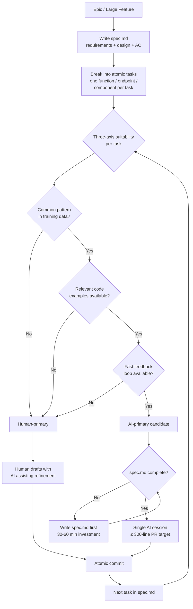

## Overview

Task decomposition and selection is the discipline of deciding what to give to AI, how to give it, and what to keep for human-first drafting. It is where the velocity promise of AI tools either materializes or collapses. Engineers who decompose well produce better output per session, require fewer correction cycles, and maintain genuine comprehension of what ships. Engineers who hand over large, loosely specified tasks produce locally coherent but architecturally inconsistent code — and create the comprehension debt described in Issue 1.

This memo covers the productivity research behind task selection, the task suitability framework, how to break work down into AI-sized units, how AI-generated code percentage benchmarks apply to team health, and how to integrate decomposition into sprint and story planning.

---

## Section 1: The Productivity Paradox in Task Selection

**Description:** The productivity gains from AI coding tools are real but highly uneven across task types. METR's July 2025 study of 16 experienced open-source developers — working on real issues from codebases averaging 22,000+ GitHub stars — found that when developers used AI tools, they took **19% longer** to complete tasks than without them, despite expecting a 24% speedup.[^1] This result is not a condemnation of AI tools; it is a signal about task selection. The developers in the study were working on complex, context-heavy issues in their own production codebases — precisely the category where AI performs worst.

Separately, well-controlled studies on implementation-heavy tasks (scaffolding, boilerplate, test generation, straightforward endpoint work) consistently show genuine 21–36% speed improvements.[^2] The difference is task type: AI tools perform best on implementation-heavy, well-precedented, fast-feedback tasks, and worst on complex reasoning, novel design, and high-context-dependency work. Using AI for the wrong task type does not produce neutral results — it produces worse results than human-only work.

Industry-level data shows that AI-generated code now represents 41–42% of global code in 2026. Sustainable benchmarks, however, sit between 25–40%: teams exceeding 40% AI-generated code see rework rates increase to 20–30%.[^3] This is not an argument against AI use; it is an argument for task selection discipline. The teams winning in 2026 are not those generating the most AI code — they are those generating the right AI code.

**Recommended Practice:**
- Establish a team-level benchmark: track the percentage of code in each sprint that is AI-generated. Flag sprints where this exceeds 40% for additional architect review.[^3]
- Treat the METR findings as a calibration tool: if a task involves novel design decisions, complex cross-module reasoning, or high organizational context, default to human-first drafting with AI assisting in refinement.[^1]
- When using AI on complex tasks, measure the actual time including correction cycles — not just the initial generation time. Tasks that appear faster because AI generated code quickly but required significant rework are not faster.[^1]
- Brief product managers on the productivity paradox: AI velocity gains are real but task-dependent. Blanket velocity expectations based on headline AI statistics will push teams toward AI use on tasks where it degrades, not improves, outcomes.[^4]

---

## Section 2: The Task Suitability Framework

**Description:** Phillip Carter at Honeycomb has documented a practical framework for evaluating AI task suitability across three axes: task commonality, code availability, and feedback loop speed.[^5] Together these axes produce a reliable prior on whether a given task is likely to be a good AI candidate before the session begins.

**Task commonality** measures how well-represented the task pattern is in AI training data. Tasks in common frameworks (Next.js, Express, standard REST patterns, well-known ORMs) benefit from dense training signal. Tasks in proprietary systems, custom DSLs, or niche frameworks require extensive context-loading to compensate for sparse training signal — and even then, the model is extrapolating rather than pattern-matching.[^5]

**Code availability** measures how much relevant public code exists for the task pattern. Tasks with abundant public examples (web development, cloud infrastructure, standard auth patterns) see better results than tasks in specialized domains where public code is scarce or where the team's codebase diverges significantly from public conventions.[^5]

**Feedback loop speed** measures how quickly the correctness of AI output can be verified. Frontend components can be visually verified in seconds; unit tests run in milliseconds; integration tests run in minutes. Infrastructure code, database migrations, and multi-service orchestration have slow, expensive feedback loops where AI errors are harder to detect and more costly to correct.[^5]

High-suitability tasks score well on all three axes: a new REST endpoint in an established Express codebase, a React component in a well-tested frontend, a utility function in a module with good test coverage. Low-suitability tasks score poorly on at least one: a complex query in a proprietary database schema, a custom protocol handler with no test coverage, a multi-service orchestration task with a 10-minute feedback loop.

**Recommended Practice:**
- Apply the three-axis suitability check before beginning a session: is this task common-pattern? Is code available? Is the feedback loop fast? Two or more "no" answers signal a human-first task.[^5]
- For low-suitability tasks, consider AI assistance at the research and documentation phase rather than the implementation phase. AI can produce reference implementations, summarize documentation, and generate initial structure even when it should not own full implementation.[^5]
- Document low-suitability task types for your specific codebase in `CLAUDE.md` under an "AI caution" section. This gives every engineer a consistent prior before beginning sessions in those areas.[^6]
- Assign the architect to review the suitability framework quarterly: which task categories have become more suitable as the codebase evolves and as models improve?[^4]

---

## Section 3: Decomposition in Practice

**Description:** Effective task decomposition for AI sessions is a different skill from traditional sprint planning or story breakdown. The relevant unit is not a user story but a prompt: a single, verifiable task that Claude can complete in one session without exceeding context limits or requiring organizational knowledge the AI cannot have.

The practical standard is one function, one endpoint, one isolated component, one test suite for a specific module. Addy Osmani describes this as the "atomic chunk" principle: "Work in small, atomic chunks — commit after each logical change to create rollback save points and enable better AI performance on focused tasks."[^7] This is not just about AI performance; it is about maintaining the human review quality described in Issue 5. A 200-line PR representing one AI task is reviewable. A 1,200-line PR representing six merged AI tasks is not.

The spec-driven development workflow formalizes decomposition: before beginning implementation, write a structured specification that explicitly breaks the feature into discrete, ordered tasks. These tasks become the implementation units for individual AI sessions or delegated subagents.[^8] This approach demonstrated its value concretely: one engineer completed a complex migration by breaking it into 14 discrete tasks, each producing an atomic commit — turning a 2-3 day estimate into an afternoon of work.[^9]

A practical decomposition heuristic: if giving the task to a competent junior engineer, would you need to provide additional context mid-task? If yes, the task is not sufficiently decomposed for AI delegation. AI needs all context upfront and cannot ask clarifying questions mid-implementation the way a human can interrupt you at their desk.[^5]

**Recommended Practice:**
- For any feature larger than a single function or component, write a task list before beginning AI sessions. This list becomes the input structure for session prompts.[^8]
- Use the "junior engineer heuristic" for decomposition: if a competent junior would need mid-task clarification, decompose further before delegating to AI.[^5]
- Apply PR size limits from Issue 5 as a decomposition forcing function: if a single AI task would produce a PR exceeding 300-400 lines, the task needs to be smaller.[^4]
- Keep a running `spec.md` or task breakdown file for features in active development. Update it as scope evolves, and use it as the input document for each AI session rather than reconstructing context from memory each time.[^7]

---

## Section 4: The 25–40% Benchmark and Sprint Health

**Description:** Sustainable AI code generation benchmarks cluster in the 25–40% range for teams maintaining quality. Below 25% suggests underutilization of available productivity tools. Above 40%, rework rates increase materially — and the Issues described in the companion memo (comprehension debt, codebase bloat, architectural drift, security vulnerabilities) compound faster than governance can address them.[^3]

This benchmark does not mean that all engineers should target 30% AI code at all times. It means that at the team level, averaged across a sprint, exceeding 40% is a signal to examine whether task selection has drifted toward AI-inappropriate work. Some engineers and some task types may operate at higher AI ratios while others remain lower; the aggregate is what matters for team health.[^3]

The benchmark also has a task-type dimension. Implementation tasks (feature work, test generation, refactoring) can sustain higher AI ratios than design tasks (architecture, API design, data modeling). A team where 70% of implementation code is AI-generated but architectural decisions remain human-owned may be operating sustainably. A team where AI is making architectural decisions at any volume is not.[^10]

METR's research design changes for 2026 reflect this nuance: they shifted from measuring task-level AI impact to measuring developer-level workflow impact, acknowledging that task selection, not AI capability, is the primary variable in productivity outcomes.[^1]

**Recommended Practice:**
- Track AI code percentage as a sprint metric alongside velocity. Use code review tooling or CI annotations to flag AI-generated commits.[^3]
- Set a team-level alert threshold at 40% AI code per sprint. When exceeded, review which task types drove the increase — not to reduce AI use, but to verify task suitability.[^3]
- Distinguish implementation AI ratio from design AI ratio. Implementation AI above 50% may be appropriate; architectural AI above 0% warrants scrutiny.[^10]
- Report the metric to the CTO and product managers in the quarterly engineering health review (per Issue 8), framed as a quality signal rather than a productivity signal.[^4]

---

## Section 5: Sprint and Story Integration

**Description:** AI task decomposition should be a first-class step in sprint planning, not an ad-hoc decision engineers make at session start. Stories that will involve significant AI-assisted implementation benefit from being pre-decomposed into AI-sized tasks before the sprint begins — not because the tasks must be tracked individually, but because the decomposition process surfaces scope, dependencies, and ambiguities that affect sprint commitments.[^7]

The practical mechanism is a brief "AI-readiness" step in story refinement: before accepting a story into a sprint, identify whether it requires AI-first implementation, which parts are AI-appropriate vs. human-first, and what the spec.md structure will look like. This takes two to five minutes per story and prevents the scenario where engineers begin AI sessions with underspecified tasks and produce outputs that require significant rework — generating the appearance of velocity without its substance.[^4]

For our team's size (11 people, 2 PMs, 1 architect), this step is particularly valuable because the architect can flag suitability concerns during refinement rather than during code review. Moving the suitability assessment upstream reduces the cost of catching AI-inappropriate task delegation.[^4]

**Recommended Practice:**
- Add an "AI approach" field to story templates: human-first, AI-assisted, or AI-primary, with brief justification. This makes task selection visible to PMs and the architect during planning.[^4]
- During sprint planning, have the architect flag stories where AI-primary is inappropriate based on suitability criteria. This is a planning gate, not a retrospective one.[^4]
- For AI-primary stories, require that a spec.md or task breakdown exists before the story is moved to "in progress." This is the engineering definition of "ready."[^8]
- After each sprint, review the distribution of AI approach types and outcomes: did AI-primary tasks require more or less rework than expected? This data should inform the next sprint's suitability decisions.[^1]

---

## Summary of Recommended Practices

| Practice | Immediate Action | Owner |
|---|---|---|
| Productivity Paradox Calibration | Apply three-axis suitability check before each AI session | All engineers |
| Task Suitability Framework | Document AI-caution areas in CLAUDE.md | Architect |
| Decomposition Standard | Require task list / spec.md before multi-component AI work | Architect |
| AI Code Percentage Tracking | Track and report AI code % per sprint; alert at 40% | Engineering team |
| Sprint Integration | Add AI-approach field to story templates; architect flags in refinement | Architect + PMs |

---

[^1]: METR — "Measuring the Impact of Early-2025 AI on Experienced Open-Source Developer Productivity," July 2025. https://arxiv.org/abs/2507.09089
    - 19% slowdown observed when experienced developers used AI tools on complex real-world issues
    - 24% speedup expected by developers vs. actual result: the perception-reality gap in AI productivity
    - Task-type dependency: results apply specifically to complex, high-context, slow-feedback tasks, not all AI work

[^2]: Axify — "A 2026 Guide on How to Use AI for Developer Productivity," 2026. https://axify.io/blog/use-ai-for-developer-productivity
    - 21–36% speed improvement for well-scoped implementation tasks in longitudinal studies
    - Task specificity as the primary variable separating productivity gains from losses
    - Integration friction: tool unfamiliarity and context-switching overhead as contributors to slowdown

[^3]: AI Code Benchmarks — "AI Code Benchmarks: Safe Productivity Thresholds 2026," Exceeds.ai, 2026. https://blog.exceeds.ai/industry-benchmarks-ai-code-productivity/
    - 41–42% of global code is AI-generated in 2026; sustainable benchmark is 25–40%
    - Rework rates increase to 20–30% when AI-generated code exceeds 40% of output
    - Quality degradation threshold: the evidence base for the 40% alert recommendation

[^4]: Developer Productivity Statistics — "Top 100 Developer Productivity Statistics with AI Tools 2026," Index.dev, 2026. https://www.index.dev/blog/developer-productivity-statistics-with-ai-tools
    - Developers report feeling 20% faster while actually performing 19% slower: the 39-point perception gap
    - Teams achieving 10x gains implement code review gates focusing senior expertise on architectural soundness
    - AI code as 41% of global output; teams with deliberate governance outperforming those without

[^5]: Phillip Carter — "How I Code With LLMs These Days," Honeycomb, March 2025. https://www.honeycomb.io/blog/how-i-code-with-llms-these-days
    - Three-axis task suitability framework: commonality, code availability, feedback loop speed
    - Incremental generation principle: single components, single endpoints, single functions at a time
    - Agent limitations in existing codebases: agents "wander into nonsensical code" without firm guardrails

[^6]: Anthropic — "Best Practices for Claude Code," Claude Code Documentation, 2026. https://code.claude.com/docs/en/best-practices
    - CLAUDE.md as the team's shared AI session governance document; AI-caution area documentation
    - Pruning discipline: only include CLAUDE.md rules whose removal would cause Claude to make mistakes
    - Verification requirement: "the single highest-leverage thing you can do" in any session

[^7]: Addy Osmani — "My LLM Coding Workflow Going Into 2026," April 2026. https://addyosmani.com/blog/ai-coding-workflow/
    - Atomic chunk principle: one logical unit per session, commit as save point
    - Spec hierarchy: product-level, change-level, and implementation-level specification structures
    - "AI amplifies expertise": existing software engineering fundamentals become more, not less, valuable

[^8]: Heeki Park — "Using Spec-Driven Development with Claude Code," Medium, March 2026. https://heeki.medium.com/using-spec-driven-development-with-claude-code-4a1ebe5d9f29
    - Spec-driven development as task decomposition formalized: four phases from requirements to implementation
    - 200k token context window sufficient for most projects when tasks are properly decomposed
    - Sonnet 4.6 vs. Opus 4.6 for sustained development: cost and usage-limit tradeoffs

[^9]: Artur Less — "Spec-Driven Development with Claude Code," Level Up Coding, March 2026. https://levelup.gitconnected.com/spec-driven-development-with-claude-code-1b08184965e3
    - 14-task atomic decomposition: one afternoon vs. 2–3 days estimated for manual implementation
    - Task dependency tracking enabling parallel subagent execution
    - Interview pattern for ambiguity resolution before implementation begins

[^10]: METR — "We Are Changing Our Developer Productivity Experiment Design," February 2026. https://www.metr.org/blog/2026-02-24-uplift-update/
    - Developer dependency on AI accelerating: developers declining tasks they cannot complete without AI
    - Design vs. implementation distinction: measurement challenges as AI takes on architectural role
    - Shift to developer-level workflow measurement: task-type as the primary variable, not AI capability

[^11]: Anthropic — "2026 Agentic Coding Trends Report," Anthropic, 2026. https://resources.anthropic.com/hubfs/2026%20Agentic%20Coding%20Trends%20Report.pdf
    - Delegation ceiling: developers can fully delegate only 0–20% of tasks; the rest require human supervision
    - Role transition: engineers shifting from writing code to orchestrating, directing, and reviewing agent output
    - Real-world benchmarks: organizations achieving productivity gains have strong task selection and review governance
